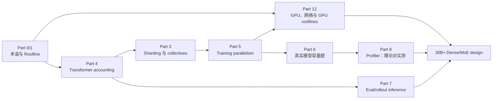

# Scaling Book 精读路线

主教材：[How To Scale Your Model](https://jax-ml.github.io/scaling-book/)  
适用范围：本 Bootcamp 的 Day 01–30  
原则：不线性通读，不抄长摘要；围绕当天要写的代码、要跑的实验和要做的容量决策精读。

## 为什么不按原书顺序读

原书以 TPU/JAX 为主要叙事，但本计划的硬件是 H100、工程栈是 PyTorch/ms-swift。Core 路线只选择可以迁移到 GPU 大模型后训练的内容：

- Core：Part 0、1、3、4、5、6、7、9、12。
- 选读：Part 2 TPU 硬件、Part 8 TPU serving、Part 10 JAX 编程。
- 不直接迁移 TPU 数字。公式、分析方法和边界条件迁移到 H100；峰值 FLOPs、HBM/NVLink/IB 带宽必须换成实际实例数据。

## 每次阅读的固定动作

工作日 45–90 分钟的 reading block：

1. 5 分钟：先写今天要回答的两个问题。
2. 25–50 分钟：只读下面指定的小节；看到推导要自己补单位。
3. 10–20 分钟：先做指定问题，再展开网页答案。
4. 10–15 分钟：写 `公式/结论 -> Qwen config -> H100/ms-swift 参数` 的映射。

周末 60 分钟：50 分钟阅读/手算，10 分钟写结论。周末不因阅读超时而开启 coding 或 GPU。

每次在当天 README 的 Daily Log 留下四项：

- `3 个可复述结论`
- `1 个带单位的手算`
- `1 个 Qwen/H100 工程映射`
- `1 个仍然不知道的问题`

## Week 1：从公式到并行心智模型

### Day 01 — 术语、上下界与阅读地图（45–60 分钟）

按顺序读：

1. [Introduction](https://jax-ml.github.io/scaling-book/)：`High-Level Outline`、`Links to Sections`，10 分钟。
2. [Part 1: Rooflines](https://jax-ml.github.io/scaling-book/roofline/)：`Where Does the Time Go?`，读到 arithmetic intensity 的定义与 compute-/communication-bound 判据，30 分钟。
3. 同页 `Visualizing rooflines`，只看图和坐标含义，10 分钟。

必须回答：

- 为什么运行时间下界是 `max(T_math, T_comms)`，上界是两者之和？
- FLOPs、FLOPs/s、bytes、bytes/s 分别是什么单位？
- “模型能放进显存”为什么不能推出“训练会很快”？

停止点：今天不读 matmul 推导和多卡网络 roofline，留给 Day 03。

### Day 02 — Transformer 参数与训练 FLOPs（80–90 分钟）

读 [Part 4: Transformer Math](https://jax-ml.github.io/scaling-book/transformers/)：

1. `Counting Dots`，10 分钟。
2. `Forward and reverse FLOPs`，15 分钟；自己推一次为什么训练约为 forward 的 3 倍。
3. `Transformer Accounting`，30 分钟；逐项对应 embedding、Q/K/V/O、gate/up/down。
4. `Global FLOPs and Params Calculation`，20 分钟；找到 `6 × parameters × tokens` 的假设边界。
5. `A Few Problems to Work` 的前两个参数/FLOPs 问题，先做后看答案，15 分钟。

必须产出：从 `Qwen3-1.7B-Base/config.json` 抄 shape，不抄模型名里的“1.7B”，独立算一次参数量与每 token 训练 FLOPs。

### Day 03 — Roofline 落到 H100（90 分钟 Core + 15 分钟 Optional）

读：

1. [Part 1](https://jax-ml.github.io/scaling-book/roofline/)：`Matrix multiplication`，25 分钟。
2. 同页 `Network communication rooflines`，20 分钟。
3. 同页 Problems：Question 3（画 roofline）与 Question 5（H100 critical batch），25 分钟；先算再展开答案。
4. [Part 12: GPUs](https://jax-ml.github.io/scaling-book/gpus/)：`What Is a GPU?`、`Memory`、`Summary of GPU specs`，20 分钟。

必须产出：用实际 AutoDL H100 型号重算 `C/W_HBM`，并解释这里的 `B` 是 local tokens，不是 sequence count。

Optional：读 Part 12 `Quiz 1: GPU hardware`，只做与 H100/显存层级相关的问题。

### Day 04 — Sharding notation 与 collective 因果链（80–90 分钟）

读 [Part 3: Sharded Matrices](https://jax-ml.github.io/scaling-book/sharding/)：

1. `Partitioning Notation and Collective Operations` 与 `A unified notation for sharding`，25 分钟。
2. `Computation With Sharded Arrays` 的 Case 1–4，35 分钟。
3. `A Deeper Dive into TPU Communication Primitives` 中 AllGather、ReduceScatter、AllToAll 与 overlap，20 分钟。
4. `Some Problems to Work` 任选一个矩阵 sharding 题，10 分钟。

必须产出：对每个 Case 写出 global shape、local shape、需要的 collective、通信 bytes。跳过 `How do we describe this in code?` 的 JAX 语法细节。

### Day 05 — DP/FSDP/TP/PP 的 roofline（70–80 分钟）

读 [Part 5: Training](https://jax-ml.github.io/scaling-book/training/)：

1. `What Do We Mean By Scaling?`，10 分钟。
2. `Data Parallelism`，10 分钟。
3. `Fully-Sharded Data Parallelism (FSDP)`，15 分钟。
4. `Tensor Parallelism`，15 分钟。
5. `Combining FSDP and Tensor Parallelism`，10 分钟。
6. `Pipelining` 与 `Takeaways from LLM Training on TPUs`，10–20 分钟。

阅读方式：每节只抓五件事——切什么、复制什么、通信什么、临界条件、最常见误用。公式里的 TPU `C/W` 保留符号，不背数字。

必须产出：把同一个概念分别指到 Part 5 公式、Picotron/Nanotron 代码、ms-swift/DeepSpeed 参数。

### Day 06 — 周末：真实模型的参数、时间与成本（60 分钟）

读 [Part 6: Training LLaMA 3](https://jax-ml.github.io/scaling-book/applied-training/)：

1. `What does LLaMA 3 look like?`，10 分钟。
2. `Counting parameters and FLOPs`，35 分钟；每个隐藏答案展开前先手算。
3. 训练时间与 minimum-memory 问题，15 分钟。

只回答：memory-feasible、compute-feasible、time/cost-feasible 为什么是三个不同判断。

### Day 07 — 周末：为真实模型选 sharding（60 分钟）

继续 Part 6：

1. `How to shard LLaMA 3-70B for training`，40 分钟；依次判断 pure FSDP、FSDP+sequence、FSDP+TP。
2. `Worked Problems` Question 1，只列方程和已知量，10 分钟。
3. 把 LLaMA 变量替换为 Qwen3-32B config，写迁移限制，10 分钟。

规则：先写自己的 topology，再展开原文答案；不要求在周末完成数值程序。

## Week 2：把理论接到 Qwen SFT

### Day 08 — Qwen/ms-swift 最小 SFT（60 分钟）

今天不读 Scaling Book 新章节。读：

1. [ms-swift README](https://github.com/modelscope/ms-swift/blob/main/README.md)：`Installation`、`Quick Start`、`Training`，20 分钟。
2. [Qwen3 ms-swift recipe](https://github.com/QwenLM/Qwen3/discussions/1301)：只读 SFT command、parallel/config 与 checkpoint 部分，25 分钟。
3. [PEFT LoRA conceptual guide](https://huggingface.co/docs/peft/conceptual_guides/lora)：rank、alpha、target modules，15 分钟。

必须产出：逐个解释 launch command 中会改变 model state、activation、batch 和 checkpoint 的参数。

### Day 09 — Dataset、template 与 loss token（75 分钟）

读 [ms-swift Custom Dataset](https://swift.readthedocs.io/en/latest/Customization/Custom-dataset.html)：

1. messages/standard format 与 dataset registration，20 分钟。
2. SFT 的 `loss`、多轮 loss、assistant-only loss 相关段落，30 分钟。
3. DPO/preference format 只看 schema，不看算法，10 分钟。
4. 用一条真实 sample 对照 tokenizer/chat template 源码，15 分钟。

必须产出：raw messages、rendered text、token IDs、labels、`-100` mask 五列对照。

### Day 10 — Eval generation 为什么是 inference 系统问题（60 分钟）

1. [Part 7: Inference](https://jax-ml.github.io/scaling-book/inference/)：`The Basics of Transformer Inference` 与 prefill/generation，15 分钟。
2. `What do we actually want to optimize?`，10 分钟；重点区分 offline eval 与在线 latency。
3. `Linear operations: what bottlenecks us?`，15 分钟。
4. [Evaluation Guidebook](https://huggingface.co/spaces/OpenEvals/evaluation-guidebook)：dataset split、contamination、reproducible generation 相关部分，20 分钟。

必须产出：为 frozen eval 固定 model/template/decoding/sample IDs 的原因，以及离线 eval 只追吞吐时仍必须记录的 latency 指标。

### Day 11 — Full SFT 模型状态与预算（60 分钟）

1. 重读 Part 4 `Global FLOPs and Params Calculation`，15 分钟。
2. 重读 Part 5 `Data Parallelism` 开头关于 BF16 参数与 FP32 Adam state 的计算，15 分钟。
3. [ms-swift command parameters](https://github.com/modelscope/ms-swift/blob/main/docs/source_en/Instruction/Command-line-parameters.md)：precision、optimizer、gradient accumulation、checkpoint 参数，30 分钟。

必须产出：在启动前写出权重、梯度、optimizer、activation 的估算表；日志实测后填 prediction error。

### Day 12 — Token budget、训练时间与 checkpoint 选择（45 分钟）

1. Part 6 `Counting parameters and FLOPs` 中 total training FLOPs/时间的三个问题，20 分钟。
2. ms-swift 参数文档中的 epochs/max_steps、warmup、save/eval strategy，15 分钟。
3. 自己完成 `steps <-> global tokens <-> estimated H100 hours` 换算，10 分钟。

必须产出：early/middle/final checkpoint 的预注册选择规则，不允许只用 final train loss。

### Day 13 — 周末：Qwen post-training 全局图（60 分钟）

读 [Qwen3 Technical Report](https://arxiv.org/abs/2505.09388)：abstract/introduction 10 分钟、model architecture 10 分钟、pre-training overview 10 分钟、post-training pipeline 25 分钟、写 3 条差距 5 分钟。Benchmark 大表与逐项结果不是 Core。

### Day 14 — 周末：SFT 复盘式阅读（60 分钟）

不读新长文：20 分钟重读 Day 08–12 自己的日志；20 分钟查 ms-swift 参数文档中 packing/checkpointing/precision；20 分钟把三个下周 ablation 写成 `假设—只改变的变量—指标—停止条件`。

## Week 3：实验、恢复、多卡与 Profiler

### Day 15 — Sequence length、attention 与 packing（60 分钟）

读 Part 4：

1. `Transformer Accounting -> Attention`，20 分钟。
2. `Fractional cost of attention with context length`，20 分钟。
3. `Key-Value (KV) caching`，10 分钟。
4. 用自己的长度分布计算 padding ratio 与 attention FLOPs 变化，10 分钟。

必须回答：packing 改变了哪些浪费，没改变哪些理论 FLOPs；为什么 `tokens/s` 不等于 `effective label tokens/s`。

### Day 16 — Activation checkpointing 与 Flash Attention（60 分钟）

读 Part 4：

1. `Gradient checkpointing`，20 分钟。
2. `Appendix A: How does Flash Attention work?`，25 分钟。
3. 重读 Part 1 matmul/HBM roofline，把两项优化标在 compute/communication/memory 三轴上，15 分钟。

必须产出：checkpointing、Flash Attention、LoRA 分别主要改变 model states、activation、FLOPs、HBM traffic 中的哪几项。

### Day 17 — Megatron parallel ownership 与 checkpoint（45 分钟）

1. Part 5 `Data Parallelism`、`Tensor Parallelism`、`Pipeline Parallelism` 各回看关键时序，共 20 分钟。
2. [Megatron Parallelism Guide](https://docs.nvidia.com/megatron-core/developer-guide/latest/user-guide/parallelism-guide.html)：TP/PP/DP/CP group 与 distributed optimizer，15 分钟。
3. [Megatron-LM](https://github.com/NVIDIA/Megatron-LM) project structure 与 distributed checkpoint 文档入口，10 分钟。

必须产出：TP/PP/DP rank-group 图、weight/gradient/optimizer ownership，以及 resume 需要的 tensor/non-tensor state。当天剩余时间按 README 通读源码，不继续扩展理论材料。

### Day 18 — Megatron 双卡 runtime（45 分钟）

读 Part 12：

1. `Networking -> At the node level`，10 分钟。
2. `How Do Collectives Work on GPUs? -> Intra-node collectives`，15 分钟。
3. `Quiz 2: GPU nodes` 与 `Quiz 4: Collectives` 各选一题，15 分钟。
4. 用 `nvidia-smi topo -m`/NCCL 实测拓扑替换书中 DGX 假设，5 分钟。

必须回答：为什么理论 link bandwidth 不等于 NCCL algorithm bandwidth；`TP=1,DP=2` 与 `TP=2,DP=1` 各触发哪些 group/collective；2 卡 scaling efficiency 的分母是什么。

### Day 19 — Megatron Profiler 与 runtime-to-source（60 分钟）

读 [Part 9: Profiling](https://jax-ml.github.io/scaling-book/profiling/)：

1. `A Thousand-Foot View...` 只读编译/算子层次，5 分钟。
2. `Trace Viewer`，15 分钟。
3. `Looking at a real(ish) example profile`，20 分钟。
4. `Memory Profile`，10 分钟。
5. `Worked Problems` 任选一个 trace 问题，10 分钟。

迁移规则：把 XLA/HLO 名称翻译成 Megatron/PyTorch op、CUDA kernel、NCCL collective；不学习 JAX profiler 操作。必须把至少一个理论瓶颈与 Day 18 的 Megatron trace 对上或明确证伪，并从 trace 反向定位到源码 caller。

### Day 20 — 周末：MoE active compute 与 EP（60 分钟）

1. Part 4 `Sparsity and Mixture-of-Experts`，15 分钟。
2. Part 12 `Expert Parallelism`，20 分钟。
3. [Qwen3.5-35B-A3B-Base model card](https://huggingface.co/Qwen/Qwen3.5-35B-A3B-Base)，只看 architecture/config，20 分钟。
4. 写三条结论，5 分钟。

必须区分：total weight memory、activated expert FLOPs、token dispatch bytes。

### Day 21 — 周末：Eval/rollout inference（60 分钟）

读 Part 7：

1. `Theoretical estimates for LLM latency and throughput`，20 分钟。
2. `What about memory?`，10 分钟。
3. `Designing an Effective Inference Engine -> Continuous batching`，15 分钟。
4. `Distributing Inference -> Prefill/Generation`，10 分钟。
5. 写一张 eval generation 与 GRPO rollout 的共同资源表，5 分钟。

## Week 4：30B+、可信 Eval 与 Alignment

### Day 22 — 35B MoE capacity 的完整推演（75 分钟）

读 Part 12：

1. `Rooflines for LLM Scaling on GPUs -> Expert Parallelism`，20 分钟。
2. `Pipeline Parallelism`，15 分钟。
3. `Examples` 中 DeepSeek 与 LLaMA 的 topology，15 分钟。
4. `TLDR of LLM Scaling on GPUs`，10 分钟。
5. `Quiz 5` Question 2，只借题型并替换为 Qwen 35B-A3B，15 分钟。

必须产出：至少两个 topology，分别列 memory-feasible、roofline-feasible、工程风险；不要给没有 pilot benchmark 支撑的单点吞吐承诺。

### Day 23 — Public benchmark 与 offline inference（60 分钟）

1. Part 7 `Modeling throughput and latency...`，15 分钟。
2. `Tricks for Improving Generation Throughput and Latency`，10 分钟。
3. `Continuous batching`，10 分钟。
4. [LM Evaluation Harness README/docs](https://github.com/EleutherAI/lm-evaluation-harness)：task、few-shot、model/backend、sample logging，25 分钟。

必须产出：benchmark config 中哪些选择会改变模型能力结论，哪些只改变吞吐/成本。

### Day 24 — Pairwise/Judge/统计（60 分钟）

今天不读 Scaling Book 新章节。读 [Evaluation Guidebook](https://huggingface.co/spaces/OpenEvals/evaluation-guidebook) 中 LLM-as-a-judge、pairwise、bias、human calibration；阅读时建立 `风险 -> 控制 -> 证据` 表，至少覆盖 position、length、style、self-preference 与 sample selection。

### Day 25 — DPO objective（90 分钟）

读 [DPO paper](https://arxiv.org/abs/2305.18290)：

1. Abstract/Introduction，10 分钟。
2. `Preliminaries` 的 reward modeling、RLHF、Bradley–Terry，20 分钟。
3. `Direct Preference Optimization` objective 推导，35 分钟。
4. Experiments 中数据/评测设置，15 分钟。
5. Limitations/Discussion，10 分钟。

必须手写 `log πθ - log πref` 在 chosen/rejected 两边的作用，并列出三个训练指标不能证明的真实能力结论。

### Day 26 — slime 的 train/rollout/weight-sync 边界（45 分钟）

1. [slime 架构文章](https://thudm.github.io/slime/blogs/introducing_slime.html)：Megatron training、SGLang rollout、Ray/Data Buffer，20 分钟。
2. [slime Quick Start](https://thudm.github.io/slime/get_started/quick_start.html)：参数分组、colocated actor/rollout、weight conversion，15 分钟。
3. 用 10 分钟写清算法层、训练 backend、rollout engine、orchestration 各自负责什么。

必须产出：一张 component ownership 图；随后按当天 README 进入源码主链路。

### Day 27 — 周末：GRPO objective 与 slime objects（60 分钟）

35 分钟读 [DeepSeekMath](https://arxiv.org/abs/2402.03300) GRPO method/objective；25 分钟把 prompt、grouped completions、reward、advantage、old/ref logprob 映射到 Day 26 读到的 slime `Sample`/rollout fields。不得启动代码或 GPU。

### Day 28 — 周末：slime runtime 架构（60 分钟）

1. `train.py`/`train_async.py` 与 `slime/ray/placement_group.py`，20 分钟。
2. `slime/rollout/sglang_rollout.py` 与 `backends/megatron_utils/actor.py`，20 分钟。
3. `backends/megatron_utils/update_weight/`，20 分钟。

唯一产物：`prompt -> rollouts -> reward -> Sample/buffer -> Megatron update -> weight sync -> next rollout`，每条边标 object 数量、GPU role、`file:function`、预期 runtime log；只读不运行。

### Day 29 — slime runtime 与 failure signatures（45 分钟）

1. 重读 Day 26/28 剩余 `STATIC_ONLY` 的 slime caller，20 分钟。
2. Part 7 `Continuous batching` 与 `Distributing Inference -> Generation`，10 分钟。
3. 预写 zero variance、reward hacking、length drift、KL explosion、rollout/weight-sync bottleneck 五种 signature，15 分钟。

必须产出：每种 failure 的观测指标、最小复现实验和停止条件。

### Day 30 — 从题目变成 30B+ design review（45 分钟）

1. Part 12 `TLDR of LLM Scaling on GPUs`，10 分钟。
2. Part 12 `Quiz 5` Question 2，改写成自己的 Qwen 32B/35B-A3B 配置，20 分钟。
3. [Conclusion](https://jax-ml.github.io/scaling-book/conclusion/) 只读总结/进一步阅读，5 分钟。
4. 用 10 分钟写清设计中的 `known / estimated / must benchmark`。

最终标准：不是复述并行术语，而是能在评审中从 config、batch、硬件拓扑推到 memory、FLOPs、communication、step time range 和验证实验。

## 本月明确不做

- 不通读 Part 2 TPU 硬件；遇到符号不懂时回查。
- 不学习 Part 10 JAX API；只借用 sharding notation 和 profiler 思路。
- 不背 TPU/H100 峰值数字；使用当日实例/官方 spec 并注明 precision、稀疏与否。
- 不把每个网页答案直接复制进笔记；必须先留下自己的计算。
- 不为“读完一章”牺牲 coding、训练或 Eval 证据。
