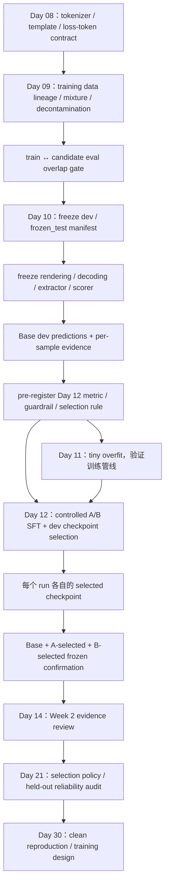

# Day 10 Research & Learning Guide

- 日期：`2026-08-04`
- 适用任务：`Day 10 — Frozen Eval 与 Qwen3-0.6B Base Baseline`
- 性质：学习路线、实验协议设计、文献预研与后续复用指南
- 状态：`base_dev_automated_eval_complete / human_review_pending`

## 0. Executive Summary

Day 10 的本质不是“跑一次 benchmark”，而是在第一次 SFT 前建立一把不可静默漂移的测量尺：

> 固定评测样本、rendered prompt、token IDs、decoding、答案抽取、scorer、执行环境和聚合规则；在一组可比较的评测 run 中，只允许被评测 checkpoint 的权重/hash 按计划变化。

如果 Base 与 SFT 的分数来自不同 prompt、template、stop、extractor 或 scorer，就无法把差异归因于训练。Day 10 因此是 Week 2 的测量门禁，而不是单纯的推理任务。

这一天最终要形成四类可复用资产：

1. `EvalDatasetContext`：哪些样本属于 dev/frozen_test，它们来自哪里、属于哪个 slice、针对哪些训练 manifests 做过何种 overlap 检查；
2. `EvalProtocolContext`：模型看到了什么、如何生成、怎样抽取和评分；
3. `EvalRunContext`：某个 checkpoint 在该协议下产生的逐样本证据；
4. `SelectionContext`：Day 12 用什么指标和规则选择 checkpoint，何时必须判为 `inconclusive`。

三个最重要的调研结论是：

- `frozen_test` 的独立性来自开发期间**没有看过结果**，不只是没有把它写进 checkpoint-selection 代码；
- 当前 160 条、四 slice 样本适合作为学习型 pilot，但不足以可靠判断几个百分点的变化；
- Qwen3-0.6B-Base 的 chat-template free-form baseline 是后续 SFT 的纵向锚点，不等同于 Base 能力的公平横向测量。

## 1. Repository Readiness

### 1.1 已完成且应直接复用

Day 08 已冻结以下真实资产，不应在 Day 10 重新研究或从远端 `latest` 复制：

- model/tokenizer：`Qwen/Qwen3-0.6B-Base`；
- revision：`ddc928429ed09d9ad603fd762053d0434c15e865`；
- template SHA-256：`44d5f08f3f72b837eaad09f13a54c1f9f4eb58d75240334548b7fd52a5437fa5`；
- tokenizer/config 文件 hash；
- EOS、padding、truncation 和 special-token 语义；
- 模板无 system 时会自动插入 `You are a helpful assistant.`；
- 当前冻结模板不引用 `enable_thinking`，因此传入该参数不改变 rendered text。

来源：[`day08-sft-data-contract.md`](../artifacts/data/day08-sft-data-contract.md)。

### 1.2 当前 readiness

Day 09 已以 `complete_with_gate_c_waiver` 完成：A/B manifests、四个 slice、160 条 candidate eval pool 与 train ↔ eval exact/near-overlap report 均已生成，自动验收为 44/44 tests 与 11/11 rebuild checks。Gate C 是用户接受的 0/60 occurrence-review 残余风险，不得改写成人工 QA passed，但不阻塞本轮学习实验。

因此 Day 10 的 manifest/protocol 工程已 ready；pinned model config/weights 也已缓存并通过 exact hash。5-sample dry run、10-sample repeatability、112 条 dev Base generation 与 28 条 E2B HumanEval 强隔离评分均已完成。code 为 0/28，完整四-slice macro 为 13.39%。30 条 dev-only 人审 packet 已生成，但 human judgment 仍为 pending。

Day 09/10 已完成的真实顺序是：

```text
candidate pool
  -> overlap 检查
  -> 20 个 near-pair 人工判定 keep_both（无删除）
  -> Gate C 0/60 occurrence review 由用户 waiver
  -> 重算 train/eval hashes
  -> Day 10 最终冻结 manifest
```

来源：[`Day 09 README`](../day-09-data-quality-mixture-lineage/README.md)。

### 1.3 Source of Truth

总 README、`PROGRESS.md` 与具体 Day/artifacts 存在状态漂移。判断是否 ready 时采用以下优先级：

```text
真实 artifacts + tests
  > 当日 README 状态与验收项
  > PROGRESS.md
  > 总 README 的 current day 文案
```

## 2. Day 10 在整个 Bootcamp 中的位置



### 2.1 各天真正传递的 context

| 上游 | 传给 Day 10 的资产 | Day 10 下游用途 |
|---|---|---|
| Day 08 | tokenizer/model revision、template/hash、EOS/rendering 语义 | 保证 Base/SFT 输入一致 |
| Day 09 | source/slice/manifest、mixture、overlap report | 构造与训练目标对齐、且对指定 Day 09 manifests 无未处理高相似 overlap 的 eval |
| Day 10 | frozen protocol、Base evidence、selection rule | Day 11/12 的统一测量锚点 |
| Day 11 | tiny-overfit pipeline gate | 证明训练链能学，不证明泛化 |
| Day 12 | matched-budget A/B、每个 run 的 selected checkpoint、paired dev/frozen evidence | 验证 mixture 假设并评估选择策略 |
| Day 14/21 | claim/evidence audit、selection-policy 加固 | 限制过度结论与 held-out 滥用 |

Day 13 的 Tülu 3 × Qwen3 阅读属于外部校准旁支，不阻塞 Day 10。它用于限制 Day 12 小实验的外推范围，而不是事后修改 Day 10 的指标。

## 3. Day 10 必须真正学会的五件事

### 3.1 Split 的职责边界

| Split | 可查看结果 | 可改 mixture/超参 | 可选 checkpoint | 用途 |
|---|:---:|:---:|:---:|---|
| train | 是 | 是 | 否 | 参数更新 |
| dev | 是 | 跨实验可以；当前 A/B 原地不可以 | 是 | 迭代、诊断、checkpoint selection |
| frozen_test | 仅最终确认 | 否 | 否 | 对 A/B 各自 selected checkpoint 的独立 confirmation |

`frozen_test` 不是“名字叫 test 的 dev”。看过其 bad cases、根据结果换 prompt、换数据或换 scorer 后，它就已经失去严格 held-out 含义。

上表的“dev 可迭代”是一般实验方法，不是修改当前实验的许可证。Day 09 已冻结 A/B manifests，Day 12 又要求除 mixture manifest/比例外其他训练条件一致；因此看到 Base dev 后若想改 manifest、prompt、scorer 或训练超参，应 fork 一个带新版本号的新实验，不能原地改写本轮预注册 A/B。

### 3.2 冻结边界

至少冻结：

- sample IDs、split、slice、reference；
- raw prompt 与最终 rendered prompt/input IDs；
- tokenizer revision、rendering contract 与逐样本 rendered inputs；被评测 checkpoint/model identity 单独进入 run identity，不进入必须跨 checkpoint 相同的 measurement protocol；
- template 内容、system 注入、`add_generation_prompt` 等 render flags；
- max input/output length、EOS、stop strings/token IDs；
- `do_sample`、temperature/top-p/top-k（不适用时也明确记录）；
- dtype、backend/runtime 和重要 deterministic 设置；
- answer extractor/canonicalizer；
- scorer、tests/rubric、timeout；
- per-slice aggregation、macro/micro 规则；
- code、环境和依赖版本。

### 3.3 逐样本证据链

能力判断的最小证据链是：

```text
sample identity
  -> rendered prompt
  -> input IDs
  -> raw generated token IDs / text
  -> parsed answer
  -> scorer input
  -> score / error type
  -> aggregate and slice metrics
```

任何一层缺失，后续都更难区分：

- 模型不会；
- prompt/template 漂移；
- generation 被 stop 截断；
- extractor 没识别语义等价答案；
- scorer/test 本身错误；
- aggregation 权重改变。

### 3.4 Determinism 与不确定性

“同配置重复 10 条”和“置信区间”解决的是不同问题：

- 重复 10 条：实现、runtime、decoding 是否可重复；
- sample bootstrap/Wilson CI：如果从同一任务分布重新抽题，分数有多不稳定；
- 多训练 seed：训练过程本身有多不稳定。

Day 10 只能覆盖前两类；Day 12 的单 seed A/B 不能估计训练随机性。

这里的“sample CI”有前提：只有样本从明确定义的任务总体按相应设计随机抽取时，区间才具有常规的重复抽样覆盖解释。若当前 160 条是配额选择的 manifest，Wilson/bootstrap 更适合作为**固定 pilot 集上的敏感度与不确定性提示**，不能冒充对完整用户任务总体的概率推断。

### 3.5 训练前决策

在看到任何 SFT 结果前写清：

- eligible checkpoints；
- primary metric；
- target slice；
- code target 与 general/math/finance guardrails；
- 最小有意义差异；
- 允许退化阈值；
- CI 与 paired-comparison 方法；
- tie-breaker；
- `inconclusive` 条件；
- frozen_test 的触发条件和使用次数。

## 4. 推荐的 Context Architecture

不要让后续分析重新加载 Day 08–12 的全部 README、论文和日志。把 context 分成四个稳定对象：

### 4.1 EvalDatasetContext

包含：

- manifest version/hash；
- `sample_id/split/slice/source/reference`；
- raw/rendered prompt hash；
- sampling rule 与目标总体定义；
- scoped overlap status：检查所针对的 train manifest hashes、normalization/matcher 版本、threshold 与 report hash；
- known coverage gaps，例如无法审计 Base pretraining 或上游合成数据来源。

### 4.2 EvalProtocolContext

包含：

- tokenizer/template revision/hash；
- render flags；
- decoding/stop/max length；
- extractor/canonicalizer；
- per-slice scorer；
- aggregation and CI method。

建议指纹：

```json
{
  "domain": "day10.measurement_protocol",
  "schema_version": 1,
  "dataset_context_hash": "sha256:...",
  "rendered_inputs_hash": "sha256:...",
  "rendering_contract": {},
  "generation": {},
  "scorer_registry_hash": "sha256:...",
  "aggregation_uncertainty_hash": "sha256:..."
}
```

`protocol_hash = H_canonical(上述结构化对象)`。不要用字符串拼接计算指纹。

#### 跨模型规模的 suite identity

`protocol_hash` 有意排除被评测 checkpoint/model identity；模型 ID、revision、config/weight hashes 进入 `run_hash`。因此 Base 与 SFT 在相同 inputs/rendering/generation/scorer/execution 下可以共享 `comparison_key`，而不会被误认为同一个 run。为 Day 31–42 的跨规模 outcome comparison，另定义不绑定 tokenizer、模板和渲染实现的 suite identity：

```text
eval_suite_hash = H_canonical({
  domain, schema_version,
  raw_task_manifest_hash,
  references_and_tool_environment_hash,
  scorer_registry_hash,
  aggregation_uncertainty_hash
})
```

跨模型 outcome table 至少要求相同 `eval_suite_hash`、sample IDs、references、scorer 与 aggregation。若 tokenizer/template、rendered inputs 和 execution 也相同，各模型可以共享 `comparison_key`；任一项不同就各自保留不同 key，并明确这只是同任务尺子的 outcome comparison，不是逐 token matched protocol。无论哪种情况，model/config/weight identity 都由各自 `run_hash` 区分。

### 4.3 EvalRunContext

包含：

- evaluated checkpoint/hash；
- code commit、环境/container 与依赖 lock；
- dtype、backend/runtime、driver、hardware、batch、seed 与 deterministic flags；
- `protocol_hash`；
- `execution_protocol_hash` 与 `comparison_key`；
- prediction artifact path/hash。

这些执行字段不能只是“允许每次随意变化的日志”。某些 backend、dtype、batch 或 kernel 差异会改变 token 输出，因此严格可比 run 必须同时满足 `protocol_hash` 与 `execution_protocol_hash` 相同：

```text
execution_protocol_hash = H_canonical({
  domain, schema_version,
  eval_code_commit, dependency_lock_or_container,
  dtype, backend_runtime_driver, hardware,
  batch_config, seed, deterministic_flags
})

comparison_key = H_canonical({
  domain, schema_version,
  protocol_hash, execution_protocol_hash
})

run_hash = H_canonical({
  domain, schema_version,
  comparison_key, evaluated_checkpoint_hash
})
```

`run_hash` 标识声明的 run 配置；文件名中的 `run_id` 使用其纯十六进制安全短前缀，manifest 保留完整 hash；结果文件另存精确字节级 `artifact_sha256`。checkpoint 本来就应该在 Base/SFT 间变化，因此不要把它混进必须相同的 `protocol_hash` 或 `comparison_key`。如果确需迁移硬件/backend，应生成新的 execution hash，并用重复性实验论证兼容性，不能静默沿用旧 comparison key。

### 4.4 SelectionContext

包含：

- run-specific candidate sets；
- matched-token-budget A/B contrasts 与 within-run selection 的问题边界；
- primary metric/guardrails；
- minimum meaningful difference；
- paired CI；
- tie-breaker；
- `inconclusive`；
- frozen-test access policy。

### 4.5 Hash Canonicalization Contract

所有结构化指纹统一定义为：

```text
H_canonical(object) = "sha256:" + hex(
  SHA256(UTF-8(RFC 8785 JCS(object)))
)
```

实现时再冻结以下规则：

- 对象必须带 `domain` 与 `schema_version`，避免不同类型对象发生字段边界歧义；
- key 由 JCS 排序；数组有序；manifest 的 records 在 hash 前按稳定 `sample_id` 排序，若执行顺序有意义则另存 `evaluation_order`；
- 缺失字段与显式 `null` 不等价；禁止重复 key、`NaN` 和 infinity；
- canonical payload 使用 UTF-8、无 BOM、无额外 newline；
- JSONL/模型权重等实际文件另算 exact-byte SHA-256，不拿文件格式差异冒充语义协议变化。

这样同一协议可跨实现得到相同 semantic hash，同时仍能用 artifact hash 审计“磁盘上的确切文件”。

### 4.6 Context 的失效传播

```text
manifest / prompt / template / generation 改动
  -> 已有 predictions 失效，需要重新生成

extractor / scorer / tests 改动
  -> parsed answers / scores / metrics 失效
  -> raw output 完整时通常无需重新生成

aggregation / report 改动
  -> 只重算派生指标
  -> 不覆盖原始 evidence
```

协议升级必须 fork `v2`，不能覆盖 `v1` 后继续把两组分数当作同协议比较。

## 5. 推荐 Schema

### 5.1 Eval Manifest

课程 README 的最低字段为 `sample_id/prompt_hash/slice/reference/scorer_version`。建议补齐：

```json
{
  "sample_id": "math-0001",
  "evaluation_split": "dev",
  "slice": "math",
  "source_lineage": {
    "source": "source-name",
    "revision": "immutable-revision",
    "source_split": "upstream-test"
  },
  "raw_prompt": "...",
  "raw_prompt_hash": "sha256:...",
  "rendered_prompt_hash": "sha256:...",
  "input_ids_hash": "sha256:...",
  "reference": "...",
  "reference_hash": "sha256:...",
  "extractor_version": "gsm8k_final_number_extractor_v1",
  "scorer_version": "gsm8k_numeric_exact_v1",
  "overlap_check": {
    "status": "no_unhandled_matches",
    "checked_against_manifest_hashes": ["sha256:mix-a...", "sha256:mix-b..."],
    "normalization_version": "overlap-normalize-v1",
    "matcher_version": "exact-near-match-v1",
    "thresholds": {},
    "report_hash": "sha256:..."
  },
  "metadata": {}
}
```

如果 rendered prompt/input IDs 尚未生成，可在 freeze 前的 compile step 补齐；正式 run 不允许动态重写这些字段。

`no_unhandled_matches` 只表示：按所记录的方法与阈值，对列出的 Day 09 manifests 没有未处理命中。它不证明样本未出现在 Qwen 的预训练语料、上游 benchmark 派生物或合成数据生成器的上下文中，因此不要把该状态简写成全局 `clean/passed`。

### 5.2 Prediction JSONL

```json
{
  "sample_id": "math-0001",
  "split": "dev",
  "slice": "math",
  "protocol_hash": "sha256:...",
  "execution_protocol_hash": "sha256:...",
  "comparison_key": "sha256:...",
  "run_hash": "sha256:...",
  "checkpoint_hash": "sha256:...",
  "input_ids_hash": "sha256:...",
  "raw_output_token_ids": [123, 456],
  "raw_output": "...",
  "parsed_answer": "42",
  "generation_status": "ok",
  "parse_status": "ok",
  "score_status": "ok",
  "score": 1.0,
  "input_tokens": 128,
  "output_tokens": 17,
  "latency_ms": 215.4,
  "error_type": null
}
```

仅记录 latency 而不记录 input/output tokens、batch 和硬件，几乎无法跨 run 解释。

## 6. Scorer Contract by Slice

### 6.1 General Knowledge MCQ

本轮 general slice 实际是 MMLU knowledge MCQ proxy，不是完整的 instruction-following 评测。固定：

- 只接受最终 `A/B/C/D` option label；
- extractor：`mmlu_option_extractor_v2`；
- scorer：`mmlu_exact_option_v2`；
- 无法抽取计 `parse_error`，抽取成功但选项不同计 `wrong_answer`。

报告只能称它为 general-knowledge proxy，不能外推成通用指令遵循能力。

### 6.2 Math

明确：

- 只取 final answer 还是接受整个推导；
- 数字、分数、百分比、单位和符号如何 canonicalize；
- 是否允许 tolerance；
- 多个答案、无答案、extractor failure 怎样计分。

`parse_error` 与 `wrong_answer` 必须分开。

### 6.3 Finance

本轮使用 TAT-QA conservative normalized exact match：

- 解析冻结的 `answer/answer_type/scale` reference；
- 数字、千/百万/十亿和百分比 scale 必须一致；
- multi-span 允许顺序无关，但不做 fuzzy/partial-credit matching；
- extractor：`tatqa_final_answer_extractor_v3`；scorer：`tatqa_normalized_exact_v3`。

### 6.4 Code

固定：

- test suite/hash；
- runtime/container；
- language/version；
- timeout/memory/network policy；
- pass@1 或其他指标；
- compile/runtime/test failure taxonomy。

生成代码应在隔离环境执行，不在宿主工作区直接运行不受信任输出。
本机只有已废弃的 `sandbox-exec`，且没有可靠硬内存上限，因此本轮没有把它包装成强安全边界。正式评分使用固定 E2B template、逐样本 fresh sandbox、禁公网与 CPU/wall/memory/file/process limits；28 条均得到有效分数，25 条 syntax error、3 条 runtime error、0 条 infrastructure failure。

## 7. Statistical Plan

### 7.1 样本量边界

当前 160 条拆到四个 slice，并进一步分为每 slice 28 dev + 12 frozen_test，统计能力仍然有限。以二元 score、真实率约 50% 的最不利位置估算：

| 每个 slice 样本数 | 95% Wilson interval 近似半宽 |
|---:|---:|
| 12（每 slice frozen_test） | ±24.6pp |
| 28（每 slice dev） | ±17.4pp |
| 40 | ±14.8pp |
| 112（dev 总体） | ±9.1pp |
| 160（总体） | ±7.7pp |

上表按独立 Bernoulli 随机样本计算，只用于展示量级。对人工挑选、配额抽样或来源相关的 manifest，它不是完整总体置信区间；报告必须同时写明 sampling frame、挑选规则与来源聚类等限制。

如果再拆成 dev/frozen，每个 cell 会更小。因此本实验最适合：

- 验证完整 measurement pipeline；
- 发现大幅能力变化或明显回退；
- 积累逐样本 failure evidence；
- 学习如何声明 `inconclusive`。

它不适合把 3–5pp 的变化写成稳健提升。

### 7.2 推荐比较方法

同一批样本上的 Base、A、B 输出应使用 paired comparison，但要分开回答两个问题：

1. **mixture 的受控对比**：只比较相同 supervised-token budget 的 `A-25% vs B-25%`、`A-60% vs B-60%`、`A-100% vs B-100%`；
2. **checkpoint/部署策略对比**：先在 A、B 各自轨迹内选 `A-selected` 与 `B-selected`，再与 Base 或彼此比较。如果两个 selected checkpoint 位于不同训练进度，这只是端到端选择策略结果，不是“仅 mixture 不同”的因果估计。

```text
for each sample:
  delta_i = score_candidate_1_i - score_candidate_2_i

在每个预注册 slice 内对 sample IDs 做 paired bootstrap，保持同一 sample 的两组输出不拆散；
每轮先重算 slice delta，再按固定的预注册权重聚合。
```

分层重采样保持每个 slice 的原定样本数，避免 bootstrap 意外改变 macro 权重；如果 primary 是 micro，也要保持预注册的样本/切片权重，不能看到结果后切换 aggregation。对 curated manifest，这些区间应标注为 pilot-set resampling uncertainty。

### 7.3 Macro 与 Micro

- micro：大 slice 或样本更多的 slice 权重更高；
- macro：每个 slice 等权；
- 两者都不是天然正确，取决于实验目标。

建议将一个预注册 aggregate 作为 primary，同时永远保留全部 slice 和逐样本 paired delta。

## 8. Held-out Hygiene

### 8.1 推荐方案：延迟 Base frozen run

最适合个人学习者、最容易解释：

1. Day 10 冻结 dev/frozen manifest 和完整协议；
2. Day 10 只生成、评分并审查 Base dev；
3. Day 12 用 dev 为 A/B 两个 run 分别选择 checkpoint；
4. 选定后同时在 frozen_test 上跑 Base、A-selected 与 B-selected；
5. 三个 frozen run 各写新的、不可追加覆盖的 prediction JSONL 和 run manifest；绝不把 frozen 行追加进 Day 10 Base dev 文件；
6. 一次性解释 paired frozen delta，不再根据 frozen 结果改 checkpoint；
7. 第一次解封结果时把该 manifest 标记为 `consumed`。若 frozen 结果驱动下一轮数据、prompt、scorer 或超参决策，下一轮必须另建 confirmation set。

建议的 Day 12 独立留档至少包括：

```text
day12-frozen-base-predictions.<run_id>.jsonl
day12-frozen-A-selected-predictions.<run_id>.jsonl
day12-frozen-B-selected-predictions.<run_id>.jsonl
day12-frozen-run-manifest.json
day12-frozen-consumption-record.json
```

run manifest 记录三个 checkpoint hashes、共同 comparison key、各 prediction artifact hash 与 selection-policy hash；consumption record 记录首次揭盲时间、操作者和由此产生的后续实验版本。

### 8.2 备选方案：预生成后封存

如果出于租卡效率必须 Day 10 生成 Base frozen outputs：

- 单独存放；
- 只记录 sealed artifact hash；
- 不展示 raw output、score、slice metric 或 bad cases；
- 30 条人工 taxonomy 只抽 dev；
- Day 12 为每个 run 选完 checkpoint 后再解封；
- sealed frozen 文件与 Day 10 dev 文件使用不同路径和 hash，解封后同样写 consumption record。

对个人项目而言，组织上的“封存”很难严格执行，因此优先采用延迟运行。

## 9. Base Evaluation 的两个通道

### 9.1 纵向训练效果通道（Core）

```text
Qwen3-0.6B-Base
  -> same chat template
  -> same free-form generation
  -> same extractor/scorer
  -> compare against SFT checkpoints
```

用途：回答“这次 SFT 在同一用户交互协议下改变了什么？”

### 9.2 Base 能力诊断通道（Optional）

弱、未指令化 Base 可能无法稳定遵守自由生成格式，但其 token likelihood 已包含部分任务能力。可额外建立少量：

- cloze/completion-formulation；
- multiple-choice loglikelihood；
- teacher-forced likelihood/token accuracy。

用途：区分“模型根本不会”和“模型知道但不遵守 chat 输出格式”。

两条通道不可混成一个总分，也不能用 optional 通道事后替换 Core baseline。

## 10. Error Taxonomy

至少分开四层：

### 10.1 Generation/System

- OOM；
- timeout；
- NaN/runtime error；
- stop/EOS 过早；
- max-new-tokens truncation；
- non-deterministic raw token IDs。

### 10.2 Parsing

- extractor 找不到答案；
- 多答案歧义；
- 格式变化但语义正确；
- canonicalization 错误。

### 10.3 Scoring

- reference/test/rubric 错误；
- false positive/negative；
- judge disagreement；
- sandbox/test infrastructure failure。

### 10.4 Capability/Behavior

- instruction noncompliance；
- hallucination/knowledge gap；
- reasoning/arithmetic error；
- code syntax/logic error；
- refusal；
- repetition；
- output-language/style mismatch。

人工审查的价值不是再给一个主观总分，而是验证自动 pipeline 有没有把前三类错误误归因于模型能力。

## 11. Recommended 4–5 Hour Learning Path

以下为约 4 小时至 4 小时 55 分钟的主动学习时间，不含模型下载、GPU 排队和无人值守推理。

### Gate 0 — Readiness（15–20 分钟）

- [x] 回读 Day 08 frozen contract，不重新下载 latest template；
- [x] 确认 Day 09 manifests/slices/overlap report；
- [x] 明确哪些内容仍是草案，哪些可以 freeze；
- [x] 确认磁盘、`post_training_lab` 环境和输出路径；
- [x] 缓存 pinned model config/weights 并核对 exact hash。

### Step 1 — Directed Reading（45–50 分钟）

- 15 分钟：LM Evaluation Harness paper/docs；
- 10 分钟：OLMES §3–4；
- 10 分钟：Tülu 3 §2.2、§3.2、§7；
- 10 分钟：Scaling Book prefill/generation/offline inference。

完成三题：

1. frozen eval 需要冻结哪些对象？
2. eval 时哪些状态只读，哪些随机/cache/runtime 状态会破坏可比性？
3. aggregate 变化时，如何区分能力、抽取器、scorer 和 decoding 漂移？

### Step 2 — Protocol First（55–65 分钟）

- [x] manifest schema；
- [x] per-slice scorer contract；
- [x] generation config；
- [x] output JSONL schema；
- [x] `protocol_hash/execution_protocol_hash/comparison_key/run_hash`；
- [x] selection-policy 已预注册并冻结。

### Step 3 — Five-sample Dry Run（20–25 分钟）

状态：已完成；dry run 发现并修复 MMLU/TAT-QA extractor 缺陷后，正式协议升级并冻结为 scorer registry v3。

逐条人工检查：

```text
raw prompt
-> rendered text
-> input IDs
-> raw output tokens/text
-> parsed answer
-> scorer result
```

任何一层不正确都停止，不开完整 GPU run。

### Step 4 — Dev Baseline（60–80 分钟）

状态：112/112 dev generation 已完成；48 条 frozen_test 未生成。

- deterministic generation；
- 保存 raw token IDs/text；
- 不因 Base bad case 临时优化 prompt；
- 记录 tokens/latency/error；
- predictions 同步后及时关卡。

### Step 5 — Audit and Pre-registration（45–55 分钟）

- [x] 10 条重复性；
- [ ] dev 人审 30 条（packet 已生成，human judgment pending）；
- [x] 自动证据支持的初始 error taxonomy；
- [x] aggregate/slice/CI（完整四-slice macro 13.39%；宏平均的 stratified bootstrap 尚未计算）；
- [x] paired-comparison 方法；
- [x] Day 12 selection policy；
- [x] limitations/known blind spots。

## 12. Literature Review

Day 10 原始 README 直接链接的是 OLMES/Tülu evaluation repo 和 Scaling Book Inference；配套 reading guide 另外引入 LM Evaluation Harness。下面把这些入口的关联论文与相邻 Day 的必要论文分为 P0/P1/P2。

### 12.1 P0 — Lessons from the Trenches on Reproducible Evaluation of Language Models

- 链接：[arXiv:2405.14782 v3](https://arxiv.org/abs/2405.14782)
- 作者背景：LM Evaluation Harness 维护团队
- 当前版本：`v3, 2026-05-31`

#### 核心问题

同一个 benchmark 会因 prompt、few-shot、task formulation、概率归一化、生成参数、答案抽取和实现细节产生显著不同的分数，甚至改变模型排序。很多论文只报告 benchmark 名和 aggregate，无法重建实际测量过程。

#### 方法与贡献

论文总结 lm-eval 团队三年评测经验，形式化常见的 loglikelihood 与 generative scoring，并通过实际 benchmark 案例归纳可复现评测的工程与报告规范。

#### 对 Day 10 最重要的结论

- 精确 prompt、代码、task config、模型输出都应版本化；
- generation 必须冻结 decoder、stop、max tokens 和 extractor；
- 先用 `write_out` 检查展开后的前几个 prompts，再用 `--limit` 配合 `--log_samples` 做少量样本端到端检查，最后才启动全量；
- 逐样本输出是 post-hoc debugging 和重新评分的基础；
- bootstrap CI 与重复 generation 解决不同的不确定性；
- 对未指令化 Base，loglikelihood 可能比自由生成更能诊断已有能力。

#### 对照阅读问题

1. 论文要求公开的 evaluation artifacts，Day 10 manifest/protocol 还缺哪些？
2. 哪些问题可通过保留 raw output 避免重新租 GPU？
3. 当前 Core baseline 是 generative 还是 loglikelihood，它真正回答什么问题？

#### 版本边界

论文中的 lm-eval 命令与实现版本不是永久 API。学习原则，实际运行时仍需 pin 当前 dry-run 通过的 commit，并保存最终展开后的 task config。

### 12.2 P0 — OLMES: A Standard for Language Model Evaluations

- 链接：[arXiv:2406.08446 v2](https://arxiv.org/html/2406.08446)
- 发表：Findings of NAACL 2025

#### 核心问题

Base LLM 的多选评测缺少统一标准。prompt 格式、few-shot 样例、CF/MCF 表述、probability normalization 等差异，使相同 benchmark 名下的数字不可直接横比。

#### 方法

OLMES 在多种 Base 模型和 10 个 MCQA 任务上系统比较：

- exact prompt formats；
- fixed/curated few-shot；
- no/token/character/PMI normalization；
- CF（completion/cloze）与 MCF（显式 multiple choice）；
- BOS、input length、precision、aggregation 等实现项。

#### 关键结论

- 使用精确、固定 prompt；
- 使用固定、人工挑选且标签更平衡的 5-shot；
- 每个任务预先规定 normalization；
- 小/弱 Base 常在 CF 上更有信号，强模型常在 MCF 上更好；OLMES 的定义性规则是两种 formulation 都评估，再按预先规定的规则取二者较高结果，而不是先按模型强弱选择 formulation；
- aggregation、BOS、precision 等“小细节”也属于协议。

#### 与 Day 10 的关系

它直接支持“所有影响最终 score 的对象都必须冻结”，也解释了为何 Qwen3-0.6B-Base 的自由生成失败不能直接等同于完全没有底层能力。

#### 迁移边界

OLMES 主要研究 MCQA。Day 10 的 general knowledge/math/code/finance 使用统一 chat-generation 纵向协议，因此应复用 OLMES 的**标准化原则**，不应把其具体 suite 当成现成替代品。

### 12.3 P0 — Tülu 3: Pushing Frontiers in Open Language Model Post-Training

- 链接：[arXiv:2411.15124 v5](https://arxiv.org/abs/2411.15124)
- 建议只读：§2.2、§3.2、§7.1–7.4

#### 核心问题

构建一个开放、可复现的多阶段 post-training recipe，同时防止开发过程对已知 benchmark 过拟合。

#### 评测设计

- 将 suite 分为 development 与 unseen；
- 两者覆盖相近核心能力；
- model/data/algorithm 开发只看 development；
- 开发期间不看 unseen；当数据、算法与超参决策锁定后再揭盲，并可对历史 SFT/DPO/final checkpoints 做 post-hoc unseen audit；
- 使用 OLMES 保留标准 task configs 和 instance-level predictions。

#### 去污染方法

Tülu 3 对 prompts/user turns 做 8-gram 检查。一个 test instance 若超过 50% token 可由同一 train instance 的共享 8-gram 覆盖，则认为存在显著重合。若某训练集与任一 evaluation 的重合实例比例超过 2%，论文将该训练集判为 contaminated：与 unseen 污染的训练集整库删除；与 development 污染的训练集则根据整库删除对性能的影响，选择整库删除或只删除匹配实例。

这个阈值是论文 recipe，不是普适真理。Day 09/10 应记录自己的 normalization、threshold、candidate list 与人工确认。

#### 关键结论

- dev 上平均趋势迁移到 unseen，不代表每个能力都泛化；
- precise instruction、knowledge、reasoning 等 slice 仍可能出现 dev overfitting；
- aggregate 上升不能替代 slice 与 bad-case 分析；
- 对不公开训练数据的外部模型，无法排除其已见过所谓 unseen benchmark。

#### 对 Day 10 的直接启示

严格 unseen 的含义是开发期间不看结果。因此 frozen_test 的 Base outputs 不应进入 Day 10 的人工 error taxonomy。

### 12.4 P1 — Rethinking Benchmark and Contamination for Language Models with Rephrased Samples

链接：[arXiv:2311.04850 v2](https://arxiv.org/abs/2311.04850)

#### 核心问题

纯字符串/n-gram 检查会漏掉 paraphrase、translation 和代码改写；embedding 相似度又容易把同领域但非复制样本误报为污染。只替换数字的样本是否会被漏检取决于保留的表面上下文、n-gram 大小和阈值：Tülu 3 反而报告其 8-gram 方法抓到过这类数学题，因此不能把“数字替换”视为字符串方法必然漏检的情形。

#### 关键结论

- 语义等价改写可以逃过传统字符串去污染；
- 在改写 test 样本上训练仍可大幅抬高 benchmark；
- 合成数据也可能携带训练生成器记住的 benchmark 内容；
- 去污染需要高召回候选与更强的语义确认。

#### 推荐落地

```text
exact hash
-> normalized exact
-> n-gram / lexical near-overlap
-> embedding top-k candidates
-> 人工或强判别器确认
```

所有候选、阈值、删除决定与误杀抽样都应保留。LLM judge 不能替代可审计的前几层检查。

### 12.5 P1 — The Benchmark Lottery

链接：[arXiv:2107.07002](https://arxiv.org/abs/2107.07002)

#### 核心问题

一个方法被认为“更好”，可能只是恰好适配了所选 benchmark、task subset 或聚合方式。每个 benchmark 都隐含“什么能力更重要”的价值选择。

#### 关键结论

- 改变 task subset 可以改变最终 winner；
- 简单平均隐含每项同等重要；
- aggregate 会掩盖模型在不同任务上的交换关系；
- 评测结论必须说明 task/metric/aggregation 的选择边界。

#### 与 Day 10 的关系

它解释了为何 Day 12 不能只看一个 aggregate：需要预注册 primary metric、target slice、guardrails、minimum meaningful difference 和 `inconclusive`。

### 12.6 P2 — Datasheets for Datasets

- 链接：[arXiv:1803.09010 v8](https://arxiv.org/abs/1803.09010)
- 发表：CACM 2021

#### 核心问题与方法

数据集缺少标准化文档，使用者无法判断来源、采集、加工、适用范围、偏差和维护状态。论文给出覆盖完整生命周期的问卷：

```text
motivation
-> composition
-> collection
-> preprocessing / cleaning / labeling
-> uses
-> distribution
-> maintenance
```

#### 与 Day 09/10 的关系

Day 09 dataset manifest 是其工程化缩影。Day 10 eval manifest 也应记录 source/revision、sampling、processing、intended use、limitations 和维护/版本，而不只是 IDs 与 hash。

Day 10 不必通读全文，重点读 §3 的问题框架。

### 12.7 P2 — Qwen3 Technical Report

链接：[arXiv:2505.09388 v1](https://arxiv.org/html/2505.09388v1)

#### 与 Day 10 直接相关的事实

- Qwen3-0.6B-Base 是 28 层 dense causal LM；
- 16 个 Q heads、8 个 KV heads、tied embeddings；
- 32K context；
- tokenizer 为约 151K vocabulary 的 BBPE；
- 官方 Base evaluation 覆盖 general、math/STEM、code 与 multilingual，但不同任务使用不同 few-shot/CoT 设置。

#### 关键边界

官方 Base benchmark 只能作为 sanity anchor，不能与 Day 10 自定义 chat-template generation 直接比较。

报告中的 `/think`、`/no_think` 与 thinking-budget template 主要描述 post-trained Qwen3。实际 Day 10 必须以本地 Day 08 已冻结的 Base tokenizer/template snapshot 为准；当前 snapshot 不响应 `enable_thinking`。

Day 10 只需读 §2、§3.3 和 0.6B 相关表格；完整 post-training §4 留到 Day 13。

### 12.8 Reference — How To Scale Your Model / Inference

链接：[Inference chapter](https://jax-ml.github.io/scaling-book/inference/)

这是一章在线技术书，不是论文。Day 10 只需理解：

- prefill 一次处理 prompt 并创建 KV cache；
- generation 逐 token 串行追加 KV；
- prefill 通常更偏 compute-bound；
- 小 batch generation 常受 memory bandwidth/KV cache 限制；
- 离线 eval 更关心总吞吐和 GPU 成本，而不是单请求 TTFT。

它只用于估算 batch、max-new-tokens、显存、吞吐和租卡时长，不用于决定 benchmark、scorer 或统计协议。15–20 分钟足够。

## 13. Tooling Strategy

### 13.1 LM Evaluation Harness 应如何使用

建议把它当成三类参考：

1. versioned task config 的组织方式；
2. `write_out`、`log_samples`、seed、generation kwargs 等可复现习惯；
3. loglikelihood/generative evaluation 的实现对照。

不建议 Day 10 为了“学 harness”通读全仓或构建 auto-eval 系统。课程目标是 measurement contract，而不是框架工程。

如果自定义四类 scorer 与 lm-eval 集成成本过高，可以写窄范围 eval driver，但必须保留同等级别的 config 展开、逐样本 logging 和 hash。

### 13.2 OLMES 应如何使用

用于参考：

- task formulation 为什么属于协议；
- Base 模型为何可能需要 CF/loglikelihood；
- prompt/few-shot/normalization 如何标准化；
- instance-level outputs 如何保存。

不要求跑完整 OLMES 10-task suite，也不应拿其 MCQA average 替代当前 general knowledge/math/code/finance 目标。

### 13.3 Version Pinning

第一次成功 dry run 后固定：

- repo commit；
- base lineage、model config、tokenizer revision 与每次 evaluated checkpoint hash；
- task config hash；
- environment lock/container digest；
- scorer/test data hash。

`main/latest` 只用于发现入口，不能写入正式 protocol。

## 14. Day 12 Pre-registration Template

```markdown
# Day 12 Checkpoint Selection Policy

## Questions
1. Matched-budget causal contrast：只改变 SFT mixture 比例时，B 相对 A 是否改善预注册 code target slice，且不造成不可接受的 general/math/finance 回退？
2. Within-run selection：A、B 各自哪一个训练进度最符合预注册的 checkpoint 选择规则？
3. End-to-end policy：A-selected 与 B-selected 的最终表现如何？若二者 token budget 不同，只作选择策略比较，不声称是纯 mixture 效应。

## Eligible Runs
- A: mix-A-balanced, config hash: ...
- B: mix-B-targeted, config hash: ...

## Eligible Checkpoints
- 25% supervised-token budget
- 60% supervised-token budget
- 100% supervised-token budget

## Eval Protocol
- dev protocol hash: ...
- frozen protocol hash: ...
- execution protocol hash: ...
- dev comparison key: ...
- frozen comparison key: ...
- dev manifest hash: ...
- frozen manifest hash: ...

## Primary Metric
- metric: ...
- aggregation: macro | micro

## Guardrails
- general delta >= ...
- math delta >= ...
- code delta >= ...
- parse/system error rate <= ...

## Statistical Rule
- paired bootstrap iterations: ...
- stratification and fixed slice weights: ...
- confidence level: 95%
- minimum meaningful difference: ...

## Matched-budget A/B Analysis
1. Compare A-25% vs B-25%.
2. Compare A-60% vs B-60%.
3. Compare A-100% vs B-100%.
4. Do not pool all six candidates into one mixture-effect estimate; that would confound mixture with training progress.

## Selection
1. Within each run, eliminate checkpoints that fail guardrails.
2. Within each run, select its checkpoint using the primary metric, minimum threshold and uncertainty rule.
3. Apply the pre-registered tie-breaker only within that run.
4. If a run has no eligible checkpoint or its candidates are indistinguishable, return inconclusive for that run.
5. Compare the two run-level selected checkpoints on dev only as an end-to-end policy result; preserve the matched-budget contrasts as the evidence for mixture effect.

## Frozen Confirmation
- Only after both run-level selections are frozen.
- Run Base, A-selected and B-selected with identical protocol.
- Do not change either selection after seeing frozen results; report confirmation or failure.
- Write three immutable prediction artifacts plus a frozen run manifest; never append to Day 10 dev predictions.
- Mark the frozen manifest consumed at first reveal; later results-driven experiments require a new confirmation set.
```

## 15. Required Artifacts and Acceptance Gates

### 15.1 Planned artifacts

- `../artifacts/eval/day10-frozen-eval-manifest.json`（冻结 dev/frozen 分配；Day 10 不揭示 frozen 结果）
- `../artifacts/eval/day10-qwen3-0.6b-base-predictions.jsonl`（**仅含 dev**，hash 后不可追加 frozen rows）
- `../artifacts/eval/day10-base-human-review-packet-30.jsonl`（dev-only；judgment 当前全部 pending）
- `../artifacts/reports/day10-base-baseline-summary.json`
- `../artifacts/reports/day10-base-baseline.md`（只报告 Base dev）
- `../artifacts/reports/day10-eval-protocol.md`
- `../artifacts/configs/day12-checkpoint-selection-policy.json`

### 15.2 Day 12 downstream frozen artifacts

- `../artifacts/eval/day12-frozen-base-predictions.<run_id>.jsonl`
- `../artifacts/eval/day12-frozen-A-selected-predictions.<run_id>.jsonl`
- `../artifacts/eval/day12-frozen-B-selected-predictions.<run_id>.jsonl`
- `../artifacts/eval/day12-frozen-run-manifest.json`
- `../artifacts/eval/day12-frozen-consumption-record.json`

这五项属于 Day 12，不应回填或覆盖 Day 10 文件。prediction files、run manifest 和 consumption record 都分别计算 exact-byte artifact hash。

### 15.3 Recommended supporting artifacts

- generation config JSON/YAML；
- extractor/scorer source hashes；
- code test/rubric versions；
- repeatability comparison report；
- Day 12 checkpoint-selection policy；
- measurement/execution protocol 与 run manifest；
- canonical-hash schema/version 与 test vector；
- sealed-frozen access record（若采用预生成方案）。

### 15.4 Day 10 final gate

- [x] Day 09 manifests 与 overlap report 已完成；
- [x] eval manifest 的 sample/split/slice/reference/source 均可追溯；
- [x] raw/rendered prompt 与 input IDs 有 hash；
- [x] template、render flags、generation、extractor、scorer、aggregation 与 execution protocol 均冻结；
- [x] 5-sample dry run 逐层检查通过；
- [x] 10 条重复 generation/raw IDs/parsed answers 已核对；
- [x] Base dev 逐样本 evidence 已保存；
- [x] 30 条待审 packet 仅来自 dev/audit split；
- [ ] 用户完成 30 条人工 judgment 并确认 failure taxonomy；
- [x] aggregate、slice、CI 与初始 failure taxonomy 齐全；四-slice macro 为 13.39%；
- [x] 对记录的 Day 09 manifest hashes 与 matcher/threshold，train/eval 无未处理高相似 overlap；
- [x] Day 12 metric/guardrail/selection/inconclusive 已预注册；
- [x] 当前 A/B manifests 与训练配置未因 Base dev 结果被原地改写；
- [x] frozen_test 未在 checkpoint selection 前泄露。
- [x] HumanEval 在固定强隔离 E2B sandbox 中完成评分（0/28）。

## 16. Recommended Decisions

1. **采用严格 held-out 方案**：Day 10 不生成/查看 frozen outputs；Day 12 为 A/B 两个 run 各自选完 checkpoint 后，同时跑 Base、A-selected 与 B-selected。
2. **Core 使用 chat-generation 纵向基线**；可选增加 loglikelihood sidecar，但分开报告。
3. **冻结并使用全部 160 条；Day 10 只运行其中 112 条 dev**，仍把小差异判为 `inconclusive`，不为得出 winner 扭曲统计解释。
4. **人工 taxonomy 只基于 dev**，并显式区分 generation/parse/scorer/capability。
5. **general slice 是 MMLU knowledge MCQ proxy**，采用 exact-option scorer；不要把它写成完整 instruction-following 能力。
6. **保存 raw token IDs 和 raw text**，使 extractor/scorer 迭代不必重新租 GPU。
7. **使用 `protocol_hash + execution_protocol_hash + comparison_key + run_hash`**，后续 Day 11/12/DPO/GRPO 只引用稳定 context，不复制后私改。
8. **提前吸收 Day 21 policy**：minimum difference、tie-breaker、`inconclusive` 和 held-out confirmation 不应等到 Day 21 才首次定义。
9. **分开两类 A/B 结论**：相同 token budget 的 A-vs-B 才回答 mixture 效应；不同进度的 A-selected-vs-B-selected 只回答端到端选择策略。

## 17. One-minute Recall

### 一句话

> Day 08 冻结“模型看到什么”，Day 09 冻结“模型学什么”，Day 10 冻结“怎样判断它是否学好了”。

### 三个对象

```text
manifest：测谁
protocol：怎么测
predictions：测到了什么
```

### 三类不确定性

```text
repeat generation：runtime/decoding repeatability
sample CI：题目抽样不确定性（curated pilot 只能作条件性提示）
multi-seed：训练随机性
```

### 三条红线

```text
不根据 Base bad cases 临时改 prompt
不在选 checkpoint 前看 frozen_test
不只凭 aggregate score 下结论
```

## References

### Local

- [`Day 10 README`](README.md)
- [`SCALING-BOOK-READING-GUIDE.md`](../SCALING-BOOK-READING-GUIDE.md#day-10)
- [`Day 08 SFT Data Contract`](../artifacts/data/day08-sft-data-contract.md)
- [`Day 09 README`](../day-09-data-quality-mixture-lineage/README.md)
- [`Day 11 README`](../day-11-sft-step-tiny-overfit/README.md)
- [`Day 12 README`](../day-12-controlled-sft-checkpoints/README.md)
- [`Day 14 README`](../day-14-weekend-week2-review/README.md)
- [`Day 21 README`](../day-21-weekend-eval-reading/README.md)

### Primary external sources

- [Lessons from the Trenches on Reproducible Evaluation of Language Models](https://arxiv.org/abs/2405.14782)
- [LM Evaluation Harness task guide](https://github.com/EleutherAI/lm-evaluation-harness/blob/main/docs/task_guide.md)
- [LM Evaluation Harness interface/logging guide](https://github.com/EleutherAI/lm-evaluation-harness/blob/main/docs/interface.md)
- [OLMES: A Standard for Language Model Evaluations](https://arxiv.org/abs/2406.08446)
- [OLMES repository](https://github.com/allenai/olmes)
- [Tülu 3](https://arxiv.org/abs/2411.15124)
- [Open Instruct decontamination](https://github.com/allenai/open-instruct/tree/main/decontamination)
- [Rethinking Benchmark and Contamination for Language Models with Rephrased Samples](https://arxiv.org/abs/2311.04850)
- [The Benchmark Lottery](https://arxiv.org/abs/2107.07002)
- [Datasheets for Datasets](https://arxiv.org/abs/1803.09010)
- [Qwen3 Technical Report](https://arxiv.org/abs/2505.09388)
- [Qwen3-0.6B-Base model card](https://huggingface.co/Qwen/Qwen3-0.6B-Base)
- [How To Scale Your Model — Inference](https://jax-ml.github.io/scaling-book/inference/)
