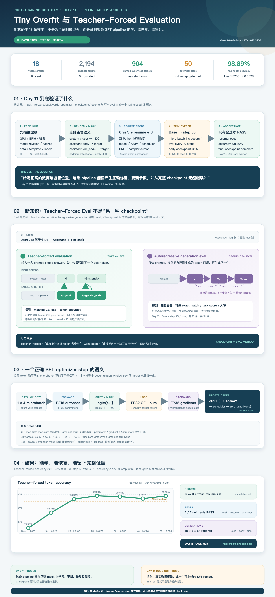

# Day 11 Lookback — Tiny Overfit 与 Teacher-Forced Evaluation

日期：`2026-08-06`

最终状态：`day11_pass`



可缩放版本：[SVG](../artifacts/reports/day11-tiny-overfit-retrospective.svg)

## 一句话结论

Day 11 用 18 条冻结样本刻意把 `Qwen3-0.6B-Base` 训练到接近完全记忆，验证了：

```text
数据与模板
→ assistant-only loss mask
→ shifted causal loss
→ forward / backward / optimizer step
→ checkpoint / fresh-process resume
→ teacher-forced eval / autoregressive generation
→ final acceptance
```

整条管线可以学习、可以恢复、可以重放并留下可审计证据。

这证明的是 **pipeline correctness**，不是模型泛化能力。

## 冻结实验契约

- 模型：`Qwen/Qwen3-0.6B-Base`，full SFT。
- 数据：18 条记录，2,194 个 encoded tokens，904 个 shifted supervised targets，无截断、无 packing。
- Batch：micro batch `1`，gradient accumulation `4`，即每个 optimizer step 看 4 条样本。
- Optimizer：AdamW，LR `1e-4`，betas `(0.9, 0.95)`，weight decay `0`。
- Scheduler：5-step linear warmup，之后 constant LR。
- Gradient clip：`1.0`。
- Dtype：FP32 parameters / gradients / Adam state，BF16 autocast forward，FP32 cross-entropy，无 GradScaler。
- Early stop：teacher-forced token accuracy ≥95%，但不允许早于 step 50 停止。

## 新知识：Teacher-forced evaluation

### 它是什么

Teacher-forced eval 把完整的参考 conversation 输入模型，但仍然遵守 causal attention：

```text
logits[t-1] → 预测 labels[t]
```

预测第 `t` 个答案 token 时，prefix 中包含的是此前的 **正确答案 token**，而不是模型自己生成的 token。

因此它：

- 不会看到当前或未来 target；没有 future leakage。
- 错误不会被回喂，所以不会像 generation 一样逐步累积。
- 很适合计算稳定的 masked loss 和 token accuracy。
- 很适合回答“模型有没有学会这些 target token”。

本次指标定义：

```text
mean loss
= 904 个有效 assistant targets 的 cross-entropy sum / 904

token accuracy
= 904 个有效 targets 中 argmax 预测正确的数量 / 904
```

### 它和 autoregressive generation 的区别

| | Teacher-forced eval | Autoregressive generation eval |
|---|---|---|
| 输入 | prompt + gold answer | 只有 prompt |
| 下一步上下文 | 前面的 gold tokens | 模型自己生成的 tokens |
| 错误传播 | 不累积 | 会累积 |
| 常用指标 | loss、perplexity、token accuracy | exact match、task score、人审 |
| 本次用途 | 检查 token-level 学习和训练 pipeline | 检查真正 free-running 的输出 |

两者都属于 eval；不能把 `eval` 等同于 generation。

Checkpoint 也不是某种 eval。Checkpoint 只是保存模型和训练状态；可以在当前内存模型上 eval，也可以加载 checkpoint 后 eval。

## Mask 与 causal loss

本次标签规则：

```text
system / user / template tokens → label = -100
assistant body tokens           → label = token_id
assistant <|im_end|>            → label = token_id
padding                         → attention_mask = 0, label = -100
```

要区分两种 mask：

- causal/attention mask：决定当前位置可以看到哪些输入位置；禁止看未来。
- supervised/loss mask：决定哪些 target 参与 loss；这里仅监督 assistant。

Loss 显式执行：

```python
shift_logits = logits[:, :-1]
shift_labels = labels[:, 1:]
valid = shift_labels != -100

loss_sum = cross_entropy(
    shift_logits.float(),
    shift_labels,
    ignore_index=-100,
    reduction="sum",
)
```

## 一个 optimizer step

```text
4 × [
  BF16 autocast forward
  → FP32 masked CE sum
  → loss_sum / 整个 accumulation window 的 supervised-token 总数
  → backward
]

→ clip_grad_norm_(1.0)
→ optimizer.step()
→ scheduler.step()
→ zero_grad(set_to_none=True)
```

关键点是 supervised-token-weighted accumulation。

四个 microbatch 的答案长度不同时，不能把四个 mean loss 简单等权平均；否则短答案和长答案会得到错误的梯度权重。

实际 trace 验证：

- 前 3 个 optimizer step 的 parameter checksum 全部变化。
- Gradient norm 有限且非零。
- Parameters、gradients、Adam state 全部为 FP32。
- 每一步 `zero_grad(set_to_none=True)` 后所有 gradient 都是 `None`。
- 实际顺序是 `forward → loss → backward → clip → optimizer → scheduler → zero_grad`。

## Resume probe

Day 11 比较了两条轨迹：

```text
A: uninterrupted 6 steps

B: 3 steps
   → 保存完整 checkpoint
   → 启动新的 Python 进程
   → 恢复到 step 6
```

Checkpoint 恢复：

- model weights
- Adam state
- scheduler state
- Python / Torch CPU / CUDA RNG
- optimizer step
- sample cursor
- global supervised-token count

逐 step 比较 sample order、loss、gradient、LR、model/optimizer/scheduler checksum 和 sampler cursor。

最终结果：

```text
status: pass
compared_steps: [1, 2, 3, 4, 5, 6]
mismatches: []
```

## 实际学习曲线

每次 teacher-forced eval 都使用相同的 904 个 supervised targets。

| 阶段 | Correct | Accuracy | Mean loss |
|---|---:|---:|---:|
| Base / step 0 | 683 / 904 | 75.55% | 1.32560 |
| Step 10 | 784 / 904 | 86.73% | 0.62035 |
| Step 20 | 873 / 904 | 96.57% | 0.18231 |
| Step 25 | 895 / 904 | 99.00% | 0.07024 |
| Step 30 | 890 / 904 | 98.45% | 0.05298 |
| Step 40 | 877 / 904 | 97.01% | 0.12765 |
| Step 50 / final | 894 / 904 | 98.89% | 0.05281 |

Step 20 已超过 95%，但冻结规则要求至少训练到 step 50，所以最终在 step 50 合法提前停止。

Accuracy/loss 不需要逐 step 单调；step 40 的短暂回退没有违反 gate。

## Generation 与测试结果

- Base generation：18 条。
- Step-25 early generation：18 条。
- Final generation：18 条。
- 合计：54 条 deterministic greedy generation。
- Day 11 单元测试：`7 / 7 PASS`。
- Resume comparison：`PASS`，`mismatches=[]`。

## 实际运行入口

正式运行位于 AutoDL 的 `tmux day11`：

```bash
export PYTHONUNBUFFERED=1
export DAY11_PYTHON=/root/miniconda3/bin/python
export DAY11_RUN_ROOT=/root/autodl-tmp/runs/day11-20260806-tmux-run

bash run-day11.sh
```

入口依次执行：

```text
bootstrap
→ fail-closed preflight
→ exact resume probe
→ Base teacher-forced eval + generation
→ tiny overfit + periodic teacher-forced eval
→ step-25 checkpoint + generation
→ final generation + final checkpoint
→ DAY11-PASS.json
```

## 关键远端产物

```text
/root/autodl-tmp/runs/day11-20260806-tmux-run/DAY11-PASS.json

/root/autodl-tmp/runs/day11-20260806-tmux-run/
  main/checkpoints/checkpoint-step-000050-final/

/root/autodl-tmp/runs/day11-20260806-tmux-run/
  resume-interrupted/checkpoints/checkpoint-step-000003/
```

## 正确解读

Day 11 证明：

- 数据与 label mask 能被准确重建。
- Forward/backward 和 supervised-token accumulation 能产生正确更新。
- 完整 checkpoint 可以精确恢复训练轨迹。
- Teacher-forced eval 与 generation 能使用相同冻结协议重放。

Day 11 不证明：

- 模型可以泛化到未见数据。
- 18 条样本代表真实数据分布。
- 这个 tiny-set recipe 可以用于生产训练。
- 记住这些答案等于模型能力提升。

Day 12 必须重新从同一个 frozen Base revision 开始，不能继承这个刻意过拟合的 checkpoint。
