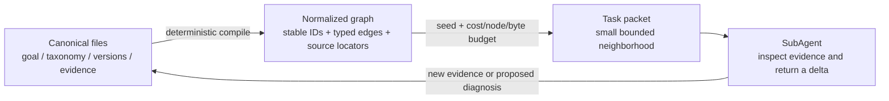

# RSI knowledge graph 与 SubAgent context packet

RSI 的知识组织采用三层模型：**文件系统保存事实，图保存关系，packet 保存当前
任务需要的最小投影**。图和 packet 都是可丢弃的派生物，不是新的事实源。



## 1. 为什么不拆成数百个手写文件

细粒度首先是**语义粒度**，不等于一个 leaf 必须占一个物理文件。当前两份 registry
已经有稳定 ID：

- `failure-taxonomy.json`：symptom、failure family/topic/mode、alias、crosswalk、case；
- `taxonomy.json`：intervention family/topic/leaf。

若再为每个 ID 维护一个文件，就会出现两份定义、两处 parent 关系和两套 revision。
因此每个原子节点使用以下地址：

```text
stable node ID
  + repo-relative source path
  + JSON Pointer
```

例如：

```text
failure.data.supervision.template_rendering
failure-taxonomy.json#/failure_modes/16
```

这已经能让 agent 精确打开一个 leaf；无需加载或复制整份 taxonomy。证据节点额外
记录当前文件的 SHA-256 与字节数，但 packet 不复制大段证据正文。

## 2. 文件系统的职责边界

```text
rsi-control/
├── goal.json                    # 当前成功标准与 action space
├── state.json                   # 当前 goal/version/action
├── failure-taxonomy.json        # failure/symptom registry 的唯一事实源
├── taxonomy.json                # intervention registry 的唯一事实源
├── TAXONOMY.md                  # first-broken-invariant 判定方法
├── versions/rsi-vNNNN/          # append-only diagnosis/run/evidence ledger
├── rsi_context.py               # graph compiler、search、packet builder
└── CONTEXT-GRAPH.md             # 本协议
```

如果需要保存完整 graph、临时 packet 或 SVG/PNG，应写入显式的 generated/report
目录；它们必须能由上述 canonical files 重建，不得被 controller 当作输入。某个
packet 若实际影响了版本决策，再把该 packet 的 hash 和对应 graph hash 写入该版本
的 append-only evidence，而不是让临时文件反向成为真相。

为防止生成命令误覆盖 canonical 或 append-only 文件，`--output` 位于
`rsi-control` 内时只允许写到 `generated/`；也可以写到 repo 的报告目录或 `/tmp`。
反过来，`generated/` 永远不能作为 diagnosis/case evidence source，且写出前会
再次验证 output 不与 graph/packet 的任何 source file 重合。

## 3. 图中的节点和边

当前 compiler 生成以下节点：

- `state`、`goal`、`version`、未来版本的 `diagnosis`；
- diagnosis 内的 atomic observation、failure hypothesis、excluded hypothesis、
  prediction、falsifier、frozen invariant 与 guardrail；
- `symptom`；
- `failure_family`、`failure_topic`、`failure_mode`；
- `intervention_family`、`intervention_topic`、`intervention_leaf`；
- `legacy_alias`、`case`、`evidence`。

主要关系包括：

| 关系 | 含义 |
|---|---|
| `parent` | taxonomy 子节点指向父节点 |
| `observed_as` | case/diagnosis 观察到 symptom |
| `primary_failure` | 最先被证据定位的 broken invariant |
| `contributing_failure` | 必要但非首个 failure |
| `excluded_failure` | 已有证据排除的替代解释 |
| `candidate_intervention` | 示例性候选 lever，不代表当前获准 |
| `*_primary_intervention` | case/diagnosis 的 primary lever |
| `*_dependent_intervention` | 机械上不可分割的 dependent lever |
| `requires` | primary lever 在这个 case 中为何需要 dependent lever |
| `allows_prefix` | 当前 goal 的 action-space 边界 |
| `supported_by` | claim/case 指向 immutable evidence locator |

未来 structured diagnosis 还会被拆成 observation、primary failure hypothesis、
excluded hypothesis、prediction、falsifier、frozen invariant 和 guardrail 等 claim
节点；证据挂在具体 claim，而不是笼统挂在 diagnosis 容器上。这里故意没有通用
`related_to`。关系必须说明为什么要把两个节点一起放进 context。
同时，`candidate_intervention` 只是 crosswalk 示例；最终权限仍由 `goal.json` 决定。

每个节点都保留 `source.path` 和 `source.pointer`，每条边都保留创建它的 locator；
同一关系若被多个字段声明，则保留排序后的 `locators`。
完整 graph 还绑定所有输入文件的排序 hash 集合、`source_set_sha256` 和
`graph_sha256`。因此 SubAgent 可以从结论回到节点，再回到具体源字段和证据文件。
Diagnosis graph ID 使用 `diagnosis:<version_id>:<diagnosis_id>`，所以不同版本可以
保留相同的本地 diagnosis 编号而不发生全局冲突。

## 4. 小 context 的检索协议

先定位 node ID，再生成有预算的邻域：

```bash
cd learning/post-training-30-day-bootcamp/rsi-control

python3 rsi_context.py search "catastrophic forgetting"

python3 rsi_context.py pack \
  --seed failure.training.transfer.catastrophic_forgetting \
  --max-cost 3 \
  --max-nodes 20 \
  --max-bytes 16000 \
  --output /tmp/rsi-retention-context.json
```

也可以从 symptom、case、version、lever 或 evidence 开始。多次传入 `--seed` 可把
两个明确 anchor 放在同一个 packet 中。

遍历不是无差别 BFS：

- leaf → parent 的成本低，parent → 所有 children 的成本高，避免把整棵树装入；
- primary failure、symptom、决定性 evidence、canonical intervention 的成本低；
- excluded alternative、历史版本和 broad priority 的成本更高；
- 当前 `goal` 始终是 mandatory policy node，内含 allowed lever prefixes、claim
  boundary 和 forbidden actions，避免把“taxonomy 中存在”误读为“本轮获准”；
- packet 内每个 intervention 节点还会标记 `allowed`、`partially_allowed` 或
  `outside_current_goal`；
- visited set 保证合法的 citation/backlink 环不会重复节点；
- `max_nodes` 与最终 pretty-printed JSON 的 `max_bytes` 同时生效；若 seed 本身及
  provenance 已超预算，直接失败，不静默裁掉 anchor。

相同 canonical inputs、参数和生成器版本会得到相同 graph/packet hash。packet 中的
`selection` 明确记录可达、纳入和因预算省略的节点数。

完整 graph 可按需导出：

```bash
python3 rsi_context.py graph --output /tmp/rsi-context-graph.json
```

## 5. SubAgent 的最小输入与返回

给 SubAgent 的任务应包含：

1. 一个清楚的 objective；
2. 一个 packet，而不是整份 repo 历史；
3. 可执行动作和 writable scope；
4. 完成条件；
5. 要求它引用 packet 中的 node ID、source locator 和 evidence hash。

推荐工作流：

```text
symptom/case seed
→ packet 定位 first broken invariant 与相邻 alternatives
→ SubAgent 只打开 decisive evidence
→ 返回 supported / contradicted / unresolved
→ root 校验证据和 scope
→ 写入新 version diagnosis 或追加 operational evidence
```

SubAgent 不直接修改全局 taxonomy 来“修正结论”。如果发现新 failure leaf、错误
crosswalk 或新证据，它应返回一个小 delta：新增/废弃建议、来源 locator、影响范围
和验证方法，由 root 在当前 graph head 上统一合并。历史 v0001/v0002 文件仍保持
append-only。

## 6. v0001 → v0002 的定位示例

```bash
python3 rsi_context.py pack \
  --seed case-rsi-v0001-v0002-leading-four-spaces \
  --max-nodes 18 \
  --max-bytes 14000 \
  --output /tmp/rsi-four-spaces-context.json
```

这个 packet 会优先包含：

- 四个 observed symptoms；
- `template_rendering` primary failure；
- `mask_materialization` contributor；
- `boundary_tokens` primary intervention；
- `token_eligibility` necessary dependent intervention；
- 四个原始 evidence locator 及 SHA-256；
- 最邻近的 excluded alternatives 与 legacy alias。

也就是说，agent 只需约十几个节点就能理解“看到什么、最先哪里坏、哪些解释被
排除、改了什么、证据在哪里”，而不需要把 270 个 failure modes、208 个 lever
leaves 和全部 run logs 一起塞入上下文。

## 7. 约束与后续演进

- graph/packet 只读 canonical files，不扫描任意目录；证据 ref 必须是
  `rsi-control` 根目录内的普通相对文件；绝对路径、`..`、symlink escape、缺失文件
  和超大输入都会 fail closed。
- `./x`、重复分隔符等 lexical alias 会先规范化成唯一 repo-relative POSIX
  identity；大小写、Unicode normalization 或 hardlink 导致的物理 alias 按
  `(device, inode)` 检出并拒绝。文件通过 `O_NOFOLLOW`、descriptor `fstat` 和
  bounded read 打开。CLI 在 graph
  编译前后各运行一次 controller validation，并再次核对全部 graph source hash。
- 物理 graph database、vector database 和 one-file-per-node 暂不需要；当前规模下
  内存 graph 足够，且更易确定性验证。
- taxonomy family 图适合用于导航，不等于因果图。真正的因果关系应逐版本写在
  structured diagnosis 和不可变 evidence 中。
- 下一步若要支持“只抽取证据中的一段”，应把未来 diagnosis 的 evidence ref
  升级为 `path + expected_sha256 + JSON Pointer/line selector`，再由 packet builder
  验证并摘取；不要用模糊路径猜测。
