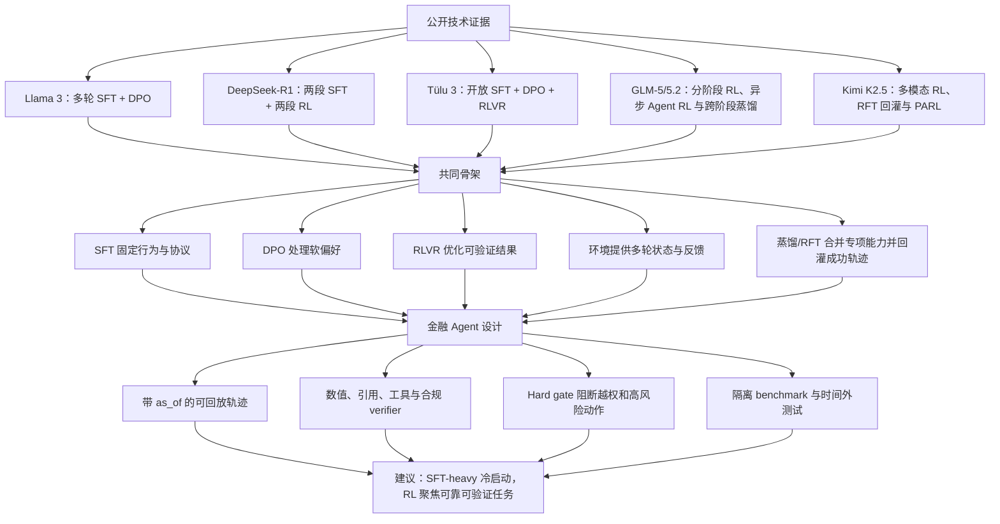
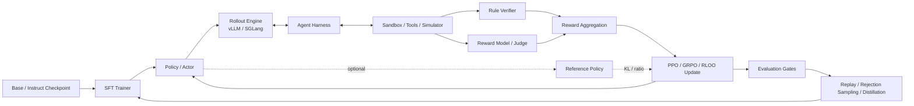
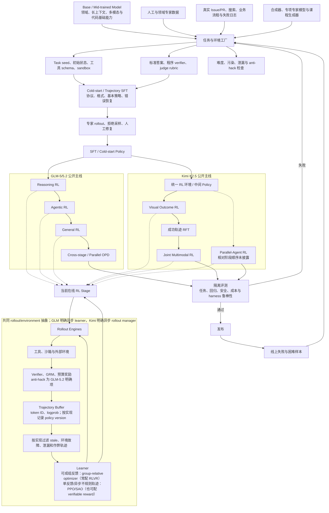

# 2026 Post-Training 技术版图与金融 Agent 实践指南

> 研究日期：2026-07-24
>
> 核心问题：Post-training 当前主要训练什么、常见架构是什么、SFT/RL 如何理解配比，以及金融 Agent 的训练数据与落地方案应如何设计。最新模型部分覆盖 GLM-5.1、GLM-5.2、Kimi K2.5 与截至当日已公开的 Kimi K3 信息。

## 执行摘要

截至 2026 年，主流大模型的 post-training 已经从早期单一路径的 `SFT → Reward Model → PPO`，演化为多阶段、可迭代的数据与训练闭环：

```text
强 Base / Instruct 模型
  → SFT：指令、格式、工具协议、基本轨迹
  → 可选 DPO：开放式偏好、安全边界、回答风格
  → RLVR / Agent RL：可验证推理、工具使用、长程任务
  → 拒绝采样、失败回放、蒸馏
  → 回灌 SFT / Preference Data
```

本报告的核心结论如下。

1. **模型网络通常不因 post-training 而改变。**底座仍以 decoder-only Transformer 为主，可能是 Dense 或 MoE；真正复杂的是训练系统，包括 policy、rollout engine、reference model、reward/verifier、沙箱环境，以及可选的 reward model 和 critic。
2. **不存在可迁移的“行业统一 SFT/RL 百分比”。**SFT example、DPO pair、RL prompt、rollout、episode、token、update step 和 GPU FLOPs 是不同分母。任何不说明分母的 `70% SFT + 30% RL` 都缺乏可比性。
3. **现代通用模型往往采用多阶段组合。**[Llama 3](https://arxiv.org/abs/2407.21783) 采用多轮 SFT+DPO；[DeepSeek-R1](https://arxiv.org/abs/2501.12948) 采用冷启动 SFT、推理 RL、拒绝采样 SFT 和第二轮 RL；[GLM-5](https://arxiv.org/abs/2602.15763) 则公开了 `多任务 SFT → Reasoning RL → Agentic RL → General RL → 跨阶段 on-policy distillation`。
4. **Agent post-training 的核心增量不是更多问答，而是可执行环境。**训练数据需要覆盖工具选择、参数生成、观察结果、状态转移、失败恢复和任务级 reward；[GLM-5](https://arxiv.org/abs/2602.15763) 与 [Kimi K2.5](https://arxiv.org/abs/2602.02276) 已把异步 rollout、环境池、可验证 reward、轨迹回灌和多 Agent 调度推到主流程。
5. **金融 Agent 的正确训练单元是带时点、证据和合规状态的可回放 episode。**实时行情、产品状态和法规应主要保留在 RAG/工具层；训练模型如何检索、核验、计算、引用、拒绝和升级人工，而不是让参数记忆不断变化的事实。
6. **如果从较强的 Instruct 模型开始做 pilot，建议按 unique task seed 以约 `SFT:RL = 10:1` 起步。**例如 50k unique SFT task seeds（首轮每个 seed 保留 1 条 accepted trajectory）、10k–20k preference pairs、5k RL task seeds；其中可成组的任务每个 seed 采 8 条 rollout，单反馈/超长异步任务则从单 rollout + critic 开始。该数字是工程初始假设，不是行业事实，更不代表 token 或 compute 比例。
7. **金融 reward 必须采用“硬约束优先”。**未经授权的资金动作、适当性违规、隐私泄露和未来信息泄漏不能被其他奖励抵消；数值、引用、工具参数等再采用可执行 verifier，LLM judge 只处理清晰度等主观残差。
8. **2026 年的新变化是 RL 算法开始按轨迹与反馈形态分工。**当同一 prompt 能稳定获得多条可比较反馈时，GLM-5 Reasoning RL 与 Kimi K2.5 证明 group-relative 方法仍有效；当任务只有单次昂贵反馈、异步 straggler 明显、环境会变化或 context compaction 产生不规则子轨迹时，GLM-5.2/SAO 表明带 critic 的 single-rollout 路线更合适。这里不是简单的“数学用 GRPO、Agent 用 PPO”。
9. **“K3 已发布”不等于“K3 技术报告已发布”。**Kimi K3 产品和 API 已于 2026-07-16 上线，但截至本报告研究日，官方只承诺完整权重最迟于 2026-07-27 发布，训练细节将在后续技术报告中补充，并未明确两者同日发布。因此本报告只记录官方已披露的架构与 SFT 阶段 QAT，不把 K2.5 的 RL/PARL 配方推断为 K3 的事实。

## 目录

1. [研究范围与方法](#1-研究范围与方法)
2. [当前 post-training 主要在训练什么](#2-当前-post-training-主要在训练什么)
3. [Post-training 架构](#3-post-training-架构)
   - [2026 最新模型：GLM-5.1/5.2 与 Kimi K2.5/K3](#35-2026-最新模型glm-5152-与-kimi-k25k3)
4. [SFT 与 RL 的比例](#4-sft-与-rl-的比例)
5. [Post-training 数据一般是什么样](#5-post-training-数据一般是什么样)
6. [金融 Agent 完整数据例子](#6-金融-agent-完整数据例子)
7. [金融 Reward 与 Verifier 设计](#7-金融-reward-与-verifier-设计)
8. [金融场景的公开数据与案例](#8-金融场景的公开数据与案例)
9. [推荐 Guide 与实现框架](#9-推荐-guide-与实现框架)
10. [建议的金融 Agent 落地方案](#10-建议的金融-agent-落地方案)
11. [风险与不确定性](#11-风险与不确定性)
12. [证据表](#12-证据表)
13. [最终建议](#13-最终建议)
14. [参考来源](#14-参考来源)

## 信息链条图



## 1. 研究范围与方法

### 1.1 研究范围

本报告将 post-training 定义为预训练底座完成之后，为获得可用行为、推理、偏好、安全和 Agent 能力而进行的训练。

需要特别区分：

- **Continued Pretraining（CPT）**：继续用领域文本做 next-token prediction，通常仍属于 pre-training 或 mid-training 范畴。
- **SFT / Instruction Tuning**：用示范回答或示范轨迹训练目标行为。
- **Preference Optimization**：用成对偏好或 reward model 对齐开放式回答。
- **Online RL / RLVR**：模型在线采样，再由环境、规则或 learned reward 给反馈。
- **Agent Post-training**：rollout 跨越多轮工具调用和状态变化，reward 作用于完整任务或中间步骤。

金融项目里经常将 CPT、SFT、DPO、RL 统称为“后训练工程”，但比较公开比例时必须保留以上边界。

### 1.2 证据选择

核心事实优先采用以下一手来源：

- 模型论文和官方技术报告；
- 官方训练代码与复现文档；
- 官方 Hugging Face 数据集；
- benchmark 原始仓库与论文。

博客、媒体和二手整理未用于支撑核心定量结论。报告中的工程配方被明确标记为“建议”，不冒充公开事实。

## 2. 当前 post-training 主要在训练什么

| 能力目标 | 优先方法 | 典型训练单元 | 为什么适合 |
| --- | --- | --- | --- |
| 指令遵循、结构化输出 | SFT | `prompt → response` | 直接学习目标格式，稳定、可控 |
| 工具协议、基本工作流 | Trajectory SFT | 多轮 `assistant → tool → observation` | 行为克隆能快速学会工具 schema 和基本顺序 |
| 回答风格、帮助性、拒答边界 | DPO / RM | `(prompt, chosen, rejected)` | 目标主观，难以写 exact-match verifier |
| 数学、代码、SQL、财务计算 | RLVR / GRPO / PPO | `task + verifier + online rollout` | 最终结果可通过执行器或规则验证 |
| 长程 Agent 规划与错误恢复 | Agent RL | state、action、observation、task reward | 需要探索不同轨迹，而不是模仿单一路径 |
| 安全、隐私和合规 | SFT + DPO + RL + red team | 违规、边界、benign neighbor | 既要拒绝危险请求，也要避免过度拒答 |
| 能力压缩到小模型 | Rejection sampling / Distillation | teacher-generated response/trajectory | 用强模型产生高质量密集监督 |

### 2.1 SFT 的角色

SFT 最适合解决“模型应该怎样说、怎样调用工具、怎样组织一次基本任务”等问题。它的优势是稳定、训练简单、样本利用率高。

SFT 的局限是：

- 它倾向于模仿单条标准轨迹，而不是探索更优策略；
- 它无法自然学习延迟奖励；
- 错误轨迹如果被清洗掉，模型可能从未学过超时、空结果、权限失败和自我纠错；
- 单纯增加 SFT 不能保证长程任务成功率。

### 2.2 Preference Optimization 的角色

经典 RLHF 使用人类偏好训练 reward model，再通过 PPO 优化 policy。[InstructGPT](https://arxiv.org/abs/2203.02155) 是这一架构的代表。

[DPO](https://arxiv.org/abs/2305.18290) 将偏好优化改写为直接作用于 chosen/rejected 的分类式目标：

- 不需要独立训练 reward model；
- 不需要在线生成 rollout；
- 训练系统显著轻于 PPO；
- 适合风格、帮助性、拒答边界和开放式质量偏好。

DPO 常被宽泛地归入 RLHF，但它本质上是 offline preference optimization，不能和在线 RL 的 prompt/episode 直接合并统计。

### 2.3 RLVR 的角色

RLVR，即 Reinforcement Learning with Verifiable Rewards，适合 reward 可以可靠计算的任务：

- 数学答案；
- 代码编译和单元测试；
- SQL 执行结果；
- 账目是否平衡；
- 财务公式和数值；
- JSON schema、工具参数、流程约束；
- 引用是否来自允许的数据快照。

[DeepSeekMath](https://arxiv.org/abs/2402.03300) 提出的 GRPO 对同一 prompt 采样一组回答，用组内相对 reward 构造 advantage，省掉了 PPO 中额外的 learned critic/value model。[DeepSeek-R1](https://arxiv.org/abs/2501.12948) 进一步展示了规则 accuracy reward 和 format reward 在推理训练中的作用。

RLVR 的关键前提不是“有一个看起来合理的 reward”，而是 reward 与目标行为高度一致。错误的 reward 会导致：

- reward hacking；
- 只优化格式而不优化内容；
- 为了高 PnL 过度承担风险；
- 学会迎合 LLM judge；
- 用未来数据、泄漏答案或绕过工具环境。

### 2.4 Agent post-training 的角色

Agent 训练与单轮推理最大的不同是 rollout 中存在真实状态变化：

```text
state
  → model action / tool call
  → environment executes
  → observation
  → updated state
  → next action
  → ...
  → task-level result
```

[Kimi K2 技术报告](https://arxiv.org/abs/2507.20534) 描述了从真实和合成工具 spec 出发，生成 agent、task、rubric 与 trajectory，再通过 stateful simulator、真实沙箱和 judge 过滤的流程。报告披露其使用 3,000+ 真实 MCP 工具和 20,000+ 合成工具，最终形成数万条 agentic SFT 样本。

[GLM-5](https://arxiv.org/abs/2602.15763) 和 [Kimi K2.5](https://arxiv.org/abs/2602.02276) 又把这一流程推进到异步 Agent RL、成功轨迹 RFT/跨阶段蒸馏、compact trajectory 与多 Agent orchestrator 训练；详见第 3.5 节。

较开放的 Agent recipe 可参考 [DR Tulu](https://github.com/rlresearch/dr-tulu)：先用多工具检索轨迹做 SFT，再在 search/browser 环境中进行在线 RL，并把任务正确性、证据和引用纳入 reward。

## 3. Post-training 架构

“Post-training 架构”至少包含两个不同问题：模型本身的网络架构，以及完整训练系统的系统架构。

### 3.1 模型层

模型层通常仍是：

- autoregressive decoder-only Transformer；
- Dense 或 Mixture-of-Experts；
- 在已有 Base 或 Instruct checkpoint 上继续训练；
- 采用 full fine-tuning、LoRA 或 QLoRA。

对于金融 Agent，通常更现实的起点是一个已经具备通用指令遵循、代码、数学和工具调用能力的 Instruct 模型，而不是从 Base 模型重新教全部对话能力。

如果从 Base 模型开始，需要更大规模、更广覆盖的 SFT；如果从强 Instruct 模型开始，领域数据可以更聚焦于：

- 金融术语和任务；
- 工具协议；
- 计算与证据；
- 合规边界；
- 时间一致性；
- 业务流程。

### 3.2 训练系统层



典型组件如下。

| 组件 | 作用 | 是否总是需要 |
| --- | --- | --- |
| Policy / Actor | 当前被训练的模型 | 是 |
| Rollout Engine | 高吞吐生成在线样本 | 在线 RL 需要 |
| Reference Policy | KL 或 probability ratio 参考 | DPO/PPO/部分 GRPO 常见 |
| Reward Model | 对主观答案打标量分数 | 可选 |
| Critic / Value Model | 估计 value，降低 PPO 方差 | PPO 常见，GRPO 通常不需要 |
| Rule Verifier | exact match、单测、执行结果、政策规则 | RLVR 核心 |
| Agent Harness | 运行工具循环、维护上下文和状态 | Agent RL 核心 |
| Sandbox / Simulator | 隔离执行、模拟用户和业务状态 | Agent RL 核心 |
| Trajectory Store | 保存 prompt、action、observation、reward | 训练、审计和回放需要 |
| Evaluation Gates | 决定是否继续训练或发布 | 生产系统需要 |

### 3.3 不同优化方法的横向比较

| 路线 | 主要组件 | 优势 | 局限 | 更适合 |
| --- | --- | --- | --- | --- |
| SFT only | policy + labeled data | 最简单、稳定、便宜 | 不会在线探索 | 工具格式、基础行为、蒸馏 |
| SFT + DPO | policy + reference + pairs | 不需要 RM 和 rollout | 依赖偏好对质量 | 风格、安全、开放式质量 |
| SFT + RM + PPO | policy + reference + RM + critic + rollout | 能优化主观 reward | 系统重、容易 reward hacking | 有成熟偏好标注的大规模对齐 |
| SFT + group-relative optimizer + verifiable reward | policy + rollout + verifier + reference/old policy | 通常不需要 critic，可利用组内可执行反馈 | 需要稳定构造同 prompt 的可比较 group | 数学、代码、工具、金融计算 |
| Trajectory SFT + group-relative Agent RL | 上述组件 + tool env + state + simulator | 无 critic，适合可成组比较的工具任务 | 不适合长度和子轨迹数量高度不均的 episode | 中短程检索、代码、可验证工具任务 |
| Trajectory SFT + critic-based PPO/SAO | policy + critic + async rollout + compact trajectory | 单条长 rollout 可训练，能处理不规则 sub-traces | value 训练和异步稳定性更复杂 | 超长研究、SWE、terminal 与复杂业务 Agent |
| SFT/RL + RFT/OPD | 专项 checkpoints + 成功轨迹 + on-policy student states | 回灌成功轨迹、合并专项能力、缓解遗忘 | teacher、prompt mixture 与筛选成本高 | 多阶段通用 Agent |

### 3.4 纵向演化：2022—2026

| 阶段 | 代表工作 | 主要变化 |
| --- | --- | --- |
| 2022 | [InstructGPT](https://arxiv.org/abs/2203.02155) | 建立 SFT→RM→PPO 的经典 RLHF 路线 |
| 2023 | [DPO](https://arxiv.org/abs/2305.18290)、[Toolformer](https://arxiv.org/abs/2302.04761) | 偏好优化变轻；工具调用开始进入训练数据 |
| 2024 | [Llama 3](https://arxiv.org/abs/2407.21783)、[Tülu 3](https://arxiv.org/abs/2411.15124) | 多轮数据飞轮、DPO 和开放 RLVR recipe 逐渐成熟 |
| 2025 | [DeepSeek-R1](https://arxiv.org/abs/2501.12948)、[Kimi K2](https://arxiv.org/abs/2507.20534) | 公开报告集中出现推理 RL、多阶段 SFT/RL 与 Agent 数据合成 |
| 2026 | [GLM-5/5.2](https://arxiv.org/abs/2602.15763)、[SAO](https://arxiv.org/abs/2607.07508)、[Kimi K2.5](https://arxiv.org/abs/2602.02276) | 分阶段 Agent RL、异步环境、轨迹压缩、critic 回归、跨阶段蒸馏和并行 Agent RL 成为公开主线 |

2026 年仍没有统一标准架构；这一行表示公开研究的重心，而不是所有厂商都采用同一配方。

### 3.5 2026 最新模型：GLM-5.1/5.2 与 Kimi K2.5/K3

这一节只采用截至 **2026-07-24** 已公开的一手材料。先明确披露边界：

| 模型 | 发布时间 / 报告时间 | 已公开的一手材料 | Post-training 可见度 |
| --- | --- | --- | --- |
| GLM-5 | 2026-02 | [完整技术报告](https://arxiv.org/abs/2602.15763)、[官方仓库](https://github.com/zai-org/GLM-5) | 较高：SFT、三类 RL、Agent 环境、异步训练和跨阶段蒸馏均有说明 |
| GLM-5.1 | 2026-04-07 | [官方发布记录](https://docs.z.ai/release-notes/new-released)、[模型卡](https://huggingface.co/zai-org/GLM-5.1) | 较低：只确认 multi-turn SFT、RL 和 process-quality evaluation，没有独立完整技术报告 |
| GLM-5.2 | 2026-06-16 | [官方发布博客](https://z.ai/blog/glm-5.2)、[模型卡](https://huggingface.co/zai-org/GLM-5.2)、[SAO](https://arxiv.org/abs/2607.07508) | 中高：公开了 compact trajectory、single-rollout PPO/SAO、parallel OPD 和 anti-hack，但没有披露完整数据量与算力 |
| Kimi K2.5 | 技术报告提交于 2026-02-02 | [完整技术报告](https://arxiv.org/abs/2602.02276)、[官方仓库](https://github.com/MoonshotAI/Kimi-K2.5) | 较高：多模态继续预训练、SFT、RL、RFT、PARL、reward 与环境系统均有说明 |
| Kimi K3 | 产品/API 于 2026-07-16 上线 | [官方发布博客](https://www.kimi.com/blog/kimi-k3)、[官方研究索引](https://www.kimi.com/en/blog/) | 截至研究日较低：产品已上线，但完整权重和技术报告尚未发布 |

这里最容易产生两个误解：

1. **GLM-5.1/5.2 并没有各自一份与 GLM-5 报告同等完整的技术报告。**理解 5.2 需要把 GLM-5 总报告、5.2 官方博客和 SAO 论文拼成证据链；不能把 SAO 在小模型 testbed 上公开的全部超参数当作 GLM-5.2 的真实超参数。
2. **Kimi K3 “已经发布”是产品事实，不是技术报告事实。**官方博客写明完整权重最迟于 2026-07-27 发布，架构、训练和评测细节将随技术报告补充。以下 K3 小节因此只写已确认项。

#### 3.5.1 2026 前沿 Agent post-training 的完整主链路

把 GLM-5/5.2 与 Kimi K2.5 的共同底座和各自阶段分开后，当前更准确的整体架构是：



上图把共同的 rollout/environment 抽象与两家不同的阶段结构分开。GLM 路线是顺序专项 RL 后做 OPD；K2.5 明确公开了 `Visual Outcome RL → RFT → subsequent Joint RL`，也公开了 PARL orchestrator，但没有披露 PARL 相对 joint RL 的严格 checkpoint 顺序。`RFT`、`PARL`、`OPD` 都不是全行业必经阶段。虚线表示某阶段复用训练闭环或相对顺序未披露，不表示额外的串行步骤。“发布失败后回到任务工厂”的具体门槛属于建议的生产工程补全。

这条主链路说明，当前 Agent 模型不是一次 `SFT + RL` 就结束，而是三个相互咬合的闭环：

- **环境闭环**：真实或合成任务 → 可执行环境 → verifier → 难度与反作弊过滤；
- **策略闭环**：SFT 冷启动 → 在线 rollout → RL 更新 → 更强策略生成更难数据；
- **能力合并闭环**：专项 RL checkpoint → 厂商选择 RFT、蒸馏或 mixed RL → 恢复/合并能力并减少灾难性遗忘。

#### 3.5.2 GLM-5 主干：分阶段 SFT/RL，再做跨阶段蒸馏

[GLM-5 技术报告](https://arxiv.org/html/2602.15763) 给出的主干可以概括为：

```text
通用预训练
  → 长上下文与 Agent 数据 mid-training
  → Multi-task SFT
  → Reasoning RL
  → Agentic RL
  → General RL
  → On-policy Cross-stage Distillation
  → 最终通用 Agent 模型
```

##### 模型与 mid-training

GLM-5 是 MoE decoder 模型，官方总体口径约为 744B 总参数、40B 激活参数、256 个 routed experts，并采用 MLA、DSA 和 MTP。技术报告披露的 base 训练量为 28.5T tokens；mid-training 逐步把 context 从 32K 扩展到 128K、再到约 200K，并提高长文档、代码仓库和 synthetic agent trajectory 的比例。

模型网络与 post-training 系统要分开理解：

- MoE、MLA、DSA、MTP 解决模型容量、长上下文和推理效率；
- SFT、RL、环境、verifier、蒸馏才是行为和 Agent 能力的 post-training；
- 更长 context 只有配合长轨迹数据、稳定的 rollout 和 credit assignment 才会转化为长程 Agent 成功率。

##### Multi-task SFT

GLM-5 的 SFT 包含三大类：

- General Chat；
- Reasoning；
- Coding & Agent。

技术报告还披露在 SFT 阶段加入 INT4 quantization-aware training，使后训练目标同时适配后续低比特部署；这属于训练—推理协同，不应计作一个额外的对齐数据阶段。

Coding/Agent 数据不是只保留完美答案。官方描述的做法是：

1. 在大量可执行环境里用 expert RL 或强策略生成长轨迹；
2. 结合 rejection sampling 选择高质量样本；
3. 对发生错误但随后成功恢复的轨迹，保留完整上下文；
4. 对错误 action 对应的 token 做 loss mask，避免模仿错误本身；
5. 让模型仍然看到“错误发生后如何诊断和恢复”。

这对金融 Agent 很重要：工具超时、空结果、数据版本冲突和权限失败不应全部从训练集删掉；应保留恢复上下文，同时只监督正确的决策段。

##### 三类 RL

| 阶段 | 任务与算法 | Reward | 主要目的 |
| --- | --- | --- | --- |
| Reasoning RL | 完全 on-policy 的 GRPO + IcePop 类稳定机制；同 prompt group size 32 | 数学、科学、代码、tool-integrated reasoning 各自使用二值 outcome judge 或执行结果 | 强化可验证推理 |
| Agentic RL | coding/search Agent；训练与 rollout 解耦、全异步 | 环境任务成功、测试、搜索证据等 | 强化长程工具策略 |
| General RL | 通用正确性、情商和任务质量 | deterministic rules + ORM + GRM，并用人工高质量回答作为风格锚点 | 恢复通用性、风格和软质量 |

Reasoning RL 的公开 group/batch 参数不等于 SFT/RL 比例。GLM-5 仍未披露可直接比较的 SFT token、RL rollout token 和 GPU-hours。

##### Cross-stage on-policy distillation

顺序做多轮专项 RL 容易出现能力遗忘。GLM-5 最后把前面阶段的最终 checkpoints 当作 teachers：

1. 混合各阶段的 prompt pools；
2. student 在自己会访问的状态上生成；
3. teacher 为这些 on-policy 状态提供分布或监督；
4. 用 cross-stage OPD 恢复 SFT、Reasoning RL 和 General RL 阶段的能力。

公开文本没有明确列出 Agentic RL checkpoint 是否单独作为该 OPD 的 teacher，因此本报告不把它列为已确认项。这种 on-policy 蒸馏比静态离线蒸馏更贴近最终策略实际访问的状态分布。

#### 3.5.3 GLM-5.1 与 GLM-5.2 分别新增了什么

##### GLM-5.1：能力升级明确，配方披露有限

官方在 [GLM-5.1 发布记录](https://docs.z.ai/release-notes/new-released) 中确认了 multi-turn SFT、RL 和 process-quality evaluation，目标是更长时间的自主工程任务；但没有公开：

- SFT 样本数或 token 数；
- RL 算法、reward 构成和 episode 数；
- process-quality evaluation 如何进入 loss；
- 与 GLM-5 各阶段 checkpoint 的继承关系；
- SFT/RL 的任何可比比例。

因此，GLM-5.1 适合用于观察能力方向，不足以恢复一套训练 recipe。

##### GLM-5.2：长上下文 Agent 迫使训练系统改变

[GLM-5.2 官方博客](https://z.ai/blog/glm-5.2) 披露了五组重要变化：

1. **1M context 与 IndexShare。**每四个 DSA layer 共享一个 indexer；IndexShare 从 128K mid-training 阶段开始训练，并加入大型实现、自动研究、性能优化和复杂调试等 1M-context coding-agent 场景。
2. **更复杂的 Agent rollout。**`slime` 支持 white-box、black-box、compact trajectory 和 sub-agent workflow；任务规模更大、领域更多、执行方式更复杂。
3. **Parallel OPD。**超过十个专项 expert checkpoints 并行蒸馏进最终模型，官方称整个 OPD 阶段约两天；各专家身份、数据混合比例和算力没有公开。
4. **在线 anti-hack。**先用高召回规则检查可疑 tool call，再由 LLM judge 判断意图；确认作弊时阻断真实调用、返回 dummy observation，并让 rollout 继续，而不是直接终止整条轨迹。
5. **MTP 与服务协同。**MTP 结合 IndexShare、KVShare、speculative-decoding rejection sampling 和端到端 TV loss；官方消融把平均 acceptance length 从 4.56 提高到 5.47（约 +20%），并称 IndexShare 在 1M context 下把 indexer 的 per-token FLOPs 降低约 2.9 倍。

官方将在线 anti-hack 的价值解释为：避免 abruptly stopped rollouts 引发训练不稳定或模型坍塌，同时保留后续恢复轨迹。它不代表生产金融系统可以放行被拦截的真实动作；第 7.1 节会区分训练沙箱与生产 hard gate。

#### 3.5.4 为什么 GLM-5.2 从 group-wise RL 转向 single-rollout PPO/SAO

这是最新公开材料中最值得关注的算法变化。

Group-relative 方法较适合以下数据形态：

- 同一个 prompt 能稳定获得多条可比较的反馈；
- 等待完整 group 的 straggler 成本可接受；
- rollout policy lag 较小；
- 环境在同组采样期间相对稳定；
- reward 和长度归一化能形成合理的组内基线。

GLM-5.2 的部分超长 Agent trajectory 则不同。context compaction 会把一次 episode 切成数量、长度都不相等的 trainable sub-traces；外部环境可能昂贵且持续变化；部分 prompt 只有一次有效反馈；长尾 rollout 还会拖慢整组样本。

这里需要分开三层证据：

1. **GLM-5.2 官方博客确认的生产做法**：context compaction 后让所有有效 sub-traces 进入训练，并以 token-level loss 处理数量和长度不均。
2. **[SAO: Single-Rollout Asynchronous Optimization](https://arxiv.org/abs/2607.07508) 补充的算法设计**：用 single rollout 和 value model 估计 advantage；使用严格双侧 token-level clipping；GAE 跳过环境 observation，只连接相邻 action；通过 value pretraining、较高 critic 更新频率等机制稳定训练。
3. **GLM-5 基础设施层做法**：记录 policy version、过滤 stale trajectory，并用 TITO 保留精确 token/logprob 对应关系。

因此，GLM-5.2/SAO 的组合路线具有以下能力：

- 单条 rollout 完成后即可进入训练，不必等同 prompt 的完整 group；
- critic 为 token/action 估计 advantage；
- compact 后的所有有效 sub-traces 都可训练；
- token-level loss 处理轨迹长度不均；
- 双侧 importance-ratio clipping/masking 屏蔽与当前 policy 偏差过大的 token；
- GAE 跳过环境 observation token，只沿模型 action 传播；
- policy version 与 stale-trajectory filter 控制异步 policy lag；
- critic 更新更频繁，并通过预训练/稳定化减轻 value cold start。

SAO 在数学/tool-integrated reasoning 与 coding 任务上也能优于 GRPO，因此不能把算法选择简化为按领域划线。更准确的分工是：

```text
同 prompt 可稳定获得多条可比较反馈
+ group 等待成本可接受
+ 环境相对稳定
  → group-relative optimizer（常配 RLVR）是自然起点

单次反馈昂贵或仅有一次
+ 全异步 straggler / policy lag
+ 环境变化或 compaction 后子轨迹不规则
  → Critic-based PPO / SAO（同样可以使用 verifiable reward）
```

SAO 论文在 Qwen3-30B-A3B testbed 上公开的 learning rate、clip 和 batch 等实验参数，不能直接当作 GLM-5.2 的真实训练参数。

#### 3.5.5 GLM 的 Agent 环境与异步训练系统

GLM-5 的 Agent 数据不只是 prompt，而是从环境工厂中生成：

##### SWE 环境

```text
真实 Issue–PR 对
  → 规则与 LLM 双重过滤
  → 自动解析依赖并构建可运行仓库
  → 生成测试命令和日志解析器
  → 提取 Fail-to-Pass / Pass-to-Pass tests
  → 形成可验证 rollout 环境
```

官方报告明确披露 SWE 部分已构建超过 10,000 个可验证环境，覆盖数千仓库和九种语言；另有数千个 terminal 环境以及高难多跳搜索任务。

##### Terminal 环境

```text
真实 seed task
  → LLM 生成 task draft
  → construction agent 生成 Harbor task、Docker 环境和测试
  → refine agent 按 rubric 反复检查
  → 构建与验证成功后入库
```

报告称形成数千个 terminal tasks，Docker 构建准确率超过 90%。

##### Search 环境

```text
早期搜索 Agent 轨迹
  → 去重 200 万+高信息网页
  → 建 Web Knowledge Graph
  → 从低/中频实体扩展多跳子图
  → 生成多跳问题
  → 难度过滤
  → 独立 verification agent 双向核验答案与证据
```

##### 异步基础设施

[slime](https://github.com/THUDM/slime) 是 GLM 系列公开的统一 post-training 框架。其系统关键点包括：

- trainer 与 rollout engine 使用独立设备；
- 中央 Multi-Task Rollout Orchestrator 管理不同环境和 reward microservices；
- TITO（token-in-token-out）保留精确 token IDs、logprobs 和元数据；
- 同一多轮 rollout 路由到相同 data-parallel rank，以复用 KV cache；
- 根据 policy version 丢弃过旧轨迹；
- 过滤环境 crash、无效或被污染的轨迹；
- 支持异步 rollout、MTP、FP8、Prefill/Decode 分离和容错；
- 报告披露中央调度器可支持 1,000+ 并发 rollout，并动态调整任务采样比例。

#### 3.5.6 Kimi K2.5：原生多模态、Zero-Vision SFT、联合 RL 与 PARL

[Kimi K2.5 技术报告](https://arxiv.org/html/2602.02276) 明确公开了下面的多模态能力主链：

```text
Kimi K2 近末期 checkpoint
  → MoonViT-3D 视觉编码器训练与 projector 对齐
  → 视觉-文本联合继续预训练
  → 长上下文 mid-training
  → Zero-Vision SFT
  → Visual Outcome RL
  → 成功轨迹 Rejection-sampling Fine-tuning
  → Joint Multimodal RL
```

同一报告还公开了 Parallel-Agent RL（PARL），但没有说明它与 Joint Multimodal RL 的严格 checkpoint 先后关系；因此本报告把 PARL 作为另一个 orchestrator 训练分支，而不是强行接在上面主链末尾。

##### 模型与 pre/mid-training

K2.5 语言主干是约 1T 总参数、32B 激活参数的 MoE decoder，包含 61 层、384 个 routed experts、每 token 选 8 个 routed experts，并使用 MLA 与 256K context；视觉侧新增约 400M 参数的 MoonViT-3D 和 MLP projector。

公开数据阶段包括：

| 阶段 | 数据形态 | 公开量级 |
| --- | --- | ---: |
| ViT training | alt text、合成 caption、grounding、OCR、video | 约 1T tokens |
| Joint pre-training | 视觉数据 + web、代码、数学、知识、interleaved data、OS screenshot | 约 15T mixed vision/text tokens |
| Long-context mid-training | 高质量长文本、长视频、reasoning、long-CoT | 表格列出 500B 与 200B 两个后续阶段 |

论文同时用“约 15T mixed tokens”概括联合继续训练，而表格另列 ViT 和 long-context 阶段；不能把所有数字机械相加成厂商宣称的总训练 token。

##### Zero-Vision SFT

K2.5 的 SFT candidates 来自 Kimi K2、Kimi K2 Thinking 和内部 expert models，并配合人工标注、prompt engineering 与多阶段验证。SFT 覆盖复杂 reasoning 和精确 tool calling，但官方没有披露样本数、token 数或领域比例。

“Zero-Vision” 指 SFT 阶段只用高质量文本数据激活推理、工具和 Agent 行为，不加入人工设计的视觉 Agent trajectories。其公开解释是：

- 前面的联合预训练已经对齐视觉与语言；
- 人工视觉轨迹质量和覆盖不足，初步实验反而损害 generalization；
- IPython 等程序工具可以把视觉操作表示为通用的 tool-use 行为；
- 真正依赖视觉的能力再交给 outcome-based visual RL。

这给出了一个值得验证、但不能机械照搬的模式：

```text
原生多模态预训练
  → 文本工具 SFT 激活行为
  → 视觉 outcome RL 学会读取并利用视觉证据
```

##### Joint Multimodal RL 与 RFT 飞轮

K2.5 的 RL 不按“文本/视觉”分域，而按 knowledge、reasoning、coding、agentic 等能力组织；每个能力域都可以同时包含纯文本和多模态 query。

其公开目标是 group-relative policy-gradient-like 方法：

- 旧 policy 对同一问题采样一组 responses；
- 使用组内平均 reward 作为 baseline；
- 按生成 token 数归一化；
- 对 rollout policy 与当前 policy 的 log-ratio 加平方惩罚；
- log-ratio 越界的 token 直接屏蔽 policy gradient；
- 使用 MuonClip optimizer；
- 公式中没有 learned critic。

论文没有把该算法命名为 GRPO，因此本报告不把它直接写成 GRPO。

Reward 采用混合结构：

| 任务 | Reward |
| --- | --- |
| 可验证 reasoning / agent | rule-based outcome reward |
| 推理预算 | token-budget reward |
| grounding / segmentation | F1、IoU、距离 |
| OCR / counting | normalized edit distance、数值距离 |
| 复杂视觉 puzzle | LLM verifier |
| 开放任务 | 多 rubric GRM，评价帮助性、相关性、指令遵循、细节、artifact 美观等 |

视觉 outcome RL 的成功轨迹会被抽取出来做 rejection-sampling fine-tuning，再进入更广的 joint RL：

```text
Zero-Vision SFT
  → Visual Outcome RL
  → 筛选成功 trajectories
  → RFT
  → 更大范围 Joint Multimodal RL
```

这说明 “SFT 和 RL 的比例”不是一个静态混合比例：RL 的输出会再次成为 SFT/RFT 数据，然后进入下一轮 RL。

##### Agent Swarm 与 PARL

K2.5 的多 Agent 架构是：

```text
Trainable Orchestrator
  ├── Frozen Subagent A
  ├── Frozen Subagent B
  └── Frozen Subagent C
```

只有 orchestrator 接受 RL 更新；subagent 的执行 trajectories 被排除在训练 objective 之外，其输出结果作为 orchestrator 的环境 observations。这样避免所有 Agent 同时更新造成的 credit assignment 歧义和训练不稳定。

PARL 的 reward 可以概括为：

```text
task outcome
  + λ1 × subagent instantiation reward
  + λ2 × subagent finish-rate reward
```

- instantiation reward 防止 orchestrator 退化成完全串行；
- finish-rate reward 防止为了刷并发而创建无意义 subagents；
- `λ1`、`λ2` 随训练逐渐退火到 0，最终仍由任务结果主导；
- 训练 prompt 通过 wide search、多独立推理分支、长文档和大量文件下载等任务形态诱导并行，而不是直接写“请并行”；
- `Critical Steps` 对每个 stage 计算 main-agent steps 加该并行组最长 subagent branch，再跨 stage 求和；它是反映关键路径的训练/评测资源约束指标，不是上式中的第三个 reward 项。

##### K2.5 Agent RL 基础设施

K2.5 披露的系统包括：

- Gym-like environment interface；
- 可插拔 Toolset、sandbox 和 Judge；
- 每个 Agent task 是独立 async coroutine，并可递归产生 subtask rollout；
- Rollout Manager 可调度约 100,000 个并发 Agent tasks；
- 环境实例由 managed pool 分配；
- 支持 partial rollout、白盒环境和标准 LLM API 黑盒环境；
- TITO API 保存每个生成 token 的 log probability；
- LLM Gateway 记录黑盒环境的完整 request/response；
- profiling、可视化、数据验证和 correctness monitoring。

多模态训练还采用 Decoupled Encoder Process：视觉 encoder 在各 GPU 复制并做 balanced vision forward，丢弃中间 activations 后运行语言 backbone 的前后向，再重算视觉前向并反传。官方称该设计使多模态训练效率达到纯文本训练的约 90%。

论文还给出 token-efficient RL 的 Toggle 方法：训练按固定节奏交替 budget-limited Phase 0 与正常 max-token Phase 1；在 Phase 0 内，只有某问题的 mean accuracy 超过阈值时才施加 token budget。公开实验平均减少约 25%–30% 输出 token，性能基本不变。该节的直接实验对象主要是 K2 Thinking，因此更适合视作公开方法组件，而不是最终 K2.5 每个阶段都已使用的确定配方。

#### 3.5.7 Kimi K3：已上线，但完整 post-training 仍待技术报告

[Kimi K3 官方博客](https://www.kimi.com/blog/kimi-k3) 已确认：

- 2.8T 总参数；
- native vision；
- 1M-token context；
- Kimi Delta Attention（KDA）；
- Attention Residuals（AttnRes）；
- Stable LatentMoE，896 个 experts、每 token 激活 16 个；
- Gated MLA、Sigmoid Tanh Unit、Quantile Balancing 和 Per-Head Muon；
- 从 SFT 阶段开始进行 quantization-aware training，权重使用 MXFP4、activation 使用 MXFP8；
- 使用 preserved thinking-history 模式训练，Agent harness 需要完整传回历史 thinking；
- 训练特别强调 long-horizon、challenging tasks，官方同时提示模型可能出现过度主动决策。

但截至 2026-07-24，以下关键内容没有公开：

| 未披露项 | 为什么不能从 K2.5 自动推断 |
| --- | --- |
| Base checkpoint 与完整 pretraining token | 架构已经显著变化到 KDA、AttnRes 和更稀疏的 MoE |
| SFT teacher、人类/合成数据来源与规模 | K3 只确认从 SFT 开始 QAT |
| 是否继续使用 Zero-Vision SFT | K3 为原生视觉，但没有公开 SFT 数据组成 |
| RL objective 与 critic | 不能假设沿用 K2.5 的 group-relative objective |
| Reward、verifier 与 GRM | 发布博客未披露 |
| Agent Swarm 是否继续使用 PARL | 产品可并行调用 subagents 不等于训练算法仍为 PARL |
| RFT、OPD 或其他蒸馏流程 | 未披露 |
| SFT/RL 样本、token 或 compute 比例 | 未披露 |

最准确的结论是：**K3 已经展示了新的 backbone、稀疏 MoE、QAT 和长上下文基础设施，但 K3 的 post-training 主链路尚不能由公开证据复原。**官方称完整权重最迟于 2026-07-27 发布，更多训练细节会随技术报告补充，但没有明确技术报告一定同日发布；本报告不提前把 K2.5 配方写成 K3 事实。

#### 3.5.8 最新流程下，“训练数据”到底长什么样

综合 GLM-5/5.2 与 Kimi K2.5 公开机制后，本报告建议把 Agent RL 的工程数据单元从 `instruction → answer` 扩展为下面的 schema。它是便于实现和审计的综合建议，不是任何厂商公开的统一格式：

```yaml
task:
  id: task_...
  objective: ...
  difficulty: ...
  initial_state: ...
  allowed_tools: [...]

environment:
  image_or_container_digest: ...
  data_snapshot: ...
  hidden_tests: [...]
  timeout_and_budget: ...

trajectory:
  policy_version: ...
  compacted_from: ...
  turns:
    - token_ids: [...]
      rollout_logprobs: [...]
      action_or_tool_call: ...
      observation: ...
      train_mask: [...]

rewards:
  task_outcome: ...
  verifier_results: [...]
  rubric_scores: [...]
  cost_and_latency: ...

safety:
  anti_hack_flags: [...]
  leakage_check: ...
  permission_check: ...
  environment_failure: ...
```

与传统 SFT 数据相比，新增的关键字段是：

- 精确 token IDs 与 rollout logprobs，用于训练/推理策略不一致修正；
- policy version，用于过滤过旧 trajectory；
- train mask，用于屏蔽错误 action、环境 observation 或不应优化的 subagent trace；
- compacted sub-trace 的来源关系；
- verifier、GRM、预算与 anti-hack 的分项结果；
- container/data snapshot，提高环境可回放性；仍需锁定外部服务版本、随机种子和非确定性来源；
- environment failure 与 policy failure 的区分，避免把基础设施故障当作负 reward。

#### 3.5.9 对金融 Agent 的直接映射

把上述流程落到金融场景，任务包应至少包含：

```yaml
task:
  objective: 解释某公司本季度毛利率下降的主要驱动
  as_of_date: 2026-06-30
  allowed_sources:
    - filings
    - earnings_transcripts
    - approved_market_data
    - point_in_time_internal_db

environment:
  tools:
    - search_filings
    - query_sql
    - calculate
    - cite_source
  hidden_state:
    - gold_metric_values
    - source_freshness
    - prohibited_future_data

verifiers:
  - sql_execution_correctness
  - calculation_reconciliation
  - citation_entailment
  - temporal_leakage_check
  - risk_and_permission_check
  - unsupported_claim_detector
```

训练阶段可以按轨迹形态分配：

| 金融任务 | 优先方法 | 原因 |
| --- | --- | --- |
| 单步财务计算、SQL、规则检查 | Group-relative optimizer + verifiable reward | 同一数据快照下可稳定构造多条可比较反馈，结果可程序验证 |
| 10-K/电话会多跳检索 | Trajectory SFT → Agent RL | 需要工具协议、证据链和失败恢复 |
| 超长尽调、跨库研究、反复 compaction | Critic-based PPO/SAO 类方法 | 单次反馈昂贵、异步等待长，且组构造、credit 与长度 weighting 不再匹配 |
| 报告清晰度、风格与解释质量 | DPO 或多 rubric GRM | 没有唯一 exact reward |
| 多公司并行研究 | 冻结 subagents、只训练 orchestrator 的 PARL 类方案 | 降低多 Agent credit assignment 难度 |
| 权限、适当性、未来信息与交易执行 | Hard gate + deterministic verifier | 不能让软 reward 抵消硬违规 |

从这几份最新报告仍然无法得到一个可信的行业 SFT/RL 百分比：GLM-5.1/5.2 和 Kimi K2.5 都没有同时披露可比的 SFT token、RL generated token、episode 与 GPU-hours，Kimi K3 更尚未公开配方。可落地的做法仍是以 task seed 建立 pilot，再用 held-out success、合规回归、成本和延迟决定下一轮预算。

## 4. SFT 与 RL 的比例

### 4.1 为什么没有统一比例

讨论 SFT/RL 配比前，至少需要同时报告：

1. unique prompts / tasks；
2. demonstrations 或 preference pairs；
3. 每个 RL prompt 的 rollout 数；
4. 被优化的 target/generated tokens；
5. policy update steps；
6. 最好再报告 GPU hours 或 FLOPs。

例如，一个数据池可能只有 5,000 个 RL prompts，但每个 prompt 在训练中被采样多次，每次生成 8–16 条长回答。按 unique prompt 看，RL 很小；按生成 token、环境调用和 GPU 时间看，RL 可能是主要成本。

### 4.2 公开案例

| 模型 / 项目 | SFT | Preference | RL | 能否形成统一比例 |
| --- | ---: | ---: | ---: | --- |
| [InstructGPT](https://arxiv.org/abs/2203.02155) | 12,725 train prompts，SFT 2 epochs | RM 使用约 33k prompts | PPO 使用 31,144 unique prompts、约 256k episodes | 不能；prompt 与 episode 分母不同 |
| [Llama 3](https://arxiv.org/abs/2407.21783) | 6 轮迭代，未给可比 absolute count | 每轮 DPO，未给完整 pair 数 | 公开主路线未采用在线 PPO | 不能 |
| [Qwen2.5](https://arxiv.org/abs/2412.15115) | 超过 1M examples、2 epochs | 约 150k DPO pairs、1 epoch | 采用 online GRPO，但未披露可比的总 rollout/episode | 只能比较 offline records |
| [DeepSeek-R1](https://arxiv.org/abs/2501.12948) | 数千 cold-start；之后约 80 万 rejection-sampling SFT | 第二轮包含通用偏好数据 | 两段 RL，第一段总量未完整披露 | 不能 |
| [Tülu 3](https://arxiv.org/abs/2411.15124) | 939,344 examples | 272,898 DPO pairs | 29,946 RLVR prompt pool | 将仓库记录数机械归一化后约 `31:9:1`；三列单位不同，不是训练配比 |
| [DianJin-R1](https://github.com/aliyun/qwen-dianjin/blob/master/DianJin-R1/README.md) | 38,098 examples | 未作为独立阶段报告 | 4,096 GRPO prompts | 按 unique task 约 `9.3:1` |
| [GLM-5/5.2](https://arxiv.org/abs/2602.15763) | 披露类别和流程，未披露可比 token/样本总量 | General RL 使用 ORM/GRM 与人工风格锚点 | Reasoning、Agentic、General RL；5.2 的不规则长轨迹使用 single-rollout PPO/SAO | 不能；公开了算法与系统，没有公开统一分母 |
| [Kimi K2.5](https://arxiv.org/abs/2602.02276) | 披露 teacher 与 Zero-Vision SFT 机制，未披露样本量 | 开放任务使用多 rubric GRM | Visual Outcome RL → 成功轨迹 RFT → Joint RL；另披露 PARL | 不能；RL 输出还会回灌 SFT/RFT |
| [Kimi K3](https://www.kimi.com/blog/kimi-k3) | 只确认从 SFT 开始 QAT | 未披露 | 截至 2026-07-24 未披露 | 不能；完整技术报告尚未发布 |

Tülu 3 的三组数据可直接检查：

- [Tülu 3 SFT mixture：939,344 条](https://huggingface.co/datasets/allenai/tulu-3-sft-mixture)
- [Tülu 3 8B preference mixture：272,898 对](https://huggingface.co/datasets/allenai/llama-3.1-tulu-3-8b-preference-mixture)
- [Tülu 3 RLVR pool：29,946 条](https://huggingface.co/datasets/allenai/RLVR-GSM-MATH-IF-Mixed-Constraints)

### 4.3 对公开数字的正确解读

从以上案例可以得出三个高置信结论：

1. **训练通常是顺序阶段，不是一个 dataloader 中固定混合 SFT 和 RL。**
2. **RL 数据池往往比 SFT 数据池小，但单条 RL task 的生成和执行成本更高。**
3. **预算应由 held-out eval gate 动态调整，而不是预先坚持某个比例。**

无法由公开资料得出：

- “业界通常 80% SFT、20% RL”；
- “RL 数据越多越好”；
- “某个开源项目的比例可以直接迁移到金融 Agent”。

### 4.4 金融 Agent pilot 建议

以下是面向“从较强 Instruct 模型开始”的工程初始配方，不是论文共识：

| 数据阶段 | 建议初始量级 | 目的 |
| --- | ---: | --- |
| SFT unique task seeds | 50k；首轮每个 seed 保留 1 条 accepted trajectory | 学会工具 schema、业务流程、引用、拒答、基本错误恢复 |
| DPO pairs | 10k–20k，可选 | 学会软偏好、解释质量、合规边界和效率偏好 |
| Group-relative RL seeds | 4k | 数值、SQL、引用和规则等能在同一快照下稳定比较的任务 |
| Rollouts per grouped seed | 8 | 提供组内相对比较；只有 verifier 和环境版本一致时才组样本 |
| Async long-agent RL seeds | 1k | 超长检索、跨库研究、compaction 和昂贵环境任务 |
| Rollouts per long-agent seed | 每个采样周期先 1 条 | 用 critic 做 single-rollout 更新；跨周期可重采，但不强等候同 prompt group |
| Held-out evaluation | 2k–5k | 按时间、公司、事件和任务家族隔离 |

按 unique task seed 看约为 `SFT:RL = 50k:(4k+1k) = 10:1`；首轮 SFT 先按每个 seed 一条 accepted trajectory 构建。首个 RL 采样周期约产生 32k 条 grouped rollouts 和 1k 条超长 asynchronous rollouts，但两者长度、环境成本与优化目标不同，不应相加后冒充一个 token 或 compute 比例。全程实际量取决于任务重用和跨 update 重采样次数；即使 long-agent seeds 较少，RL 计算和环境成本仍可能超过 SFT。

调整原则：

- schema error、工具选择和拒答仍不稳定：增加 SFT；
- 基本行为稳定，但策略、恢复和最终成功率停滞：增加 RL；
- reward 不能可靠验证：减少 RL，改用 DPO、拒绝采样或人工筛选；
- 主观质量退化：增加 preference data 和通用能力 replay；
- 出现合规或越权回归：停止发布，补 hard gate 与红队数据，而不是只调 reward 权重。

## 5. Post-training 数据一般是什么样

### 5.1 数据金字塔

#### 层 0：领域语料

示例：

- 年报、季报、招股书；
- 法规、监管问答、产品说明书；
- 研究报告和财务教材；
- 内部政策、操作手册和标准流程。

用途主要是 CPT、RAG 或工具知识库。它们本身不是高质量 SFT 数据，除非被转换成任务、回答、证据和可验证程序。

#### 层 1：SFT demonstration

最简单形式：

```json
{
  "messages": [
    {"role": "system", "content": "角色、政策与输出要求"},
    {"role": "user", "content": "金融任务"},
    {"role": "assistant", "content": "标准回答"}
  ],
  "metadata": {
    "task_type": "financial_reasoning",
    "language": "zh"
  }
}
```

Agent SFT 更推荐保存完整工具轨迹，而不是只保存最终答案。

#### 层 2：Preference pair

```json
{
  "prompt_state": {
    "messages": [],
    "tool_manifest": [],
    "policy": {}
  },
  "chosen": {
    "trajectory": [],
    "final_answer": {}
  },
  "rejected": {
    "trajectory": [],
    "final_answer": {}
  },
  "preference_dimensions": {
    "correctness": "chosen",
    "groundedness": "chosen",
    "freshness": "chosen",
    "compliance": "chosen",
    "efficiency": "tie"
  },
  "preference_reason": "rejected 使用了报告期之后的数据"
}
```

金融偏好数据应该比较完整 trajectory，而不只是最后一句。

#### 层 3：RL task/environment

RL 数据通常不需要标准 completion。它需要：

```json
{
  "task": "完成适当性判断并给出可审计结论",
  "initial_state": {},
  "tool_manifest": [],
  "constraints": [
    "不得执行真实交易",
    "只能使用 as_of 之前的数据",
    "必须引用证据字段"
  ],
  "oracle": {
    "decision": "reject",
    "required_evidence": ["kyc.risk_level", "product.risk_level"]
  },
  "verifiers": {
    "schema": "json_schema",
    "numeric": "unit_test",
    "freshness": "timestamp_check",
    "compliance": "rules_engine",
    "grounding": "field_match"
  }
}
```

模型在线生成 trajectory，环境执行工具并返回 observation，verifier 在过程或结束时给 reward。

#### 层 4：Safety、adversarial 与 eval

需要同时覆盖：

- 明确危险的金融请求；
- 与危险请求语义接近但合法的 benign neighbor；
- prompt injection；
- 工具返回恶意内容；
- 过期行情与修订财报；
- 数据缺失、超时、空结果；
- 未授权交易和权限升级；
- KYC、持仓和个人信息泄漏；
- 诱导模型隐瞒风险或伪造依据。

只训练 harmful case 容易把模型训成“所有金融问题都拒答”；必须加入合法相邻问题，评估过度拒答。

### 5.2 数据来源

现代 post-training 数据通常来自：

- 人类专家示范；
- 生产日志脱敏与重构；
- 强模型蒸馏；
- rejection sampling；
- simulator 生成；
- benchmark 或业务规则派生任务；
- adversarial generation；
- 失败轨迹回放。

[Kimi K2](https://arxiv.org/abs/2507.20534) 和 [Llama 3](https://arxiv.org/abs/2407.21783) 等公开案例大量使用合成、拒绝采样或模型生成数据，部分数据阶段可能以合成为主；但高质量体系仍需要人类定义任务、rubric、政策边界和抽样审计。不能把“合成数据多”理解为“不需要专家”。

### 5.3 数据质量字段

金融 Agent 至少应记录：

| 字段 | 原因 |
| --- | --- |
| `as_of` | 阻止使用未来信息 |
| `published_at` / `fetched_at` | 区分事件发生、发布和抓取时间 |
| `document_id` / `revision_id` | 处理财报和数据修订 |
| `tool_name` / `tool_version` | 保证轨迹可回放 |
| `currency` / `unit` | 防止金额和比例口径错误 |
| `fiscal_period` | 区分财年、自然年和报告期 |
| `jurisdiction` | 绑定适用规则 |
| `authorization_level` | 防止越权动作 |
| `source_provenance` | 支持引用与审计 |
| `pii_policy` | 管理脱敏和可训练范围 |

## 6. 金融 Agent 完整数据例子

以下示例对应“客户适当性检查”任务，数据均为合成标识。

```json
{
  "episode_id": "suitability_00017",
  "task": {
    "intent": "advisory",
    "question": "客户 C17 想把 10 万元货币基金换成产品 P88，请先判断适当性",
    "reference_decision": "reject"
  },
  "context": {
    "as_of": "2026-06-30T15:00:00+08:00",
    "jurisdiction": "CN",
    "currency": "CNY",
    "authorization_level": "read_only"
  },
  "policy": {
    "allowed_tools": ["get_kyc", "get_product_facts"],
    "prohibited_actions": ["place_order"],
    "required_disclosures": ["最终决定需由授权人员确认"]
  },
  "tool_manifest": [
    {
      "name": "get_kyc",
      "version": "2.0",
      "input_schema": {
        "type": "object",
        "properties": {
          "customer_id": {"type": "string"}
        },
        "required": ["customer_id"],
        "additionalProperties": false
      }
    },
    {
      "name": "get_product_facts",
      "version": "3.1",
      "input_schema": {
        "type": "object",
        "properties": {
          "product_id": {"type": "string"},
          "as_of": {
            "type": "string",
            "format": "date"
          }
        },
        "required": ["product_id", "as_of"],
        "additionalProperties": false
      }
    }
  ],
  "messages": [
    {
      "role": "user",
      "content": "客户 C17 想把 10 万元货币基金换成产品 P88，请先判断适当性"
    },
    {
      "role": "assistant",
      "tool_calls": [
        {
          "id": "call_1",
          "name": "get_kyc",
          "arguments": {"customer_id": "C17"}
        }
      ]
    },
    {
      "role": "tool",
      "tool_call_id": "call_1",
      "content": {
        "risk_level": "C2",
        "investment_horizon_months": 12,
        "version": 7
      },
      "status": "success",
      "provenance": {
        "record_id": "kyc:C17:v7",
        "effective_at": "2026-06-01"
      }
    },
    {
      "role": "assistant",
      "tool_calls": [
        {
          "id": "call_2",
          "name": "get_product_facts",
          "arguments": {
            "product_id": "P88",
            "as_of": "2026-06-30"
          }
        }
      ]
    },
    {
      "role": "tool",
      "tool_call_id": "call_2",
      "content": {
        "risk_level": "R4",
        "recommended_horizon_months": 36
      },
      "status": "success",
      "provenance": {
        "document_id": "product:P88:20260630",
        "published_at": "2026-06-25"
      }
    },
    {
      "role": "assistant",
      "final_answer": {
        "decision": "reject",
        "reason": "客户风险等级 C2 低于产品风险等级 R4，且投资期限不匹配",
        "evidence": [
          "kyc:C17:v7",
          "product:P88:20260630"
        ],
        "disclosure": "未执行交易；如需进一步处理，应转交授权人员"
      }
    }
  ],
  "reward": {
    "task_success": 1.0,
    "tool_selection": 1.0,
    "argument_accuracy": 1.0,
    "groundedness": 1.0,
    "freshness": 1.0,
    "policy_compliance": 1.0,
    "privacy_penalty": 0.0,
    "cost_latency_penalty": -0.05
  }
}
```

### 6.1 如何用于 SFT

保留完整 `messages` 作为目标轨迹，训练：

- 何时调用 KYC 工具；
- 如何传正确参数；
- 如何读取工具结果；
- 何时调用产品信息工具；
- 如何基于证据拒绝；
- 如何声明未执行真实交易。

训练集需要加入失败轨迹的“正确恢复版本”：

- KYC 返回空结果；
- 产品数据过期；
- 工具超时；
- 产品代码不存在；
- 权限不足；
- 客户信息不完整；
- 两个数据源冲突。

### 6.2 如何用于 DPO

构造：

```json
{
  "prompt_state": "同一初始状态、工具和政策",
  "chosen": "完成查询后拒绝，并提供证据",
  "rejected": "未查询 KYC 直接推荐产品",
  "preference_reason": "rejected 跳过适当性检查并缺少依据"
}
```

也可以把“使用未来数据”“选择错误工具”“重复调用无关工具”“未经授权尝试下单”作为 rejected trajectory。

### 6.3 如何用于 RL

移除标准 `messages`，仅提供：

- 初始任务；
- point-in-time 状态；
- 工具 schema；
- 政策和权限；
- sandbox；
- oracle 与 verifier。

模型自行生成多条轨迹，由环境判定：

- 是否得出正确决定；
- 是否使用了必要证据；
- 是否调用了允许的工具；
- 参数是否正确；
- 是否使用未来数据；
- 是否触发越权动作；
- 是否在合理成本内完成。

## 7. 金融 Reward 与 Verifier 设计

### 7.1 Hard gate

以下事件必须在动作层立即阻断，并将 episode 记为不可被软奖励抵消的 hard failure：

- 执行未经授权的资金动作；
- 违反适当性、风险限额或内部政策；
- 泄露 PII、持仓或账户信息；
- 使用 `as_of` 之后的信息；
- 伪造引用、工具结果或审批状态；
- 绕过沙箱调用真实生产接口。

这些约束不能被“答案清晰”“少调用一次工具”或“收益更高”等软奖励抵消。

训练沙箱与生产环境的 episode 生命周期应分开处理：

- **训练沙箱**：可以像 GLM-5.2 的 anti-hack 机制一样，阻断真实调用、返回无敏感信息的 dummy observation，并让轨迹继续，以收集恢复行为；但 hard-fail 标记保持不变，且绝不产生真实副作用。
- **生产金融环境**：阻断动作后应终止当前高风险流程，或升级授权人员；不能因为“继续 rollout 有利于训练”而继续执行真实业务动作。

### 7.2 可执行 reward

| Reward 维度 | 优先实现 |
| --- | --- |
| 数值正确性 | 计算器、程序执行、unit test |
| 单位与币种 | schema + conversion check |
| 账目一致性 | balance / reconciliation rule |
| 工具选择 | allowed/required tool set |
| 参数正确性 | JSON schema + value constraint |
| 数据时效 | `published_at <= as_of` |
| 引用一致性 | source field match |
| 流程合规 | rules engine / state machine |
| 成本与延迟 | tool count、token、latency |

### 7.3 Learned judge 的使用边界

LLM judge 可以用于：

- 表达是否清楚；
- 是否遗漏重要风险；
- 是否给出恰当的下一步；
- 多个都正确的回答中哪个更有帮助。

不应只依赖 LLM judge 判断：

- 精确数值；
- 工具执行成功与否；
- 时间泄漏；
- 交易是否越权；
- 账目是否平衡；
- 法规和内部规则是否满足。

### 7.4 为什么不能只优化 PnL

PnL 具有高噪声、长延迟和非平稳性。只优化 PnL 会鼓励：

- 增加杠杆；
- 承担尾部风险；
- 忽略交易成本；
- 利用测试窗口偶然性；
- 使用未来信息；
- 牺牲合规换取短期收益。

如果训练交易类 policy，至少需要：

- walk-forward 时间切分；
- 手续费、冲击成本和滑点；
- 最大回撤与波动；
- 换手率；
- exposure 和 concentration 限制；
- 交易权限与合规 hard gate；
- 多市场和 regime 外测试。

## 8. 金融场景的公开数据与案例

### 8.1 完整金融 post-training：FinDAP

[FinDAP](https://github.com/SalesforceAIResearch/FinDAP) 是当前公开资料中较完整的金融领域训练 recipe之一，论文与数据分别见：

- [FinDAP 论文](https://arxiv.org/abs/2501.04961)
- [FinTrain 数据集](https://huggingface.co/datasets/Salesforce/FinTrain)

其公开配方包括：

- 联合训练中 50% CPT tokens + 50% instruction-tuning tokens；
- CPT 内 50% 金融文本 + 50% 高质量通用文本；
- instruction tuning 内 20% 金融任务 + 80% 通用任务；
- CPT+IT 合计约 5.50B tokens；
- preference alignment 约 24.58M tokens。

按 token 粗算，preference alignment 只占上述总量约 0.45%，但不能将其解释成行业标准：

- CPT 被计入分母；
- 任务主要是金融知识与推理；
- 它不是完整工具 Agent；
- PA 与 online RL 不是同一个训练范式。

FinDAP 的过程偏好构造值得参考：

1. GenORM 判断完整候选是否正确；
2. GenPRM 定位第一个错误步骤；
3. 生成修正后的下一步；
4. 构造 corrected step 与 erroneous step 的 DPO pair。

该方法可以迁移到金融 Agent：

- 错误工具 vs 正确工具；
- 错误参数 vs 修正参数；
- 过期数据 vs point-in-time 数据；
- 合规违规动作 vs 正确升级人工；
- 第一次错误之后的恢复动作。

### 8.2 金融推理 SFT + GRPO：DianJin-R1 与 Fin-R1

[DianJin-R1](https://github.com/aliyun/qwen-dianjin/blob/master/DianJin-R1/README.md) 采用 SFT→GRPO：

- recipe 报告 38,098 条 SFT examples；
- 4,096 条 GRPO prompts；
- unique prompt 粗比约为 `9.3:1`。

公开数据中的部分合规语料不完整，因此它适合学习简单 pipeline 和数量口径，不应视为完整可复现的生产金融 Agent。

[Fin-R1](https://github.com/SUFE-AIFLM-Lab/Fin-R1) 使用 60,091 条中英双语金融推理样本，采用 SFT→GRPO。数据覆盖：

- 专业金融知识；
- 基础与高级推理；
- 商业问题；
- 金融代码。

它更接近金融 reasoning model，而非多轮工具 Agent。

### 8.3 金融工具与轨迹：FinMCP-Bench

[FinMCP-Bench](https://huggingface.co/datasets/DianJin/FinMCP-Bench) 提供真实金融 MCP 工具和多轮轨迹，论文与代码见：

- [FinMCP-Bench 论文](https://arxiv.org/abs/2603.24943)
- [DianJin-TIR 代码](https://github.com/aliyun/qwen-dianjin/tree/master/DianJin-TIR)

论文口径包含：

- 613 个唯一任务；
- 65 个真实金融工具；
- 145 个单工具任务；
- 249 个多工具任务；
- 219 个多轮任务。

字段包含 `scenery`、`diff_level`、`tool_list`、`question`、`messages` 和 `task`，其中 `messages` 是 OpenAI 风格的 tool-call 对话。

注意：

- 它首先是 benchmark，应与训练集隔离；
- 一些工具依赖外部服务；
- 许可证带非商用限制，商用前必须逐项审核。

### 8.4 可执行财务计算：FinQA 与 ConvFinQA

[FinQA](https://github.com/czyssrs/FinQA) 的主要字段包括：

- `pre_text` / `post_text`；
- `table`；
- `question`；
- `program`；
- `gold_inds`；
- `exe_ans`。

其中 `program` 可以执行，适合：

- SFT 学习财务计算程序；
- RLVR 用执行结果做 exact reward；
- 数据引用与计算链条审计。

[ConvFinQA](https://github.com/czyssrs/ConvFinQA) 将任务扩展为多轮对话，适合训练：

- 对话状态；
- 追问与上下文引用；
- 多步程序；
- turn-level 和 task-level verifier。

局限是两者仍以静态文档 QA 为主，不等同于真实业务 Agent 环境。

### 8.5 过程奖励：DianJin-Fin-PRM

[DianJin-Fin-PRM-Data](https://huggingface.co/datasets/DianJin/DianJin-Fin-PRM-Data) 包含逐步金融推理标注，例如：

- `step_scores`；
- `step_labels`；
- `trajectory_label`；
- 知识覆盖与逐步正确性。

它适合训练 process reward model 或筛选 SFT 轨迹，但主要是考试类选择题，不含完整工具调用。

### 8.6 证据与 rubric：FinanceBench

[FinanceBench](https://github.com/patronus-ai/financebench) 包含：

- question；
- answer；
- evidence；
- justification；
- company；
- document name 和页码。

它适合设计 grounded answer 和引用评测，但应保留为测试集，直接训练会造成 benchmark contamination。

## 9. 推荐 Guide 与实现框架

### 9.1 学习顺序

| 优先级 | 资源 | 最值得学习的部分 | 主要局限 |
| --- | --- | --- | --- |
| P0 | [Tülu 3 / Open Instruct](https://github.com/allenai/open-instruct/blob/main/docs/tulu3.md) | 最完整可复现的 SFT→DPO→RLVR 全栈 | 通用任务为主 |
| P0 | [DeepSeek-R1](https://arxiv.org/abs/2501.12948) | 现代推理模型的多阶段 SFT/RL 数据飞轮 | 没有披露所有训练量与基础设施细节 |
| P0 | [GLM-5](https://arxiv.org/abs/2602.15763) + [GLM-5.2](https://z.ai/blog/glm-5.2) + [SAO](https://arxiv.org/abs/2607.07508) | 分阶段 RL、异步 Agent RL、compact trajectory、critic PPO 与跨阶段蒸馏 | 5.1/5.2 没有完整独立 recipe，需组合阅读 |
| P0 | [Kimi K2.5](https://arxiv.org/abs/2602.02276) | Zero-Vision SFT、多模态 RL、RFT、PARL 与大规模异步环境 | 数据规模、比例和训练代码未完全开放 |
| P1 | [DR Tulu](https://github.com/rlresearch/dr-tulu) | 多工具 trajectory SFT + online agent RL | 偏检索研究场景 |
| P1 | [FinDAP](https://github.com/SalesforceAIResearch/FinDAP) | 金融 CPT、IT 和过程偏好构造 | 不是完整工具 Agent |
| P1 | [DianJin-R1](https://github.com/aliyun/qwen-dianjin/blob/master/DianJin-R1/README.md) | 简单金融 SFT→GRPO recipe | 部分数据不公开 |
| P1 | [FinMCP-Bench](https://huggingface.co/datasets/DianJin/FinMCP-Bench) | 金融多工具与多轮数据 schema | 更适合隔离评测 |
| P1 | [FinQA](https://github.com/czyssrs/FinQA) / [ConvFinQA](https://github.com/czyssrs/ConvFinQA) | 可执行财务程序与多轮 verifier | 静态文档 QA |

### 9.2 工程框架

| 框架 | 适合 | 备注 |
| --- | --- | --- |
| [TRL](https://github.com/huggingface/trl) | 快速试验 SFT、DPO、GRPO、Reward Model | API 直观，适合原型 |
| [LLaMA-Factory](https://github.com/hiyouga/LlamaFactory) | 中文生态、LoRA/QLoRA、SFT/DPO/PPO | 配置化程度高 |
| [veRL](https://github.com/verl-project/verl) | 分布式在线 RL、FSDP/Megatron、vLLM/SGLang | 适合扩展到大规模 rollout |
| [OpenRLHF](https://github.com/OpenRLHF/OpenRLHF) | Ray + vLLM + DeepSpeed 的 RLHF/Agent RL | 支持 PPO、GRPO、RLOO 等 |
| [Open Instruct](https://github.com/allenai/open-instruct) | 复现 Tülu 数据和训练 recipe | 最适合学习端到端研究流程 |
| [slime](https://github.com/THUDM/slime) | Megatron + SGLang 的异步 Agent RL、custom rollout 与 OPD | 最适合对照 GLM-5/5.2 的系统设计 |

## 10. 建议的金融 Agent 落地方案

### 10.1 推荐起点

选择一个已经具备以下能力的强 Instruct 模型：

- 中英文指令遵循；
- 数学和代码；
- JSON 与 tool calling；
- 足够长的上下文；
- 稳定的 serving 和训练生态。

不要把第一阶段目标设成“让模型记住全部金融知识”。先定义一个边界明确、可验证的 Agent，例如：

- 财报研究与比率计算；
- 对账与差异解释；
- 产品适当性预检查；
- 合规材料检查；
- 投资研究证据整理；
- 信贷 memo 辅助；
- 只读的账户与持仓分析。

第一版不建议直接做可触发真实交易的自主 Agent。

### 10.2 阶段化训练

#### 阶段 0：冻结评测

先建立不可训练的 held-out suite：

- 正常任务；
- 工具失败；
- 时间泄漏；
- 合规边界；
- prompt injection；
- 过度拒答；
- 跨公司、跨年份和 regime 外测试。

#### 阶段 1：Trajectory SFT

训练：

- 工具选择和参数；
- 引用和证据；
- 标准业务流程；
- 不确定时请求更多信息；
- 权限不足时停止；
- 失败、重试和升级人工。

#### 阶段 2：可选 DPO

处理：

- 清晰度和帮助性；
- 多个正确路径中的效率；
- 风险披露；
- 合规拒答；
- 简短可审计解释。

#### 阶段 3：RLVR / Agent RL

只将 reward 可靠的任务放入 RL，并按反馈/轨迹形态分流。

`阶段 3.1：Group-relative optimizer + RLVR`：

- 财务计算、SQL/代码执行和对账；
- 引用一致性、时间约束、工具参数和规则检查；
- 同一数据快照下能获得多条可比较结果；
- 每个 seed 可采多条 rollout，用组内 reward 构造 advantage。

`阶段 3.2：Async long-agent RL`：

- 超长尽调、跨库研究和多轮任务完成率；
- 环境调用昂贵、反馈只有一次或环境会随时间变化；
- context compaction 后 sub-traces 数量与长度不一；
- 使用 critic-based PPO/SAO 类方法，从单 rollout 学习，并严格监控 policy lag。

合规、权限和未来信息仍由 hard gate 决定，不作为可以被其他 reward 抵消的软分数。

#### 阶段 4：Replay 与持续评测

- 保存失败 trajectory；
- 对失败做分类；
- 将“不会基本行为”的失败回灌 SFT；
- 将“会基本行为但策略差”的失败回灌 RL；
- 将“主观表达差”的失败转成 preference pairs；
- 每轮训练后重新运行完整 eval gate。

### 10.3 发布门槛

至少分开报告：

| 指标族 | 示例 |
| --- | --- |
| Task success | 完整任务通过率、分场景通过率 |
| Tool use | 选对工具、参数正确、无效调用、恢复率 |
| Grounding | 引用准确率、证据覆盖、幻觉率 |
| Numeric | 数值、单位、币种、会计口径 |
| Temporal | 未来信息泄漏率、过期数据使用率 |
| Safety | 越权、隐私、违规、prompt injection |
| Calibration | 正确拒答、过度拒答、升级人工 |
| Efficiency | token、工具次数、延迟、环境成本 |
| Regression | 通用能力、安全和业务基线 |

不能只用一个总分掩盖严重失败项。

## 11. 风险与不确定性

### 11.1 公开数据并不等于可商用数据

公开金融数据的许可证差异较大，可能包含：

- non-commercial 限制；
- share-alike；
- 来源文档再分发限制；
- 外部工具服务条款；
- 个人信息或账户标识风险。

商用前必须建立逐源 license ledger。

### 11.2 benchmark contamination

FinanceBench、FinMCP-Bench、FinQA 等公开 benchmark 很容易被混入训练语料。应：

- 保存 benchmark hash；
- 做 exact/near-duplicate 检查；
- 按公司、文档、事件和时间分组切分；
- 将公开测试集从训练抓取链路中排除。

### 11.3 时间泄漏

随机拆分金融问答通常不够。需要按：

- `published_at`；
- 公司；
- 文档；
- 事件；
- 市场 regime；
- 数据修订版本

进行 group/time split。

### 11.4 Chain-of-thought 与审计

部分公开金融数据使用 `<think>` 形式训练长推理。生产金融系统不应把无限制、未经验证的内部思维文本当作审计合同。

更可靠的审计产物是：

- 工具调用；
- 可执行计算程序；
- 数据快照；
- 引用与页码；
- policy check；
- 简短决策依据；
- 人工审批记录。

Kimi K3 的官方博客还提示其依赖 preserved thinking history：兼容的 Agent harness 需要把历史推理状态传回模型，否则长会话可能不稳定。对金融系统，这类 thinking state 只能作为受控的模型运行状态，不能当作审计证据：

- 对状态加密、最小化留存并实施最小权限访问；
- 防止 PII、持仓、交易意图和内部策略被跨会话复用；
- 不在会话中途无验证地切换模型或丢弃部分历史状态；
- 对外审计仍使用工具、数据快照、规则结果和简短决策依据；
- 上线前单独评估 preserved-thinking 对隐私、数据驻留和删除请求的影响。

### 11.5 公开比例的披露不完整

多数论文不会同时披露：

- unique prompts；
- rollout reuse；
- generated tokens；
- update steps；
- environment cost；
- GPU hours。

因此本报告对“没有统一比例”的结论为高置信；对某个项目实际 SFT/RL compute 占比的推断则应保持谨慎。

## 12. 证据表

| 关键判断 | 主要来源 | 可信度 | 注意点 |
| --- | --- | --- | --- |
| 经典 RLHF 是 SFT→RM→PPO | [InstructGPT](https://arxiv.org/abs/2203.02155) | 高 | 代表 2022 架构，不等于 2026 唯一路线 |
| DPO 不需要独立 RM 和在线 rollout | [DPO](https://arxiv.org/abs/2305.18290) | 高 | 仍需要高质量 preference pairs |
| GRPO 可避免 PPO 的 learned critic | [DeepSeekMath](https://arxiv.org/abs/2402.03300) | 高 | reward 可靠性仍是前提 |
| 现代推理模型采用多阶段 SFT/RL | [DeepSeek-R1](https://arxiv.org/abs/2501.12948) | 高 | 部分训练量未披露 |
| 强 offline preference 路线同样有效 | [Llama 3](https://arxiv.org/abs/2407.21783) | 高 | Meta 未公开完整 absolute data count |
| Tülu 3 提供开放端到端 recipe | [Tülu 3](https://arxiv.org/abs/2411.15124)、[Open Instruct](https://github.com/allenai/open-instruct) | 高 | 通用任务，不是金融专用 |
| Agent 数据需要工具、任务、rubric、trajectory 和环境 | [Kimi K2](https://arxiv.org/abs/2507.20534) | 高 | 完整数据和训练代码未全部开放 |
| 前沿通用 Agent 采用分阶段 RL 后再跨阶段蒸馏 | [GLM-5](https://arxiv.org/abs/2602.15763) | 高 | 各阶段数据量和算力未完整披露 |
| 不规则超长轨迹可使用 single-rollout critic-based PPO | [GLM-5.2 官方博客](https://z.ai/blog/glm-5.2)、[SAO](https://arxiv.org/abs/2607.07508) | 高 | SAO testbed 超参数不等于 GLM-5.2 实际超参数 |
| 多模态 Agent 可采用 Zero-Vision SFT→Outcome RL→RFT→Joint RL | [Kimi K2.5](https://arxiv.org/abs/2602.02276) | 高 | 生产数据规模、比例和 expert teachers 未披露 |
| 多 Agent RL 可只训练 orchestrator、冻结 subagents | [Kimi K2.5](https://arxiv.org/abs/2602.02276) | 高 | 是 K2.5/PARL 配方，不能自动推断到 K3 |
| Kimi K3 完整训练方法截至 2026-07-24 尚未公开 | [Kimi K3 官方博客](https://www.kimi.com/blog/kimi-k3) | 高 | 产品/API 已上线；完整权重承诺最迟于 2026-07-27 发布，技术报告日期未明确 |
| 金融领域已有 CPT/IT/PA 联合案例 | [FinDAP](https://arxiv.org/abs/2501.04961) | 高 | 不是完整工具 Agent |
| 金融 SFT→GRPO 有公开样例 | [DianJin-R1](https://github.com/aliyun/qwen-dianjin/blob/master/DianJin-R1/README.md)、[Fin-R1](https://github.com/SUFE-AIFLM-Lab/Fin-R1) | 中高 | 开放程度和数据说明不完全一致 |
| 金融工具数据应采用多轮 trajectory | [FinMCP-Bench](https://arxiv.org/abs/2603.24943) | 高 | benchmark 应隔离，且许可证有限制 |
| 财务程序可用于 exact execution reward | [FinQA](https://github.com/czyssrs/FinQA)、[ConvFinQA](https://github.com/czyssrs/ConvFinQA) | 高 | 任务环境较静态 |
| `SFT:RL = 10:1` 可作为 pilot 的 task-seed 起点 | 本报告综合建议 | 中 | 不是行业共识，且不代表 token/compute 比例，应由 eval gate 调整 |

## 13. 最终建议

对金融 Agent，最稳妥的总体方案是：

```text
强 Instruct 模型
  + point-in-time 金融工具/RAG
  + 50k unique SFT task seeds（首轮每个 seed 1 条 accepted trajectory）
  + 可选 10k–20k trajectory preference pairs
  + 5k RL task seeds（4k grouped × 8；1k async × 单 rollout 起步）
  + 合规、权限、隐私、时间泄漏 hard gates
  + 完全隔离的时间外评测
```

方法选择可以简化成：

```text
不会格式、协议和基本流程 → SFT
没有唯一答案但能比较好坏 → DPO / RM
同 prompt 可获得多条可比较、可程序验证的反馈 → Group-relative optimizer + RLVR
只有单次昂贵反馈、异步且轨迹不规则 → Critic-based Agent RL（可继续使用 verifiable reward）
需要跨多轮状态完成任务 → Trajectory SFT + Agent RL
涉及资金、隐私和合规 → Hard gate + 人工审批
```

当前没有一套完全开放、端到端、生产级的金融 Agent post-training 标准答案。较可靠的组合是：

- 用 [Tülu 3](https://github.com/allenai/open-instruct/blob/main/docs/tulu3.md) 学完整训练骨架；
- 用 [GLM-5](https://arxiv.org/abs/2602.15763) 学分阶段 Reasoning/Agentic/General RL、异步 rollout 和跨阶段蒸馏；
- 用 [GLM-5.2](https://z.ai/blog/glm-5.2) 与 [SAO](https://arxiv.org/abs/2607.07508) 学 compact trajectory、single-rollout PPO 和在线 anti-hack；
- 用 [Kimi K2.5](https://arxiv.org/abs/2602.02276) 学多模态 RL、成功轨迹 RFT 和只训练 orchestrator 的并行 Agent RL；
- 用 [DR Tulu](https://github.com/rlresearch/dr-tulu) 学较开放的检索 Agent 数据与在线环境；
- 用 [FinDAP](https://github.com/SalesforceAIResearch/FinDAP)、[DianJin-R1](https://github.com/aliyun/qwen-dianjin/blob/master/DianJin-R1/README.md) 学金融领域训练；
- 用 [FinQA](https://github.com/czyssrs/FinQA)、[ConvFinQA](https://github.com/czyssrs/ConvFinQA) 和内部规则构建可执行 verifier；
- 用 [FinMCP-Bench](https://huggingface.co/datasets/DianJin/FinMCP-Bench) 的数据形态设计多工具评测，但保持 benchmark 与训练集隔离。

Kimi K3 目前应作为“待补证据”而不是 recipe 来源；它的官方技术报告发布后，需要重新核对是否沿用 K2.5 的 Zero-Vision SFT、group-relative objective、RFT 与 PARL。

## 14. 参考来源

### 通用 post-training

1. [Training language models to follow instructions with human feedback — InstructGPT](https://arxiv.org/abs/2203.02155)
2. [Direct Preference Optimization](https://arxiv.org/abs/2305.18290)
3. [Toolformer](https://arxiv.org/abs/2302.04761)
4. [DeepSeekMath / GRPO](https://arxiv.org/abs/2402.03300)
5. [The Llama 3 Herd of Models](https://arxiv.org/abs/2407.21783)
6. [Tülu 3](https://arxiv.org/abs/2411.15124)
7. [Open Instruct](https://github.com/allenai/open-instruct)
8. [DeepSeek-R1](https://arxiv.org/abs/2501.12948)
9. [Qwen2.5 Technical Report](https://arxiv.org/abs/2412.15115)
10. [Kimi K2](https://arxiv.org/abs/2507.20534)
11. [DR Tulu](https://github.com/rlresearch/dr-tulu)
12. [GLM-5: From Vibe Coding to Agentic Engineering](https://arxiv.org/abs/2602.15763)
13. [GLM-5 官方仓库（覆盖 GLM-5/5.1/5.2）](https://github.com/zai-org/GLM-5)
14. [GLM-5.1 模型卡](https://huggingface.co/zai-org/GLM-5.1)
15. [GLM-5.2 官方发布博客](https://z.ai/blog/glm-5.2)
16. [GLM-5.2 模型卡](https://huggingface.co/zai-org/GLM-5.2)
17. [Single-Rollout Asynchronous Optimization](https://arxiv.org/abs/2607.07508)
18. [Kimi K2.5: Visual Agentic Intelligence](https://arxiv.org/abs/2602.02276)
19. [Kimi K2.5 官方仓库](https://github.com/MoonshotAI/Kimi-K2.5)
20. [Kimi K3 官方发布博客](https://www.kimi.com/blog/kimi-k3)
21. [Kimi 官方研究索引](https://www.kimi.com/en/blog/)
22. [Z.AI 官方模型发布记录](https://docs.z.ai/release-notes/new-released)
23. [Tülu 3 SFT mixture](https://huggingface.co/datasets/allenai/tulu-3-sft-mixture)
24. [Tülu 3 8B preference mixture](https://huggingface.co/datasets/allenai/llama-3.1-tulu-3-8b-preference-mixture)
25. [Tülu 3 RLVR pool](https://huggingface.co/datasets/allenai/RLVR-GSM-MATH-IF-Mixed-Constraints)

### 金融 post-training、数据与评测

26. [FinDAP](https://github.com/SalesforceAIResearch/FinDAP)
27. [FinDAP paper](https://arxiv.org/abs/2501.04961)
28. [FinTrain](https://huggingface.co/datasets/Salesforce/FinTrain)
29. [DianJin-R1](https://github.com/aliyun/qwen-dianjin/blob/master/DianJin-R1/README.md)
30. [Fin-R1](https://github.com/SUFE-AIFLM-Lab/Fin-R1)
31. [FinMCP-Bench](https://huggingface.co/datasets/DianJin/FinMCP-Bench)
32. [FinMCP-Bench paper](https://arxiv.org/abs/2603.24943)
33. [FinQA](https://github.com/czyssrs/FinQA)
34. [ConvFinQA](https://github.com/czyssrs/ConvFinQA)
35. [DianJin-Fin-PRM-Data](https://huggingface.co/datasets/DianJin/DianJin-Fin-PRM-Data)
36. [FinanceBench](https://github.com/patronus-ai/financebench)
37. [DianJin-TIR](https://github.com/aliyun/qwen-dianjin/tree/master/DianJin-TIR)

### 工程框架

38. [TRL](https://github.com/huggingface/trl)
39. [LLaMA-Factory](https://github.com/hiyouga/LlamaFactory)
40. [veRL](https://github.com/verl-project/verl)
41. [OpenRLHF](https://github.com/OpenRLHF/OpenRLHF)
42. [slime：GLM 系列 Post-training 框架](https://github.com/THUDM/slime)
