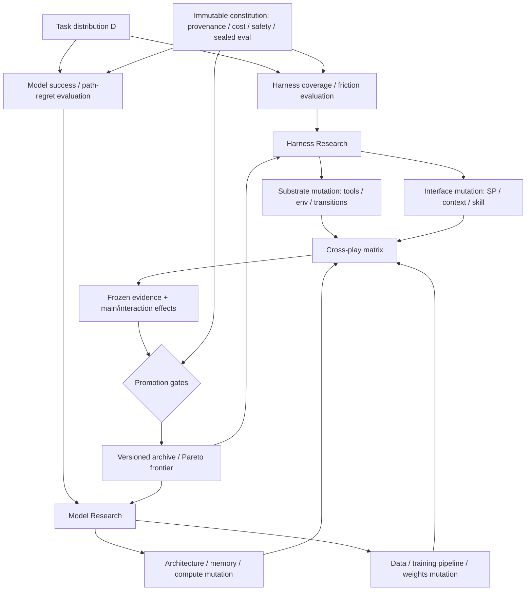

# RSI 两层范式：Model Intelligence、Harness Reachability 与 Architecture Search

日期：2026-08-19

状态：讨论结论 / 研究设计草案

范围：把现有 RSI control plane 扩展为 Model 与 Harness 两个主要改进回路，并为 LLM architecture search 建立更细粒度、可验证的分解。

## 一句话结论

我们希望构建的 RSI 不是一个无边界地改写所有代码的系统，而是两个相互协作、可以分别归因的改进回路：

1. **Model 层**：在给定 Harness 与任务分布下，提高成功概率，降低完成任务所需的加权行动成本；Architecture、data、training pipeline 与 weights 都属于这一层。
2. **Harness 层**：通过 tool set、environment、state transition 与 observation interface，扩大任务可达范围，并降低成功路径的最小可行成本。

System Prompt、context、skill、tool description 等属于 Harness 的 interface compiler。它们确实会改变 Model 的成功概率和行动长度，但不改变 Model weights，因此应作为 Model–Harness interaction 单独测量，而不是模糊地归入“模型智力”。

真正的递归性不只表现为当前版本得分更高，还要求新版本在相同预算和 fresh problems 上，能比旧版本更有效地制造出更好的下一代。

---

## 1. 两个 transition kernel

设任务为 \(\tau\sim D\)。Harness 定义：

\[
h=(\mathcal S,\mathcal A,T_h,O_h,\kappa_h)
\]

其中：

- \(\mathcal S\)：环境状态空间；
- \(\mathcal A\)：可用 action / tool 空间；
- \(T_h\)：action 执行后的环境状态转移；
- \(O_h\)：环境向模型暴露 observation 的方式；
- \(\kappa_h\)：一次 action 的真实成本与风险。

Model 是一个条件 action-selection kernel：

\[
\pi_\theta(a_t\mid o_{\le t})
\]

整个 agent system 的闭环状态转移为：

\[
P_{\theta,h}(s_{t+1},a_t\mid s_t)
=
\pi_\theta(a_t\mid O_h(s_t))
T_h(s_{t+1}\mid s_t,a_t)
\]

因此两层的因果职责可以明确分开：

- **Harness 构造 action graph**：什么可以做、做了以后发生什么、模型能看见什么。
- **Model 在 action graph 上选择路径**：走哪条路、是否成功、是否绕路、是否能够遵守模板与终止条件。

这比把整个 agent 笼统地看成一个“智能系统”更适合做 RSI，因为失败可以被归因到 reachability、interface、policy 或 architecture，而不是全部回流到 prompt tuning。

## 2. 共同的 trajectory utility

对任务 \(\tau\) 的一条 trajectory \(\zeta\)，定义：

\[
u(\tau,\zeta)
=
c_2\mathbf 1[\mathrm{success}]
-
c_1 C(\zeta)
\]

这里的 \(C(\zeta)\) 不应只是可见的 tool-call step 数，而应包含：

\[
C(\zeta)=
\alpha N_{\mathrm{tool}}
+\beta N_{\mathrm{tokens}}
+\gamma T_{\mathrm{wall}}
+\delta C_{\mathrm{tool\ internal}}
+\epsilon N_{\mathrm{retry}}
+\rho R_{\mathrm{risk}}
\]

原因是 raw step count 很容易被 Goodhart：一个 Harness 可以暴露 `solve_everything(task)`，在一步内完成全部任务，但只是把 intelligence 和成本藏进 tool 内部。类似地，一次 tool call 可以运行数小时、调用另一个 frontier model，或者产生不可逆副作用；这些不能和一次轻量 calculator call 视为相同步数。

实践中应同时保留 Pareto 指标，而不是只保存一个线性总分：

- success / reachable task coverage；
- tool calls、model tokens、environment tokens；
- wall time 与内部 tool compute；
- retry、timeout、invalid action；
- side-effect、权限与安全风险；
- human intervention；
- monetary cost / GPU-hours。

## 3. Model 层目标

给定 Harness \(h\) 和任务分布 \(D\)，Model 的目标是：

\[
J_M(\theta\mid h,D)
=
\mathbb E_{\tau\sim D,\zeta\sim(\pi_\theta,h)}
[u(\tau,\zeta)]
\]

它优化的不是抽象的 benchmark intelligence，而是：

- 在可用 action graph 上的实际成功概率；
- 成功时的行动、token、时间和重试成本；
- observation 压缩、状态跟踪与长期 credit assignment；
- tool selection、argument construction 与错误恢复；
- 模板、协议、输出格式和 stop condition 的稳定达成；
- 在相同 Harness 下跨任务族的泛化。

Model 层的可改写表面包括：

- model architecture；
- tokenizer 与 representation；
- pre-training / mid-training / post-training data；
- data mixture 与 curriculum；
- objective、optimizer、regularization；
- SFT、RL、OPD/MOPD；
- weights、trainable scope 与 specialist structure；
- decoding policy 中真正属于模型执行策略的部分。

## 4. Harness 层目标

Harness 不应只按“当前模型能不能用好”来评价，否则 Harness 与 Model 会共同过拟合。它的理想目标是它所提供的 potential frontier：

\[
J_H(h\mid D)
=
\mathbb E_{\tau\sim D}
\left[
\max_{\pi\in\Pi_{\mathrm{reference}}}
\mathbb E[u(\tau,\zeta)]
\right]
-\lambda\Omega(h)
\]

其中 \(\Omega(h)\) 应惩罚：

- tool 数量与 schema 复杂度；
- action branching factor；
- context / observation 带宽；
- nondeterminism 与不可重放行为；
- 隐藏的外部 intelligence 或 compute；
- side-effect、权限和安全风险；
- 环境部署与维护成本。

对每个任务进一步定义：

\[
R_h(\tau)=\mathbf 1[\text{Harness 中存在成功路径}]
\]

\[
L_h^*(\tau)=
\min_{\pi:\mathrm{success}} C(\zeta)
\]

于是可以把系统拆成四组可诊断指标：

1. **Harness coverage**：\(\mathbb E[R_h]\)
2. **Harness friction**：\(\mathbb E[L_h^*\mid R_h=1]\)
3. **Model utilization**：实际成功率相对 reachable coverage 的比例
4. **Model path regret**：\(L_{\theta,h}-L_h^*\)

严格的 \(L_h^*\) 在开放环境里通常不可计算。工程上应记录 `best_known_feasible_cost`：

- deterministic environment 使用 graph search、program solver 或 proof；
- 开放任务使用 human reference plan；
- 使用多个强模型、search agents 和 deterministic scripts 构成 solver envelope；
- 对无法证明的最短路径明确保留 upper/lower bound 与不确定性。

## 5. Harness 内部再拆成 substrate 与 interface compiler

两层 RSI 的主边界仍然是 Model / Harness，但 Harness 内部需要区分：

```text
Harness substrate
  tools / environment / state / permissions / transition semantics

Interface compiler
  system prompt / context / skill / memory
  retrieval / tool descriptions / schema rendering

Model policy
  weights / architecture / learned decoding behavior
```

Interface compiler \(q_\phi\) 把环境历史转换成模型实际看见的输入：

\[
z_t=q_\phi(O_h(s_{\le t}))
\]

模型再根据它选择 action：

\[
a_t\sim\pi_\theta(a_t\mid z_t)
\]

因此 SP/context 的确能显著改变成功概率与步数，但它优化的是 **Model–Harness compatibility**。归属规则可以保持简单：

- 修改 \(\theta\) 或 architecture：Model improvement；
- 修改 action/state/transition/tool semantics：Harness substrate improvement；
- 修改 SP/context/skill/schema exposure：Harness interface improvement；
- 同一个用户可见结果可以由三层产生，但 intervention identity 必须唯一、可追踪。

## 6. 用 cross-play 分离 main effect 与 interaction

不能只固定一个 Model 优化 Harness，再固定一个 Harness 优化 Model。应维护 reference model panel 与 reference harness panel，形成 cross-play matrix：

| | H1 | H2 | H3 |
|---|---:|---:|---:|
| M1 | score | score | score |
| M2 | score | score | score |
| M3 | score | score | score |

结果可以写成：

\[
Y_{ij\tau}
=
\mu
+\alpha_i^{\mathrm{model}}
+\beta_j^{\mathrm{harness}}
+\gamma_{ij}^{\mathrm{interaction}}
+\epsilon
\]

- \(\alpha_i\)：Model main effect；
- \(\beta_j\)：Harness main effect；
- \(\gamma_{ij}\)：SP、context、tool description 与模型兼容性等 interaction effect。

建议的 promotion 规则：

- Model candidate 必须跨多个 reference harness 提升；
- Harness candidate 必须跨多个 reference model 提升；
- 只在单个 cell 提升时，标记为 interface specialization，不宣称 general improvement；
- 在 held-out model 或 held-out harness 上仍提升，才获得 transfer evidence；
- Model 与 Harness 同时变化时，必须保留 matched controls，不能把 interaction gain 错归因给某一层。

---

## 7. Architecture 不按技术名拆，而按状态职责拆

KDA、MLA、DSA、Engram 并不都是同一轴上的替代品。更合适的分法是：它们分别提供哪一种 memory、retrieval 或 computation channel。

| 机制 | 状态职责 | 主要作用 | 核心失败面 |
|---|---|---|---|
| Engram | static conditional memory | 高频/local pattern 与知识的确定性 lookup | 容量分配、hash collision、稀有组合泛化 |
| KDA | compressed dynamic working memory | 用有限 recurrent state 读写、遗忘历史 | 状态容量不足、错误覆盖、长距离信息丢失 |
| MLA | addressable episodic memory | 保留 global token access，同时低秩压缩 KV | KV rank 不足、global attention 成本 |
| DSA | episodic-memory selector | 先检索相关 token，再做 sparse attention | indexer 漏召回关键证据 |
| MoE | conditional computation | 为 token 选择不同计算/知识专家 | routing、负载、专家利用率与通信 |
| AttnRes / mHC | depth-wise memory | 改善跨层信息保存与计算路径 | residual state 成本、数值稳定性 |
| MTP | predictive output depth | 辅助表征学习或 speculative decoding | objective interference、draft mismatch |

MLA 使用低秩 KV 联合压缩减少 inference-time KV cache，同时保留 content-addressed global attention。[DeepSeek-V2](https://arxiv.org/abs/2405.04434)

KDA 是带细粒度 gating 的 recurrent linear attention；Kimi Linear 用多数 KDA 层承担固定状态的序列处理，再周期性插入 MLA 恢复 global token-to-token interaction。[Kimi Linear](https://arxiv.org/abs/2510.26692)

DSA 使用 learned indexer 选择相关 token，再执行 token-level sparse attention，更像 token memory 前的选择器，而不是和 MLA 完全互斥的替代方案。[DeepSeek-V3.2](https://arxiv.org/abs/2512.02556)

Engram 提供基于 \(N\)-gram 的确定性 \(O(1)\) lookup，是 conditional memory 轴；它主要和 MoE/neural computation 竞争 parameter allocation，而不是简单替代 KDA 或 MLA。[Conditional Memory / Engram](https://arxiv.org/abs/2601.07372)

一个可组合的 architecture grammar 因而可以写成：

```text
Engram
  提供 static/local lookup

[KDA × r → MLA/DSA × 1] × depth
  KDA：流式压缩工作记忆
  MLA：周期性全局 episodic access
  DSA：超长 context 中的 token selection

MoE
  提供 conditional computation

AttnRes / mHC
  提供 depth-wise state preservation
```

重点不是把热门模块全部堆在一起，而是明确每个信息通道的职责、预算和失败条件。

## 8. Architecture search 的细粒度坐标

### 8.1 Static memory allocation

```text
memory.static.family
memory.static.parameter_ratio
memory.static.ngram_orders
memory.static.table_size
memory.static.hashing
memory.static.fusion_layers
memory.static.gate
memory.static.offload_policy
```

核心问题：多少参数应该用于 static lookup，多少留给 neural computation / MoE？

### 8.2 Dynamic recurrent memory

```text
memory.recurrent.family
memory.recurrent.state_dim
memory.recurrent.layer_ratio
memory.recurrent.layer_placement
memory.recurrent.decay_granularity
memory.recurrent.erase_write_policy
memory.recurrent.chunk_size
```

核心问题：多大、怎样更新的有限状态，足以承担多少比例的历史信息？

### 8.3 Episodic token memory

```text
memory.episodic.family
memory.episodic.kv_rank
memory.episodic.q_rank
memory.episodic.rope_dim
memory.episodic.global_layer_ratio
memory.episodic.global_layer_placement
memory.episodic.output_gate
```

核心问题：模型需要保留多少可以被重新寻址的 token-level history？

### 8.4 Sparse retrieval

```text
memory.selector.family
memory.selector.top_k
memory.selector.compression_stride
memory.selector.local_window
memory.selector.indexer_dim
memory.selector.indexer_heads
memory.selector.share_interval
memory.selector.warmup_policy
```

核心问题：在不读取完整 token memory 的情况下，怎样控制关键证据漏召回？

### 8.5 Conditional computation

```text
compute.moe.total_experts
compute.moe.active_experts
compute.moe.shared_experts
compute.moe.expert_width
compute.moe.latent_width
compute.moe.router
compute.moe.balance_policy
```

核心问题：每 token 需要多少动态计算，以及知识容量与 active cost 如何分配？

### 8.6 Depth allocation

```text
depth.layers
depth.width
depth.residual_streams
depth.block_size
depth.cross_layer_routing
depth.early_late_allocation
```

核心问题：信息需要经过多少有效计算深度，如何避免在层间退化？

### 8.7 Training-program coupling

Architecture candidate 不能只有 model config。它还必须绑定最小、明确的 mechanically required closure：

```text
architecture hypothesis
  + initialization / conversion
  + data and context curriculum
  + auxiliary objective / warmup
  + optimizer and numerics requirements
  + kernel / runtime implementation
  + capability and cost evaluators
```

例如 DSA 变化可能同时要求 indexer warmup、长上下文 data、sparse kernel 和 index-recall evaluator。这些是一个 causal thesis 的必要实现闭包，不应伪装成完全独立的随机变化。

现有 RSI 的“一个 primary lever + 至多一个 dependent lever”应为 architecture research 扩展成：

> 一个 primary causal thesis + 显式 dependency closure + matched ablations。

---

## 9. Model Program：Architecture、Data、Pipeline 与 Systems 的共同搜索对象

完整的 Model candidate 应定义为：

\[
X=(A,D,P,S)
\]

- \(A\)：Architecture；
- \(D\)：Data program；
- \(P\)：Training pipeline / recipe graph；
- \(S\)：Systems and deployment realization。

### Architecture

- backbone 与 block schedule；
- attention/recurrent/static-memory allocation；
- depth、width、total/active parameters；
- MoE routing 与 specialists；
- residual mixing、tokenizer、MTP/output heads。

### Data program

- source/domain/task mixture；
- natural/synthetic/replay ratio；
- difficulty、quality、temporal distribution；
- context-length curriculum；
- modality 与 capability coverage。

### Training pipeline

应表示为 recipe graph，而不是一个不可分解的 shell script：

```text
pretrain
  → context extension
  → architecture conversion / indexer warmup
  → SFT cold start
  → domain specialists
  → RL
  → OPD / MOPD
  → recovery / general RL
  → deployment-aware adaptation
```

每个 node 都绑定自己的 data mixture、token/compute budget、objective、optimizer、trainable scope、precision 与输入输出 checkpoint。

### Systems

- theoretical FLOPs 与 measured GPU-hours；
- MFU、HBM、communication；
- numerical stability；
- KV footprint；
- prefill/decode latency；
- kernel availability 与成熟度；
- checkpoint、resume、serving compatibility。

Architecture ranking 依赖 data、training stage 和 hardware realization。因此 full-stack Model RSI 寻找的不是孤立的“最好架构”，而是 architecture × data × pipeline × systems 的 Pareto frontier。

## 10. Architecture RSI 的多保真度实验阶梯

Auto Research 不应生成一个架构后直接启动昂贵 pre-training。Auto Harness 应把 architecture hypothesis 编译成多保真度实验：

```text
L0 Static falsification
   parameter / active-parameter / FLOPs / KV / memory accounting
   shape、causality、routing、state invariants

L1 Mechanism test
   tiny model forward/backward
   numerics、kernel correctness、memory update diagnostics

L2 Isomorphic proxy
   fixed tokenizer / data / dimensions / compute
   单轴机制消融

L3 Scaling probe
   multiple model sizes × token budgets
   estimate scaling response and rank stability

L4 Matched-compute pretraining
   matched train FLOPs / GPU-hours，而不只是 matched tokens

L5 Post-training compatibility
   相同 SFT / RL / OPD budget
   measure plasticity、stability、capability gain

L6 Agent cross-play
   reference harness panel × model candidates
   success、cost、regret、interaction effect

L7 Deployment frontier
   capability × latency × throughput × KV × reliability × cost

L8 Independent confirmation
   fresh initialization / seed / data slice / process
```

Architecture promotion 不能只看 terminal benchmark score。至少需要同时报告：

- pre-training loss / scaling behavior；
- mechanism-specific diagnostics；
- post-training gain；
- agent success 与 path regret；
- train stability 和 seed variance；
- total/active parameters 与 train FLOPs；
- measured GPU-hours；
- KV、latency、throughput；
- kernel/runtime maturity；
- cross-harness transfer。

## 11. 第一轮可执行的 Architecture RSI

第一轮不搜索全部组合，而是先做三个尽可能正交的 single-axis sweeps。

### Axis A：Static memory vs neural compute

固定 tokenizer、data、total parameters、active FLOPs、layer topology 与 training budget，扫描：

```text
Engram allocation = 0% / 5% / 10% / 20%
```

增加 Engram 参数时，对应减少 MoE/static FFN 参数，保持 iso-parameter 与尽量 matched FLOPs。

主要 diagnostics：

- static/local knowledge；
- rare combination generalization；
- early-layer representation burden；
- reasoning/code/math transfer；
- host-memory/offload cost。

### Axis B：Recurrent vs episodic memory

固定 Engram=0、MoE 与 active FLOPs，扫描：

```text
KDA : MLA
0 : 1
1 : 1
3 : 1
7 : 1
```

主要 diagnostics：

- streaming state retention；
- arbitrary token recall；
- long-output generation；
- in-context learning；
- agent trajectory success；
- KV、decode latency 与 training throughput。

### Axis C：Dense vs selective episodic access

在选定的 MLA baseline 上扫描：

```text
DSA disabled
top-k = 512 / 1024 / 2048
compression and index-sharing variants
```

主要 diagnostics：

- relevant-evidence recall；
- lost-evidence failure；
- local/global dependency slices；
- long-context FLOPs 与 measured latency；
- downstream agent success。

三个单轴实验获得可信 main effect 后，才组合：

```text
best static-memory allocation
× best KDA:MLA schedule
× best DSA policy
```

每个进入组合阶段的 candidate 都应接受相同预算的短 post-training。否则只能证明 pre-training loss 更好，不能证明它更容易成为一个高效 agent model。

## 12. 两层 RSI 的总体闭环



建议保持三个不同速度的循环：

1. **Interface loop**：SP/context/skill/tool description，分钟到小时；
2. **Harness substrate / post-training loop**：tool/env/data/SFT/RL，小时到天；
3. **Architecture loop**：model program 与 multi-fidelity scaling，天到更长周期。

三个循环共享同一个 RSI control plane，但拥有不同的 action space、evidence contract、cost ledger 与 promotion threshold。

## 13. 什么才构成 recursive improvement evidence

当前版本能力更高，只能证明 improvement。递归性要求被改进的系统同时增强后续改进能力。

定义 Researcher 与 Harness compiler 的 meta-quality：

\[
Q(R,H)
=
\mathbb E_{\tau\sim D_{\mathrm{fresh}}}
\left[
\max_{i\le B} U(\mathrm{child}_i)
\right]
\]

其中 \(B\) 是相同的 experiment、token、GPU-hour 与 human-intervention budget。

一个 self-change 只有在 offspring test 中通过，才获得 recursive evidence：

- old Researcher 与 evolved Researcher 面对 fresh design problems；
- 使用相同 reference models、harnesses、data 与 compute budget；
- 比较它们产生的后代 frontier，而不是只比较父代得分；
- 测量 best-so-far AUC、successful mutation rate、transfer、hack rate 和 human intervention；
- 保留 branching archive，避免 greedy keep/discard 杀死暂时退化但有价值的 stepping stones。

因此最终定义是：

> Harness 定义什么是可做的；Model 决定在可做空间里实际能做到多少；interface compiler 决定两者是否能有效沟通；Auto Research 决定下一次应修改哪一层；RSI control plane 决定改进是否被证据支持，以及新版本是否真的更会制造下一代。

---

## 14. 与当前 Repo 的关系

当前 Repo 已经拥有最难补齐的科学控制基础：

- frozen Goal 与 hard gates；
- version / run / attempt / retry 的语义边界；
- hypothesis、prediction 与 falsifier；
- 单因果干预；
- immutable identities 与 append-only ledger；
- Probe → Main → independent confirmation；
- raw → normalized → executable evidence；
- cost ledger、Base fallback 与 claim boundary。

当前实现见：

- [`rsi-control/README.md`](../post-training-30-day-bootcamp/rsi-control/README.md)
- [`rsi-control/goal.json`](../post-training-30-day-bootcamp/rsi-control/goal.json)
- [`rsi-control/taxonomy.json`](../post-training-30-day-bootcamp/rsi-control/taxonomy.json)
- [`rsi-end-to-end-workflow.svg`](../post-training-30-day-bootcamp/artifacts/reports/rsi-end-to-end-workflow.svg)

现有 taxonomy 已经命名了 architecture、data mixture、curriculum、optimizer、Harness、verifier 与 runtime levers，但当前 goal 实际授权的是固定 backbone 上的 SFT/data/optimization action space。下一步不是重写 RSI，而是新增：

1. `Model Program` candidate contract；
2. architecture dependency-closure contract；
3. multi-fidelity experiment compiler；
4. reference model × reference harness cross-play；
5. architecture-specific diagnostics 与 matched-compute accounting；
6. Researcher offspring test。

## 15. 当前仍需继续讨论的问题

1. Model 层的 primary objective 应使用线性标量，还是 success-first、cost-second 的 lexicographic/Pareto gate？
2. reference solver population 如何逼近 Harness 的 best-known potential，而不把某个 frontier model 的盲点误认为 Harness 不可达？
3. tool 内部封装的 intelligence、外部模型调用与 hidden compute 如何统一计费？
4. Architecture proxy scale 上的 ranking 需要什么证据，才能授权更大规模训练？
5. Architecture candidate 的 dependency closure 最多允许多大，仍能保持因果归因？
6. Data mixture、architecture 和 optimizer 的交互应使用 factorial experiment、active learning，还是 branching evolutionary archive？
7. Model improvement 应要求跨多少个 Harness；Harness improvement 应要求跨多少个 Model？
8. 哪些 evaluator 可以由 Auto Harness 改进，哪些必须属于 immutable constitution？

这些问题不阻塞两层 RSI 的定义，但决定它从一个严谨的 experiment OS，进一步成为真正 self-hosted 的 AI research system。
