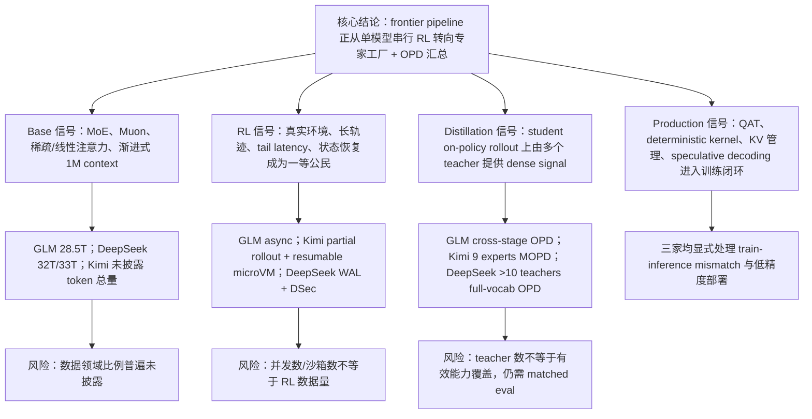

# GLM-5/5.2、Kimi K3、DeepSeek-V4 Training Pipeline Roadmap

研究截止：2026-08-07（Asia/Shanghai）
对象：GLM-5 技术报告 + GLM-5.2 官方增量博客、Kimi K3 技术报告、DeepSeek-V4 技术报告
读者：希望理解或设计 frontier LLM 全训练链路的研究、算法、数据与系统工程人员

## 一句话结论

三家的最新路线已经明显收敛为：**长上下文 MoE 基座 → 领域/推理预算专家工厂 → 可执行环境中的长轨迹 RL → 多教师 On-Policy Distillation（OPD/MOPD）统一模型 → 面向真实部署的量化与推测解码**。差异不再主要是“用了哪种 RL 算法”，而是：长上下文从哪一阶段引入、专家如何组织、轨迹如何跨迭代存活、off-policy/数值误差如何控制，以及 OPD 使用 sampled-token 近似还是真正的 full-vocabulary KL。

这是本报告的**跨报告综合判断**，不是任一家报告的原句；后文把支撑它的官方事实、直接计算值和仍未披露项分开列出。

## 先纠正一个版本口径

| 模型线 | 截止日最新一手材料 | 状态 | 本报告采用方式 |
|---|---|---|---|
| GLM-5 → GLM-5.2 | [GLM-5 完整技术报告](https://arxiv.org/pdf/2602.15763)；[GLM-5.2 官方博客](https://z.ai/blog/glm-5.2)；[GLM-5.2 官方仓库](https://github.com/zai-org/GLM-5) | GLM-5 有完整 report；5.2 **没有独立完整 training report**，官方仍要求引用 GLM-5 report | 用 GLM-5 还原完整 pipeline，用 5.2 博客只补增量，不把未披露的 5.2 数据量沿用为 5 的数字 |
| Kimi K3 | [官方完整技术报告](https://github.com/MoonshotAI/Kimi-K3/blob/main/k3_tech_report.pdf)、[官方技术博客](https://www.kimi.com/blog/kimi-k3)、[官方仓库/model card](https://github.com/MoonshotAI/Kimi-K3) | 产品/API 于 2026-07-16 上线；完整 report/weights 于 07-27 公开；仓库当前 PDF 编译元数据为 08-06 | 以当前 report 为主，博客只补发布时间和上线口径 |
| DeepSeek-V4 | [完整技术报告](https://arxiv.org/pdf/2606.19348)、[官方透明度中心](https://www.deepseek.com/en/transparency/)、[官方发布说明](https://api-docs.deepseek.com/news/news260424/) | 2026-04-24 发布；报告明确称 V4-Pro/Flash 为 preview version | 同时覆盖 Pro 与 Flash；不把 preview 的结论外推到未发布的后续 V4 版本 |

所有主要结论均来自官方报告、官方博客、官方仓库或官方模型配置，证据等级为 `高`。由原文数字计算出的比例标记为 `计算`；报告没有给出的量统一标成 `未披露`。

## 信息链条图



## 比较时的四个口径

1. `训练数据量` 优先指模型实际消费的 tokens；raw 文档数、unique tokens、监督 loss tokens 必须分开。
2. `RL 数据量` 至少应包含 prompts、rollout trajectories、assistant/loss tokens、成功/失败/截断分布和 policy version。三份报告都没有完整披露这一组数字。
3. `系统规模`（GPU、并发 rollout、sandbox 数、镜像数）只说明产能，不能换算为训练样本数。
4. `比例` 只有原文明确给出或能由同口径数字直接计算时才报告；“roughly balanced”不写成精确 25.00%。

## 三条 pipeline：端到端复原

```mermaid
flowchart LR
  subgraph G["GLM-5 / 5.2"]
    G0["4K pre-train: General 18T + Code & Reasoning 9T"] --> G1["Mid: 32K/1T → 128K/500B → 200K/50B"]
    G1 --> G2["DSA conversion: 1k-step indexer warmup + 20B sparse adaptation"]
    G2 --> G3["SFT: general + reasoning + coding/agent; 202,752 context"]
    G3 --> G4["Reasoning RL: math/science/code/TIR"]
    G4 --> G5["Async Agentic RL: coding + search"]
    G5 --> G6["General RL: correctness + EQ + task quality"]
    G6 --> G7["Cross-stage OPD recovery/merge"]
    G7 --> G8["5.2 delta: IndexShare + 1M + critic PPO + anti-hack + >10-teacher OPD"]
  end

  subgraph K["Kimi K3"]
    K0["Native multimodal pre-train: 8K → 64K"] --> K1["Cooldown/context extension: 256K → 1M"]
    K1 --> K2["SFT cold start + MXFP4/MXFP8 QAT"]
    K2 --> K3["RL experts: 3 domains × 3 effort levels = 9"]
    K3 --> K4["MOPD: domain/effort-conditioned teacher"]
    K4 --> K5["Deployment-aware post-train + EAGLE-3 draft tuning"]
  end

  subgraph D["DeepSeek-V4"]
    D0["Pre-train: 4K → 16K → 64K → 1M; Flash 32T / Pro 33T"] --> D1["Specialists: domain SFT → GRPO"]
    D1 --> D2[">10-teacher full-vocabulary OPD"]
    D2 --> D3["FP4 QAT + teacher scheduling + 1M RL/OPD infra"]
  end
```



### 模型骨架：pipeline 的第一组约束

| 模型 | 参数规模 | 深度与 MoE | 长上下文核心 | 公开最大 context |
|---|---|---|---|---:|
| GLM-5 | 744B total / 40B active | Table 10：3 dense + 75 MoE；256 routed experts，top-8 + 1 shared | DSA；5.2 增加 IndexShare | 5：200K；5.2：1M |
| Kimi K3 | 2.78T total / 104.2B active | 93 layers；896 routed experts，top-16 + 2 shared | 69 KDA + 24 Gated MLA；AttnRes | 1M |
| DeepSeek-V4-Flash | 284B total / 13B active | 43 layers；256 routed experts，top-6 + 1 shared | CSA/HCA hybrid | 1M |
| DeepSeek-V4-Pro | 1.6T total / 49B active | 61 layers；384 routed experts，top-6 + 1 shared | CSA/HCA hybrid | 1M |

这些参数不是“排行榜信息”：它们决定每个 node 的 batch、通信、KV、路由一致性和 teacher serving 成本。尤其是 K3 的极高 sparsity 与 native multimodal、V4 的 full-vocabulary teacher scoring，会把系统约束直接带入训练算法。GLM-5 正文另写“80 layers”，而 Table 10 的 3 dense + 75 MoE 不含单独列出的 1 个 MTP layer；报告没有解释剩余口径差异，因此这里保留表格原始拆分，不自行对齐。

### GLM-5 → 5.2

GLM-5 是三者里最像“单个 policy 串行长大”的路线：先 reasoning RL，再 agentic RL，再 general RL，最后用 earlier-stage checkpoints 作为 teachers 做 cross-stage OPD，追回被后续阶段冲淡的能力。[GLM-5 report §2–4，pp. 4–21](https://arxiv.org/pdf/2602.15763)

关键节点：

- Base：4K context 下 General 18T + Code & Reasoning 9T，共约 27T；完整 base-model stages 报告为 28.5T。
- Mid-training：32K/1T、128K/500B、200K/50B；后期上采样长文档与 synthetic agent trajectories。
- DSA：从 mid-training 末尾的 dense/MLA checkpoint 转换；先只训练 indexer，再做 sparse joint adaptation。RL 时使用 deterministic `torch.topk` 并默认冻结 indexer，避免 rollout/train 选出的 KV token 不一致导致熵坍塌。
- SFT：general chat、reasoning、coding & agent 三大类；支持 interleaved、preserved、turn-level thinking；错误轨迹片段保留但 mask loss，使模型看到 recovery context 而不学习错误 action。
- Reasoning RL：GRPO + IcePop-style train/inference correction；四个域 roughly balanced。
- Agentic RL：rollout 与 learner 分离；TITO 保留原始 token IDs；双侧 importance mask、stale-policy filtering、sandbox-failure filtering、DP-aware KV affinity 共同控制 off-policy 与 tail cost。
- General RL：规则 reward、ORM、GRM 混合，并加入 human-written style anchors。
- Cross-stage OPD：student 自己采样，earlier stage teachers 在 student prefixes 上给 log-ratio advantage；group size 退化为 1，可把 batch 提到 1024。

GLM-5.2 的官方增量不是一次完整 recipe 重披露，而是四处修改：[官方 5.2 博客](https://z.ai/blog/glm-5.2)

- 从 128K mid-training 起使用 IndexShare：每 4 个 sparse-attention layers 共用 1 个 indexer；1M context 下 per-token FLOPs 降低 2.9×。
- MTP 同时做 IndexShare/KVShare，并用 rejection sampling + end-to-end total-variation loss 改善长 draft。官方在 GLM-5.1 backbone/data 的 7-step ablation 中，平均 acceptance length 从 4.56 提到 5.47（约 +20%）；这是 5.2 设计证据，不等于最终 744B 线上配置的完整披露。
- 1M coding-agent 数据显著扩充，但 token 数、来源比例、持续训练步数均未披露。
- 超长轨迹经 compaction 后一条 prompt 会产生数量/长度不等的 sub-traces，因此从 group-relative 方法转向 critic-based PPO，以 token-level advantage 训练单条 rollout。
- coding RL 加入在线 anti-hack：规则高召回筛查 + LLM intent judge；阻断违规 tool call 后返回 dummy result，让轨迹继续，避免因整条 abort 造成训练不稳定。
- slime 并行 OPD 合并超过 10 个专家，官方称约两天完成；这是 wall-clock/系统效率，不是 RL 数据量。

GLM-5.1 是不可忽略但公开信息最少的中间版本。它没有独立 training report；[官方 release notes](https://docs.z.ai/release-notes/new-released)只确认使用 multi-turn SFT、RL 和 process-quality evaluation framework，仍为 744B-A40B/200K 路线。是否新增 base/mid-training、SFT/RL/OPD 数量与具体算法均未披露。因此本报告不为 5.1 补造一条完整 pipeline，也不把评测中的长轨迹当训练量。

两篇方法论文可解释 5.2，但有严格边界：

- [IndexCache/IndexShare](https://arxiv.org/abs/2603.12201)给出 training-aware multi-layer indexer distillation；5.2 博客只明确确认从 128K mid-training 训练并使用共享 indexer，未确认所有论文实验超参就是 744B 生产配置。
- [SAO](https://arxiv.org/abs/2607.07508)明确称 single-rollout critic 方法已部署到 GLM-5.2 agentic RL，并补充 skip-observation GAE、critic 更频繁更新等设计；公开消融主体为 Qwen3-30B-A3B，batch、LR、context 等不能搬成 GLM-5.2 生产数字。

### Kimi K3

Kimi K3 的主线是“native multimodal + 极高 MoE sparsity + domain×effort 专家矩阵”。它没有先训练纯文本 LLM 再外挂视觉 encoder，而是从预训练第一天就把 text/vision tokens 放进同一 next-token objective。[Kimi K3 report §2–5，pp. 5–22](https://github.com/MoonshotAI/Kimi-K3/blob/main/k3_tech_report.pdf)

关键节点：

- Architecture：69 层 KDA + 24 层 Gated MLA、Attention Residuals、Stable LatentMoE、SiTU-GLU、Quantile Balancing、Per-Head Muon。
- Data：Web Text、Code、Mathematics、Knowledge 四个 text domains + vision；vision 包含 caption、interleaved image-text、OCR、perception、video、visual coding。总 token 与域比例未披露。
- Long context：8K→64K 在 pre-training，256K→1M 在 cooldown；自然长文档/视频做 exact/fuzzy dedup、感知哈希、质量/结构过滤，并用跨全文散布依赖的合成任务防止只学局部模式。
- SFT：用前代 Kimi domain specialists 合成长 agent trajectories，再做 multi-stage verification 与 human-in-the-loop annotation；从 SFT 开始即 QAT。
- RL：general tasks、general agents、coding agents 三域，每域训练 low/high/max 三种 effort，共 9 个 experts。partial rollout 在一部分轨迹完成后更新，把 unfinished trajectory 排队到下一轮继续；per-token regularization 容忍由此产生的 stale/off-policy data。
- Policy update 口径：K3 没有把方法独立定义成标准 PPO 或标准 GRPO；K3 原文只说 policy optimization follows K2.5，并以 per-token regularization 承受极端 staleness。被继承的 [K2.5 公式](https://arxiv.org/abs/2602.02276)使用 group-relative outcome advantage、token log-ratio masking/clipping 与 quadratic log-ratio drift penalty；这些是继承背景，不代表 K3 报告重新披露了全部实现细节。
- Effort control：按冷启动模型估计每题 budget；超过 `τ × baseline budget` 的 trajectory reward 置为 -1，再逐阶段降低 τ 得到 max/high/low experts。
- MOPD：按 domain 和 effort 选择相应 teacher，以 clipped teacher/student sampled-token log-ratio 作为 dense OPD reward；报告称更细的 top-k objective 没有明显收益。
- Environment：white-box harness 可组合 tool schema、prompt、memory、skill、subagent 和 context management；RL 期间动态构造 Kimi Code、Claude Code、Codex、OpenClaw、Hermes 等 scaffold，降低对单一 harness 的过拟合。
- Systems：MoonEP 用动态 redundant experts 实现严格负载均衡；1M RL 使用 external KV pool、auto-throttling、可暂停/恢复/分叉的 Firecracker microVM。

### DeepSeek-V4

DeepSeek-V4 的主线是“base training 透明度最高 + specialist-first + full-vocabulary OPD 工程化最彻底”。与 V3.2 相比，报告明确说最终 mixed RL integration stage 被 OPD **完全替换**。[DeepSeek-V4 report §4–5，pp. 24–36](https://arxiv.org/pdf/2606.19348)

关键节点：

- Base：Flash 32T，Pro 33T；4K→16K→64K→1M。Flash 前 1T 使用 dense attention，64K 阶段先 warm up CSA indexer，再进入 sparse training；Pro 的 dense 阶段更长但未给 token 数。
- Data：在 V3 数据上增强 web auto-generated/template filtering、multilingual、math/code、long academic documents，并在 mid-training 加 agentic data；具体比例未披露。
- Architecture：CSA/HCA hybrid attention、mHC、Muon；MoE 与 MTP 沿用。Flash 284B/13B active，Pro 1.6T/49B active。
- Stability：Anticipatory Routing 用历史参数提前计算未来 step 的 routing indices，打断 router 与 outlier 同步放大的循环；仅在 spike 后触发，单次模式约增加 20% wall time。SwiGLU 分支做数值 clamping。
- Specialists：math、coding、agent、instruction following 等分别走 domain SFT→GRPO；不同 context/length penalty 产生 Non-think、Think High、Think Max。
- Reward：easy-to-verify 用 rule/test；hard-to-verify 不再依赖传统 scalar RM，而使用 rubric-guided GRM，并对 GRM/actor 的判断能力做 RL 优化。
- OPD：超过 10 个 teachers，student on-policy trajectories，按 domain 权重做 reverse KL；不同于 GLM-5 cross-stage OPD 与 Kimi K3 的 sampled-token signal，DeepSeek 使用 full-vocabulary logits，方差更低但系统代价更高。
- Systems：teacher weights 按需从分布式存储加载，只缓存 last hidden states、训练时重建 logits；rollout 每 token 写 WAL，preemption 后继续 decode，避免“中断时短回复更容易存活”的 length bias；DSec 支持大规模 sandbox 与 trajectory replay。

## Data node：三家真正怎样处理数据

这部分分别依据 [GLM-5 §2.2–2.3](https://arxiv.org/pdf/2602.15763)、[Kimi K3 §3.1/§3.4](https://github.com/MoonshotAI/Kimi-K3/blob/main/k3_tech_report.pdf) 和 [DeepSeek-V4 §4.1](https://arxiv.org/pdf/2606.19348)。共同趋势不是简单“多抓网页”，而是把 quality scoring、长依赖构造、可执行环境和训练时 mask 组合成数据产品。

| Data node | GLM-5/5.2 | Kimi K3 | DeepSeek-V4 |
|---|---|---|---|
| Web/knowledge quality | sentence-embedding DCLM classifier 扩大高质量召回；用 Wikipedia + LLM labels 优化 World Knowledge classifier，从中低质数据提取长尾知识 | 各 text domain 组合规则、classifier quality score 与去重；domain sampling rate 由小模型 ablation 选择，但最终比例未公布 | 继承 V3 pipeline，重点过滤批量自动生成与模板化网页，降低 synthetic collapse 风险 |
| Code/math 处理 | 刷新代码托管快照、修复 Software Heritage metadata alignment、改进语言识别并为低资源编程语言训练 classifier；math/science 用 LLM 教育价值评分，明确过滤 synthetic/AI/template data | 对 Knowledge/Math 做多风格、多视角 rephrasing，以 chunk-wise autoregressive generation 生成，再对源文档做 fidelity verification | math/code 仍是核心；mid-training 加 agentic code data；继承 token splitting 与 FIM |
| Multimodal | 本次报告没有 native vision pipeline | vision 从头联合训练；过滤、合成、去重；坐标同时用 absolute 与 normalized；扩大 code↔rendered visual 数据到 SVG/3D/Web/Game/CAD | V4 主报告按 text model 披露 |
| 长文档清洗 | natural long data 做 PPL/dedup/length 多阶段过滤并上采样 knowledge-intensive domains | exact/fuzzy dedup、video frame perceptual hash、heuristic/classifier quality、structural validation；清掉 binary blob、截断文件与无效机器日志 | 优先 scientific papers、technical reports 等具有独特学术价值的材料；跨来源 packing 减少 truncation |
| 长依赖构造 | interleaved packing 相似文本；200K 阶段少量 MRCR-like 多轮 recall 数据；后期上采样 synthetic agent trajectories | 重排并拼接 multimodal documents/subtasks，使任务必须使用散布在完整 1M context 的信息 | 4K→16K→64K→1M curriculum；报告未细述与 GLM/Kimi 同等级的合成长依赖 recipe |
| 样本边界/监督 | repo files + commit diff + issue + PR + relevant files 拼为统一 sequence；SFT 保留错误上下文但 mask 错误 action loss | text/vision 进入统一 next-token objective；SFT 全部序列化为 XTML | sample-level attention masking 隔离 packed samples；rollout metadata 与 per-token heavy fields 分离加载 |

最值得复用的判断有两个：第一，**数据 mixture 的最佳比例可以由小模型 ablation 选择，但不等于可省略最终披露**；第二，长上下文数据必须同时通过“干净、连贯、真的需要远距离依赖”三道 gate，长度本身不是能力监督。

## 横向对比：pipeline 为什么相似、哪里真正不同

| 维度 | GLM-5/5.2 | Kimi K3 | DeepSeek-V4 | 判断 |
|---|---|---|---|---|
| 主 pipeline 拓扑 | GLM-5 是 sequential RL；5.2 向 >10-expert OPD 收敛 | 9 个 domain×effort experts → MOPD | >10 domain experts → full-vocab OPD | **专家工厂 + OPD 已成为共同终局** |
| 长上下文引入 | 5：32K→128K→200K；5.2 到 1M | 8K→64K；cooldown 256K→1M | 4K→16K→64K→1M | 都是 curriculum，不是一开始全程 1M |
| 1M attention | DSA + IndexShare | KDA recurrent backbone + 周期 Gated MLA | CSA/HCA hybrid | GLM/DeepSeek 是 content-selected sparse；Kimi 更多依赖 recurrent state |
| 多模态 | 未在本次报告中作为 native pretrain 主线 | native text+vision from scratch | V4 主报告为 text model | Kimi 的 data/infra 问题多一层 vision imbalance |
| Optimizer | Muon Split | Per-Head Muon | Muon 为主，embedding/head/norm 用 AdamW | 三家都把 head-wise update scale 当稳定性问题 |
| RL 并行策略 | 5 agent RL 完全 async；5.2 compaction-aware critic PPO | co-located + partial rollout、跨 iteration resume | preemptible rollout service + token WAL | 都在消除 long-tail bubble，但一致性处理不同 |
| Agent 泛化 | central multi-task services | white-box composable harness，跨 scaffold RL | unified DSec substrates + tool schema | Kimi 最直接训练 harness invariance |
| Reward hacking | 5.2 在线 tool-call anti-hack | kernel/web/AET hidden verifier 与 hacking detectors | GRM + isolated verifier/trajectory provenance | anti-hack 已从 eval 附件变成 training node |
| OPD signal | GLM-5 cross-stage：sampled action-token log-ratio；5.2 multi-expert objective 未重披露 | clipped sampled-token log-ratio；domain×effort teacher | full-vocabulary reverse KL | DeepSeek 信号最完整、系统成本最高；不能把 GLM-5 公式无证据外推给 5.2 |
| 低精度 | 5：SFT INT4 QAT；5.2 KV FP8 等 | SFT/RL 全程 MXFP4 weight + MXFP8 activation | post-train FP4 experts + CSA QK path | Kimi 的 rollout/train quantization parity 最明确 |
| 披露强项 | mid-training、async RL algorithm/infra | architecture、environment 与 sandbox 规模 | base recipe、stability、full-vocab OPD infra | 三者各自“透明”的 node 不同 |

## Node ledger：公开了多少数据、比例和 RL 规模

### 预训练与 mid-training

| 指标 | GLM-5/5.2 | Kimi K3 | DeepSeek-V4 |
|---|---|---|---|
| Base token 总量 | GLM-5 完整 base stages 总计约 28.5T；其中初始 4K 阶段为 27T | **未披露** | Flash 32T；Pro 33T |
| 初始阶段 mixture | 4K 阶段：General 18T + Code & Reasoning 9T，即约 66.7% / 33.3%（计算） | web/code/math/knowledge + vision；比例未披露 | math/code/web/long docs/multilingual/agentic；比例未披露 |
| 更细领域构成 | General 内部与 Code & Reasoning 内部比例未披露 | 未披露 | 未披露 |
| 明确的阶段数据 | 32K 1T；128K 500B；200K 50B | 只披露 8K→64K→256K→1M 顺序 | 只披露 4K→16K→64K→1M；Flash dense first 1T |
| 阶段比例（计算） | 在 1.55T mid tokens 内约 64.5% / 32.3% / 3.2% | 不可计算 | 不可计算 |
| DSA/sparse adaptation | warmup：1,000×14×202,752 ≈ 2.84B processed tokens；joint sparse 20B | 不适用 | Flash indexer warmup长度未披露；之后 sparse |
| 特色数据 inventory | 约 10M issue–PR pairs、160B unique tokens；code unique tokens +28%，**均不是 processed/consumed tokens** | 无 token 数；视觉 programmatic formats 公开 | batch 上限 Flash 75.5M / Pro 94.4M tokens，**这是 batch size，不是数据集大小** |
| 5.2 增量 | 扩充 1M coding-agent training，但规模/比例未披露 | — | — |

注意：GLM 的 27T、1T、500B、50B 和总计 28.5T 都是约数，简单相加得到 28.55T，会与报告总计发生 rounding mismatch；不要把 20B DSA adaptation 再机械加一次后声称得到“精确总量”。

### SFT、RL、OPD

| 指标 | GLM-5/5.2 | Kimi K3 | DeepSeek-V4 |
|---|---|---|---|
| SFT examples/tokens | 未披露 | 未披露 | 未披露 |
| RL domains | reasoning：math/science/code/TIR roughly balanced；agentic：coding/search；general：三维目标 | general tasks / general agents / coding agents | math / code / agent / instruction following 等 |
| RL experts | 5 原始路线非固定 expert matrix；5.2 OPD >10 experts | 3 domains × 3 effort = 9 experts | OPD >10 teachers；精确组成未披露 |
| RL prompts | 未披露 | 未披露 | 未披露 |
| RL trajectories | 未披露 | 未披露 | 未披露 |
| RL/loss tokens | 未披露 | 未披露 | 未披露 |
| 可复用算法数字 | Reasoning RL `G=32, batch=32`；OPD `G=1, batch=1024` | `N×K` partial rollouts 与完成比例 λ 均未给具体值 | GRPO 超参“接近前作”，本 report 未展开 |
| RL infra concurrency/capacity | orchestrator >1K concurrent rollouts | 并发轨迹数未披露 | 单 DSec cluster 可管理 hundreds of thousands concurrent sandboxes |
| 计算资源披露 | 未披露 | 单次 1M-context RL experiment 控制在 few hundred GPUs | 未披露 |
| 环境 inventory / 累计作业 | >10K SWE envs；WKG >2M webpages | 51,219,741 sandbox instances / 1,505,678 sandbox images（training **及 evaluation 合计**） | 未披露 |
| Wall-clock | 5.2 multi-expert OPD ≈2 days | 未披露 | 未披露 |
| OPD objective | GLM-5：student sampled token 上的 teacher/student log-ratio advantage；5.2 未重披露 | clipped sampled-token log-ratio reward | exact full-vocabulary reverse KL |

### 对“RL 到底做了多少”的直接回答

**无法从公开报告得到三家可比较的 RL 数据量。**三家均未完整披露 prompt 数、独立 trajectory 数、采样 token 数、进入 loss 的 assistant tokens、失败/截断/重采样率或每阶段更新数。现有数字只能回答：

- GLM 公开了 group/batch、并发、环境池与 5.2 OPD wall time；
- Kimi 公开了 expert 矩阵、sandbox 生命周期总次数和极端 trajectory 形态；
- DeepSeek 公开了 teacher 数量级和 sandbox/rollout infrastructure capacity；
- 上述任何一项都不能可靠换算成“RL 训练了 X 条/XT tokens”。

若向团队或厂商追问，最有价值的 disclosure schema 是：

```text
stage_id
  prompts_unique / prompts_sampled
  rollouts_started / completed / failed / truncated / resumed
  assistant_tokens_generated / loss_tokens / environment_tokens
  group_size_distribution / turns / tool_calls / context_length
  policy_versions / policy_lag / replay_or_resample_rate
  reward-source mixture / zero-variance rate / anti-hack rejection rate
  optimizer updates / effective batch tokens / GPU-hours
```

## 最有亮点的七个设计判断

### 1. OPD 不是“最后再蒸馏一下”，而是 capability integration layer

传统 mixed RL 让不同 domain 的 reward 在同一个 policy 上竞争；新的路线先把 domain experts 各自推高，再让 student 在**自己会访问的 prefixes**上向相关 teacher 学习。它同时解决三件事：避免跨域 reward interference、减少 sequential forgetting、允许 reasoning-effort 成为 teacher 选择维度。

### 2. GLM-5.2 显示了 pipeline 拓扑的纵向演化

GLM-5 的 report 仍是 reasoning→agentic→general 的串行 RL，再用 cross-stage OPD 修复；到 5.2 已经公开“超过 10 个专家并行 OPD”。这说明 OPD 从 regression-recovery node 升级为主要 merge node，向 Kimi/DeepSeek 的 specialist-first 结构靠拢。

### 3. 1M context 的真正难点是状态存活，而不只是 attention FLOPs

- 模型状态：KDA/CSA/DSA 要保证 rollout 和 train 的 index/routing 一致；
- 轨迹状态：partial rollout、compaction、preemption 不能改变训练分布；
- 环境状态：microVM/container 必须 pause/resume/fork/replay；
- KV 状态：跨 turns、iterations、GPU/CPU/NVMe 有明确生命周期。

所以“把 max_position_embeddings 改到 1M”在这些 pipeline 中只是最小的一步。

### 4. Train–inference parity 已经成为算法条件

GLM 用 TITO、deterministic top-k；Kimi 让 rollout/train 共用量化方案；DeepSeek 强调 batch-invariant deterministic kernels、native FP4 rollout 和 token WAL。RL 中一个看似系统性的 tokenization、kernel 或 quantization 差异，都会变成错误 importance ratio 或错误 reward attribution。

### 5. Tail latency 决定 RL wall-clock

同步 RL 的一步速度由最慢 trajectory 决定。三家分别用 async、partial rollout、preemptible WAL；共同目标不是单纯提高 aggregate tokens/s，而是让长尾样本不再卡住 learner，同时又不因“只保留短样本”制造 length bias。

### 6. Agent environment 已成为训练数据生成器

issue–PR、terminal、research、office、kernel、webdev 不再只是离线 JSONL，而是带状态、工具、verifier、隐藏测试与恢复语义的 executable data source。环境工程、reward contract 与数据工程已经合并成一个 node。

### 7. Anti-hacking 必须在线化

只在训练后过滤高 reward trajectory 太晚：policy 已经持续探索并放大漏洞。GLM 5.2 的“阻断单次违规 action、返回 dummy result、继续 rollout”尤其值得借鉴，因为它既保留 recovery learning，又避免把 environment exploit 当成能力。

## 12 个月 roadmap：从可审计原型到 frontier-style pipeline

时间只表示依赖顺序；实际 wall-clock 取决于模型规模、算力和数据权限。每一阶段必须通过 gate 后再扩规模。

| 阶段 | 时间 | 建什么 | 借鉴 | Exit gate |
|---|---:|---|---|---|
| R0 评测与证据合同 | Week 0–4 | frozen eval、per-sample evidence、数据/trajectory schema、成本 ledger | 三家共同的长程/agent eval 需求 | 任意分数能追溯到 prompt、harness、model、judge、seed 与 raw trace |
| R1 Data OS | Month 1–3 | source lineage、exact/fuzzy dedup、quality classifier、domain/length mixture、eval decontamination | GLM classifier+issue–PR；Kimi multimodal cleaning；DeepSeek template filtering | mixture 同时报 example/raw/supervised tokens；删除记录可重放 |
| R2 Architecture & scaling law | Month 1–4 | 小模型对比 dense/sparse/recurrent attention、MoE routing、Muon variant、stability injection | IndexShare/KDA/CSA-HCA、Muon、mHC/AttnRes | 相同 compute 下质量、吞吐、KV、稳定性有受控 ablation |
| R3 Base + long-context curriculum | Month 3–7 | 短上下文 base，分阶段延长；自然+合成 long dependency；indexer/attention conversion | 三家的渐进 context；GLM DSA conversion | 每个 length stage 通过 short/long regression、retrieval、real-document gate |
| R4 SFT cold start | Month 5–7 | general/reasoning/tool/agent trajectories、error masking、thinking/tool schema、QAT smoke | GLM preserved thinking；Kimi native QAT；DeepSeek DSML | exact token/loss mask audit；工具调用与恢复轨迹在 frozen suite 稳定 |
| R5 Specialist factory | Month 6–9 | domain × effort × modality/harness experts；独立 reward contracts | Kimi 3×3；DeepSeek specialists；GLM reasoning/agent/general | 每个 teacher 在 held-out domain 胜过共同 anchor，guardrail 不退化 |
| R6 Agentic RL platform | Month 6–10 | executable environments、sandbox state、partial/async rollout、TITO、policy lag、anti-hack | GLM async；Kimi AgentENV；DeepSeek WAL/DSec | 1-update replay；失败可分类；resume 不引入 length/selection bias |
| R7 OPD integration | Month 8–11 | teacher router、student on-policy batch、sampled-token baseline、full-vocab stretch | 三家 OPD/MOPD | same-model near-zero sanity；token alignment；matched direct-RL control；teacher/student cost分账 |
| R8 Deployment-aware closeout | Month 9–12 | FP4/INT4 QAT、speculative draft、KV tiering、PD disaggregation、serving parity | 三家 QAT 与 long-context serving | quantized rollout/train/online eval parity；吞吐收益不靠质量回退换取 |
| R9 Continuous evaluation | 持续 | reward-hack red team、real task refresh、capability regression graph | 5.2 anti-hack、hidden verifier、trajectory provenance | 新 reward 上线前有 exploit test；每次 merge 有 cross-domain regression report |

### 最小团队版本

若没有 frontier 预训练预算，不要复刻 trillion-token 数字；复刻**接口与 gate**：

1. 用同一 0.6B–4B anchor 建两个 domain teachers 和一个 student；
2. 冻结 100–500 条可验证 prompts，保留 raw trajectory/logprob/mask/version；
3. 先跑 matched direct-RL control，再跑 sampled-token OPD；
4. 若框架支持，再以 top-k/full-vocab KL 做 stretch；
5. 只在 frozen eval、guardrail、cost 三者同时改善时扩大规模。

这条路线可直接复用本仓库的 [Day 24 online RL dataflow](../../../post-training-30-day-bootcamp/day-24-online-rl-dataflow-reward/README.md)、[Day 39 OPD one-update](../../../post-training-30-day-bootcamp/day-39-opd-one-update-replay/README.md) 与 [Day 40 controlled OPD](../../../post-training-30-day-bootcamp/day-40-opd-controlled-run/README.md)。

## 风险与未解决问题

| 风险/缺口 | 影响 | 当前可信度 | 下一项验证 |
|---|---|---|---|
| 三家都不披露完整 RL volume | 无法比较 sample efficiency 或 RL compute | 高 | 要求统一 disclosure schema；不要用 sandbox proxy |
| Kimi 未披露 base token 数 | 无法把 2.5× scaling efficiency 还原为训练预算 | 高 | 等后续 report revision/model card 补充 |
| GLM-5.2 无独立完整 report | 5 的 recipe 与 5.2 delta 之间有未知 continual-training 部分 | 高 | 只把 5.2 blog 明说的增量归到 5.2 |
| DeepSeek V4 是 preview | 当前结论可能被正式 V4 改写 | 高、时间敏感 | 跟踪透明度页与 arXiv version history |
| 报告中的 benchmark harness 不同 | capability score 不可直接作为 training design 因果证据 | 高 | 同 checkpoint、同 harness、同 budget 重评 |
| OPD teacher routing/mixture 未披露 | 无法判断 gain 来自 teacher quality、sampling 还是 objective | 高 | matched teacher、prompt、token budget ablation |
| 低精度与 deterministic 实现依赖硬件 | 公开效果不一定跨 GPU/NPU 复现 | 中高 | 同一 batch 做 full precision / rollout / train parity test |

## 可行动建议

1. 把现有 training lifecycle 图升级为 `data → policy rollout → environment state → reward/verifier → learner → teacher scoring → OPD → serving`，每条边都写 schema 和 version。
2. 近期学习优先级应是 `RL object contract → async/partial rollout correctness → OPD one-update replay`，而不是先追大规模吞吐。
3. 数据 mixture 报告至少同时给 example、input token、supervised/loss token 三种口径；长轨迹还要单列 environment/tool tokens。
4. 任何 agent RL 扩容前，先做三个 failure injection：stale policy、sandbox crash、reward artifact leakage。
5. OPD 实验必须有 common anchor 的 direct-RL control；否则无法区分“teacher 更强”与“OPD objective 更好”。
6. 把 QAT/deterministic/TITO 视作训练正确性条件，而不只是 inference optimization。

## 关键证据表

| 结论 | 一手来源 | 可信度 | Caveat |
|---|---|---|---|
| GLM-5 base 28.5T，mid 32K/128K/200K 三阶段 | [GLM-5 report §2.2–2.3](https://arxiv.org/pdf/2602.15763) | 高 | 数字为约数 |
| GLM 初始 4K 阶段为 18T General + 9T Code & Reasoning；66.7%/33.3% 为本报告计算 | [GLM-5 report Figure 5](https://arxiv.org/pdf/2602.15763) | 高/计算 | 不代表两个大类内部的细分比例 |
| GLM sequential RL + cross-stage OPD；async agent RL | [GLM-5 report §3–4](https://arxiv.org/pdf/2602.15763) | 高 | RL 总量未披露 |
| GLM-5.2 IndexShare、critic PPO、anti-hack、>10 experts/约2天 OPD | [GLM-5.2 官方博客](https://z.ai/blog/glm-5.2) | 高 | 博客，不是完整 report |
| Kimi native multimodal、9 experts、MOPD、partial rollout | [Kimi K3 report §3–5](https://github.com/MoonshotAI/Kimi-K3/blob/main/k3_tech_report.pdf) | 高 | base/RL token 均未披露 |
| Kimi 51.2M sandbox instances / 1.51M sandbox images 是 training+evaluation 合计 | [Kimi K3 report §5.3.2](https://github.com/MoonshotAI/Kimi-K3/blob/main/k3_tech_report.pdf) | 高 | 不能当 RL trajectory 数 |
| DeepSeek Flash/Pro 32T/33T、1M curriculum | [DeepSeek-V4 report §4](https://arxiv.org/pdf/2606.19348) | 高 | domain mixture 未披露 |
| DeepSeek mixed RL 被 >10-teacher full-vocab OPD 替换 | [DeepSeek-V4 report §5.1–5.2](https://arxiv.org/pdf/2606.19348) | 高 | teacher 权重/数据 mix 未披露 |
| DeepSeek WAL resume 避免中断 length bias | [DeepSeek-V4 report §5.2.3](https://arxiv.org/pdf/2606.19348) | 高 | 需要 deterministic/持久化实现配合 |

## 推荐阅读顺序

1. 本报告的 pipeline DAG 与 Node ledger；
2. GLM-5 report Figure 5、§2.2–2.3、§3.2–3.6、§4.1；
3. Kimi K3 report §3.3–3.4、§4.1–4.2、§5.3；
4. DeepSeek-V4 report §4.1–4.2、§5.1–5.2；
5. [GLM-5.2 blog](https://z.ai/blog/glm-5.2)，只读相对 GLM-5 的 delta；
6. 配套的 [教学计划](teaching-plan.md)，按课次完成复述与实验。

本次使用的三份 PDF 已固定为[本地来源快照与校验和](sources/README.md)，便于以后识别上游 report revision。
