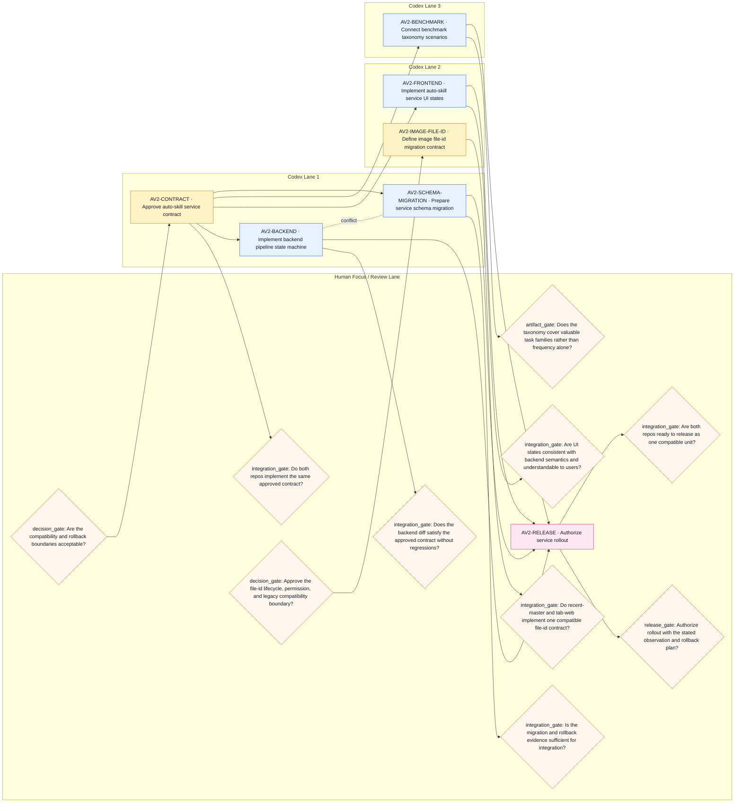

# Work Plan: Agent V2 auto-skill pipeline

- Plan: `av2-forward-test` v1 (draft)
- Critical path: `AV2-CONTRACT, AV2-BACKEND, AV2-RELEASE`
- Safe Codex parallelism: 3
- Proposed review batches: 2

## Flow

## Human Focus Chain

1. **AV2-CONTRACT · Approve auto-skill service contract** — `auto-skill-contract` — Are the compatibility and rollback boundaries acceptable?
2. **AV2-IMAGE-FILE-ID · Define image file-id migration contract** — `image-artifact-contract` — Approve the file-id lifecycle, permission, and legacy compatibility boundary?

## Proposed Codex Queue (after approval)

No Codex task is dispatchable now.

Waiting:
- `AV2-CONTRACT` — blocking pre-execution review
- `AV2-BACKEND` — status=draft
- `AV2-FRONTEND` — status=draft
- `AV2-BENCHMARK` — status=draft
- `AV2-SCHEMA-MIGRATION` — status=draft
- `AV2-IMAGE-FILE-ID` — blocking pre-execution review

## Review Checkpoints

### contract-approved (ready)

- [READY] `AV2-CONTRACT/contract-decision` decision_gate: Are the compatibility and rollback boundaries acceptable?
- [later] `AV2-CONTRACT/cross-repo-contract` integration_gate: Do both repos implement the same approved contract?

### image-file-id-contract (ready)

- [READY] `AV2-IMAGE-FILE-ID/file-id-decision` decision_gate: Approve the file-id lifecycle, permission, and legacy compatibility boundary?
- [later] `AV2-IMAGE-FILE-ID/file-id-integration` integration_gate: Do recent-master and tab-web implement one compatible file-id contract?

### auto-skill-integration (planned)

- [later] `AV2-BACKEND/backend-integration` integration_gate: Does the backend diff satisfy the approved contract without regressions?
- [later] `AV2-BENCHMARK/taxonomy-artifact` artifact_gate: Does the taxonomy cover valuable task families rather than frequency alone?
- [later] `AV2-FRONTEND/frontend-integration` integration_gate: Are UI states consistent with backend semantics and understandable to users?
- [later] `AV2-SCHEMA-MIGRATION/migration-integration` integration_gate: Is the migration and rollback evidence sufficient for integration?

### production-release (planned)

- [later] `AV2-RELEASE/cross-repo-release` integration_gate: Are both repos ready to release as one compatible unit?
- [later] `AV2-RELEASE/release-authority` release_gate: Authorize rollout with the stated observation and rollback plan?

## Insights

- **parallel-unlocker** — AV2-CONTRACT is a decision/unlocker for 5 downstream tasks.
- **inherited-urgency** — AV2-CONTRACT keeps declared priority P1 but inherits urgency P0 from a higher-priority descendant.
- **inherited-urgency** — AV2-SCHEMA-MIGRATION keeps declared priority P2 but inherits urgency P1 from a higher-priority descendant.
- **snapshot-risk** — Repo recent-master is dirty, blocking safe auto-dispatch for AV2-BACKEND, AV2-BENCHMARK, AV2-CONTRACT, AV2-IMAGE-FILE-ID, AV2-RELEASE, AV2-SCHEMA-MIGRATION; changed paths: app/services/agent_v2/agent_v2_agent.py, docs/runtime-skill-template-picker-frontend-api.md, tests/unit/test_agent_v2_visual_followups.py.
- **snapshot-risk** — Repo tab-web is dirty, blocking safe auto-dispatch for AV2-CONTRACT, AV2-FRONTEND, AV2-IMAGE-FILE-ID, AV2-RELEASE; changed paths: app/browser-use/_handdler/handleWsMessages.ts, app/browser-use/evaluation/EvaluationClient.tsx, app/browser-use/evaluation/components/EvaluationTable.tsx, app/browser-use/evaluation/hooks/useEvaluationTasks.ts, app/browser-use/evaluation/types.ts.
- **parallel-conflict** — AV2-BACKEND and AV2-SCHEMA-MIGRATION must not share a wave: explicit conflict; shared resource: auto-skill-integration-env; overlapping touch scope: contract:auto-skill-v1, services/auto_skill/**, services/auto_skill/schema.py.
- **review-pressure** — Milestone auto-skill-integration batches 4 review items; keep one context-loaded checkpoint instead of individual interruptions.

## Delegation, Review & Handoff

### AV2-CONTRACT · Approve auto-skill service contract

- Assignment: **hybrid** (high confidence)
- Why: Codex can draft the contract from repo evidence, A human must approve product and compatibility semantics
- Automatic evidence: python3 -m json.tool contract/auto-skill-v1.json
- Human review: decision_gate — Are the compatibility and rollback boundaries acceptable?; integration_gate — Do both repos implement the same approved contract?
- Handoff outputs: Contract artifact, Decision log, Downstream constraints
- Stop and hand back if: Product semantics are ambiguous, A required repo is unavailable

### AV2-IMAGE-FILE-ID · Define image file-id migration contract

- Assignment: **hybrid** (medium confidence)
- Why: Codex can inspect both implementations and draft the migration, A human must approve compatibility, lifecycle, and UX boundaries
- Automatic evidence: python3 -m json.tool contract/image-file-reference.json
- Human review: decision_gate — Approve the file-id lifecycle, permission, and legacy compatibility boundary?; integration_gate — Do recent-master and tab-web implement one compatible file-id contract?
- Handoff outputs: File-id contract, Migration matrix, Implementation split
- Stop and hand back if: Artifact ownership is unclear, Permission model cannot be determined

### AV2-BACKEND · Implement backend pipeline state machine

- Assignment: **codex** (high confidence)
- Why: The contract is explicit, Unit and integration tests can verify behavior
- Automatic evidence: pytest tests/auto_skill -q
- Human review: integration_gate — Does the backend diff satisfy the approved contract without regressions?
- Handoff outputs: Backend commit, Test evidence, Residual risks
- Stop and hand back if: Contract ambiguity, Baseline tests fail before changes

### AV2-BENCHMARK · Connect benchmark taxonomy scenarios

- Assignment: **codex** (medium confidence)
- Why: Data transformation is automatable, Taxonomy quality needs milestone review
- Automatic evidence: pytest tests/benchmarks/test_auto_skill_taxonomy.py -q
- Human review: artifact_gate — Does the taxonomy cover valuable task families rather than frequency alone?
- Handoff outputs: Scenario manifest, Eval evidence, Coverage gaps
- Stop and hand back if: Taxonomy source has no owner, Scenario schema is unresolved

### AV2-FRONTEND · Implement auto-skill service UI states

- Assignment: **codex** (high confidence)
- Why: UI contract is explicit, Component tests and smoke evidence are available
- Automatic evidence: pnpm test --filter auto-skill
- Human review: integration_gate — Are UI states consistent with backend semantics and understandable to users?
- Handoff outputs: Frontend commit, Test and smoke evidence, UX caveats
- Stop and hand back if: Backend state meaning is ambiguous, Required UI harness is unavailable

### AV2-SCHEMA-MIGRATION · Prepare service schema migration

- Assignment: **codex** (medium confidence)
- Why: Migration code is testable, Shared schema edits must be serialized
- Automatic evidence: pytest tests/auto_skill/test_migration.py -q
- Human review: integration_gate — Is the migration and rollback evidence sufficient for integration?
- Handoff outputs: Migration commit, Rollback evidence, Data risks
- Stop and hand back if: Schema changed upstream, Rollback cannot be proven

### AV2-RELEASE · Authorize service rollout

- Assignment: **human** (high confidence)
- Why: Production authority and risk acceptance belong to the human owner
- Automatic evidence: No command; human evidence required
- Human review: release_gate — Authorize rollout with the stated observation and rollback plan?; integration_gate — Are both repos ready to release as one compatible unit?
- Handoff outputs: Rollout decision, Named owner, Observation window
- Stop and hand back if: Evidence is incomplete, Rollback owner is missing

## Tasks

| Task | Priority | Urgency | Actor | State | Context | Dependencies | Review |
| --- | --- | --- | --- | --- | --- | --- | --- |
| AV2-CONTRACT · Approve auto-skill service contract | P1 | P0 | hybrid | proposed-ready | auto-skill-contract | None | decision_gate, integration_gate |
| AV2-IMAGE-FILE-ID · Define image file-id migration contract | P1 | P1 | hybrid | proposed-ready | image-artifact-contract | None | decision_gate, integration_gate |
| AV2-BACKEND · Implement backend pipeline state machine | P0 | P0 | codex | proposed-waiting | auto-skill-backend | AV2-CONTRACT | integration_gate |
| AV2-BENCHMARK · Connect benchmark taxonomy scenarios | P1 | P1 | codex | proposed-waiting | benchmark-taxonomy | AV2-CONTRACT | artifact_gate |
| AV2-FRONTEND · Implement auto-skill service UI states | P1 | P1 | codex | proposed-waiting | auto-skill-frontend | AV2-CONTRACT | integration_gate |
| AV2-SCHEMA-MIGRATION · Prepare service schema migration | P2 | P1 | codex | proposed-waiting | auto-skill-backend | AV2-CONTRACT | integration_gate |
| AV2-RELEASE · Authorize service rollout | P1 | P1 | human | proposed-waiting | auto-skill-release | AV2-BACKEND, AV2-FRONTEND, AV2-BENCHMARK, AV2-SCHEMA-MIGRATION | release_gate, integration_gate |
